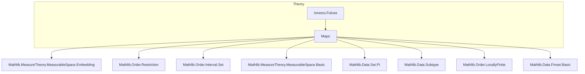

### Technical Brief: `Maps.lean` — Auxiliary Maps for Ionescu-Tulcea Theorem

---

#### **1. Key Definitions & Theorems**

| Name | Type / Signature | Purpose |
|------|------------------|---------|
| `IocProdIoc` | `Π {ι} [LinearOrder ι] [LocallyFiniteOrder ι] [DecidableLE ι] {X : ι → Type*} (a b c : ι), (Π i : Ioc a b, X i) × (Π i : Ioc b c, X i) → (Π i : Ioc a c, X i)` | Glues two dependent function spaces over adjacent half-open intervals `Ioc a b` and `Ioc b c` into one over `Ioc a c`. |
| `IicProdIoc` (non-equiv version) | `Π {ι} [LocallyFiniteOrderBot ι] {X : ι → Type*} (a b : ι), (Π i : Iic a, X i) × (Π i : Ioc a b, X i) → (Π i : Iic b, X i)` | Glues `Iic a` and `Ioc a b` into `Iic b`, handling both `a ≤ b` and `b < a` cases. |
| `IicProdIoc` (measurable equivalence) | `Π {ι} [LinearOrder ι] [LocallyFiniteOrder ι] [DecidableLE ι] [LocallyFiniteOrderBot ι] {X : ι → Type*} {a b : ι} (hab : a ≤ b), ((Π i : Iic a, X i) × (Π i : Ioc a b, X i)) ≃ᵐ (Π i : Iic b, X i)` | Provides a *measurable equivalence* when `a ≤ b`, crucial for measure-theoretic constructions. |
| `IicProdIoi` | `Π {ι} [LinearOrder ι] [LocallyFiniteOrder ι] [DecidableLE ι] [LocallyFiniteOrderBot ι] {X : ι → Type*} (a : ι), ((Π i : Iic a, X i) × (Π i : Set.Ioi a, X i)) ≃ᵐ (Π n, X n)` | Glues left-closed and right-open intervals at `a` to cover the whole index set (e.g., `ℕ`), used to build full product spaces. |
| `MeasurableEquiv.piSingleton` | `Π {X : ℕ → Type*} [∀ n, MeasurableSpace (X n)] (a : ℕ), X (a + 1) ≃ᵐ Π i : Ioc a (a + 1), X i` | Identifies a singleton factor with a unit-length interval `Ioc a (a+1)` as a measurable equivalence. |
| `measurable_IocProdIoc` | `Measurable (IocProdIoc a b c)` | Proves `IocProdIoc` is measurable. |
| `measurable_IicProdIoc` | `Measurable (IicProdIoc m n)` | Proves `IicProdIoc` is measurable. |
| `IicProdIoc_preimage` | Preimage of a measurable rectangle under `IicProdIoc` is a product of measurable rectangles. | Key lemma for verifying measurability of constructions via π-systems. |
| `IocProdIoc_preimage` | Analogous preimage lemma for `IocProdIoc`. | Used inductively to build cylinder sets. |

---

#### **2. Naming Conventions**

- **Prefixes**:
  - `IocProdIoc`, `IicProdIoc`: indicate *gluing* of function spaces over intervals (`Ioc` = open-closed, `Iic` = closed-closed).
  - `frestrictLe₂`, `restrict₂`: denote restriction operations along inclusions of intervals.
- **Suffixes**:
  - `_def`: definition unfolding lemma (e.g., `IicProdIoc_def`).
  - `_self`: special case where endpoints coincide (e.g., `IicProdIoc_self`).
  - `_le`, `_lt`: indicate inequality assumptions (e.g., `IicProdIoc_le`, `IocProdIoc_preimage`).
- **`MeasurableEquiv.*` namespace**: all constructions here are *measurable equivalences* (`≃ᵐ`), emphasizing both bijectivity and mutual measurability.

---

#### **3. Tactic Stack**

- **Core tactics**:
  - `refine`, `ext`, `simp`, `rw`, `cases`, `split_ifs`, `by_cases`
- **Specialized**:
  - `measurable_fst.eval`, `measurable_snd.eval`: used to prove measurability of projections.
  - `measurable_pi_lambda`: for proving measurability of dependent function spaces.
  - `simp_rw [eqRec_eq_cast]`: handles transport in dependent types (e.g., `piSingleton`).
  - `cast`-based simplifications via `eqRec_eq_cast`.
- **Set-theoretic reasoning**:
  - `Set.mem_pi`, `Set.mem_preimage`, `Set.mem_prod`, `restrict₂`, `frestrictLe₂_apply`.

---

#### **4. Proof Logic**

- **Structure**:
  - **Induction-free**: proofs are mostly *extensionality + case analysis* on order relations (`i ≤ a`, `i ≤ b`, etc.).
  - **Case splitting** on `i ≤ a` (or similar) inside definitions and proofs.
  - **Measurability proofs** follow a pattern:
    1. Use `measurable_pi_lambda`.
    2. Split on `i ≤ a`.
    3. Apply `measurable_fst.eval` or `measurable_snd.eval`.
  - **Equivalence proofs**:
    - `left_inv`/`right_inv`: use `ext` + `simp` on subtype components.
    - `measurable_toFun`/`measurable_toInv`: same as above.
  - **Preimage lemmas**:
    - Use `ext x` + `simp only [...]` to reduce to logical equivalences.
    - Manual construction of forward/backward directions using interval inclusions (`Ioc_subset_Ioc_right`, `Ioc_subset_Ioc_left`, `Ioc_subset_Iic_self`, etc.).

---

#### **5. Imports & Dependencies**

- **Core imports**:
  ```lean
  Mathlib.MeasureTheory.MeasurableSpace.Embedding
  Mathlib.Order.Restriction
  ```
- **Implicit dependencies** (via `LinearOrder`, `LocallyFiniteOrder`, etc.):
  - `Mathlib.Order.Interval.Set` (for `Ioc`, `Iic`, `Ioi`, `Ioi`, `Icc`, etc.)
  - `Mathlib.MeasureTheory.MeasurableSpace.Basic` (for `MeasurableSpace`, `measurable_fst`, etc.)
  - `Mathlib.Data.Set.Pi` (for `Set.pi`, `Set.univ.pi`)
  - `Mathlib.Data.Finset.Basic` (via `Finset` import)
  - `Mathlib.Order.LocallyFinite` (for `LocallyFiniteOrder`, `LocallyFiniteOrderBot`)
  - `Mathlib.Data.Subtype` (for subtype projections in interval definitions)

---

#### **6. Mermaid Diagrams**

##### **Dependency Graph (Module-Level)**



##### **Conceptual Overview of `Maps.lean`**

```mermaid
flowchart LR
  A[Linear Order ι] --> B[Interval Types]
  B --> C1[Ioc a b]
  B --> C2[Iic a]
  B --> C3[Ioc a b]
  B --> C4[Iic b]

  C1 & C3 --> D[Gluing Maps]
  C2 & C3 --> D
  D --> E1[IocProdIoc]
  D --> E2[IicProdIoc (non-equiv)]
  D --> E3[IicProdIoc ≃ᵐ]
  D --> E4[IicProdIoi ≃ᵐ]

  E1 & E2 & E3 & E4 --> F[Measurability]
  F --> G[Preimage Lemmas]
  G --> H[Used in Ionescu-Tulcea]

  subgraph Applications
    H --> IonescuTulcea
  end
```

##### **Measurable Equivalence Chain (for Ionescu-Tulcea)**

```mermaid
flowchart LR
  X[a] -->|piSingleton| Ioc[a,a+1]
  (Π_{i≤a} X i) × (Π_{i>a} X i) -->|IicProdIoi| Π_{n} X n
  (Π_{i≤a} X i) × (Π_{i∈Ioc[a,b]} X i) -->|IicProdIoc| Π_{i≤b} X i
  (Π_{i∈Ioc[a,b]} X i) × (Π_{i∈Ioc[b,c]} X i) -->|IocProdIoc| Π_{i∈Ioc[a,c]} X i
```

---

#### **7. Summary**

This module provides *constructive, measurable gluing maps* for dependent function spaces over intervals in a linearly ordered type. These maps are foundational for inductive constructions in probability theory (e.g., the Ionescu–Tulcea extension theorem), where one builds measures on increasingly large σ-algebras by gluing cylinder sets. The careful handling of endpoints (`a ≤ b` vs `b < a`) and the explicit measurable equivalence structure ensure compatibility with measure-theoretic requirements (e.g., σ-additivity, completion).
