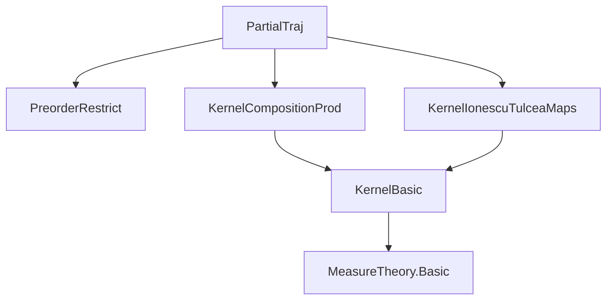
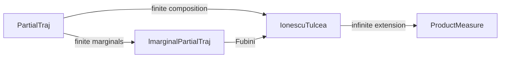

Here is the structured technical metadata extracted from `PartialTraj.lean`:

---

### **1. Key Definitions & Theorems**

| Name | Type / Signature | Purpose |
|------|------------------|---------|
| `partialTraj κ a b` | `Kernel (Π i : Iic a, X i) (Π i : Iic b, X i)` | Constructs a kernel that maps a trajectory up to time `a` to the distribution of the full trajectory up to time `b`, via iterative composition of `κ`. |
| `lmarginalPartialTraj κ a b f x₀` | `ℝ≥0∞` | Computes the integral of `f : (Π n, X n) → ℝ≥0∞` against `partialTraj κ a b x₀`, viewing the result as a function of the initial trajectory `x₀`. Mimics `MeasureTheory.lmarginal`. |
| `partialTraj_comp_partialTraj` | `partialTraj κ b c ∘ₖ partialTraj κ a b = partialTraj κ a c` | Associativity of composition for `partialTraj`, under `a ≤ b ≤ c`. |
| `partialTraj_self` | `partialTraj κ a a = Kernel.id` | Identity case: trajectory up to same time is deterministic identity. |
| `partialTraj_succ_self` | `partialTraj κ a (a + 1) = ((Kernel.id ×ₖ (κ a).map (piSingleton a)).map (IicProdIoc a (a + 1)))` | One-step extension of trajectory. |
| `map_partialTraj_succ_self` | `(partialTraj κ a (a + 1)).map (fun x ↦ x ⟨a + 1, _⟩) = κ a` | Marginal at time `a + 1` recovers the original kernel `κ a`. |
| `lmarginalPartialTraj_self` | `lmarginalPartialTraj κ b c (lmarginalPartialTraj κ a b f) = lmarginalPartialTraj κ a c f` | Fubini-type property: integrating in stages equals integrating over the full interval. |
| `partialTraj_eq_prod` | `partialTraj κ a b = (Kernel.id ×ₖ (partialTraj κ a b).map (restrict₂ Ioc_subset_Iic_self)).map (IicProdIoc a b)` | Structural decomposition: `partialTraj` splits into identity on `Iic a` and a residual kernel on `Ioc a b`. |
| `lmarginalPartialTraj_succ` | `lmarginalPartialTraj κ a (a + 1) f x₀ = ∫⁻ x, f (update x₀ _ x) ∂κ a (frestrictLe a x₀)` | One-step integral reduces to integration against `κ a`. |

---

### **2. Naming Conventions**

- **Prefixes**:
  - `partialTraj_`: for kernel constructions over partial trajectories.
  - `lmarginalPartialTraj_`: for integral operators w.r.t. `partialTraj`.
  - `frestrictLe₂`, `IicProdIoc`, `piSingleton`: standard measurable-theoretic constructions.
- **Suffixes**:
  - `_le`: when `b ≤ a`, i.e., deterministic restriction.
  - `_succ`: when stepping from `b` to `b + 1`.
  - `_self`: when `a = b`, identity case.
  - `_map_frestrictLe₂`: when pushing forward along restriction maps.
- **General patterns**:
  - `comp` for composition (`∘ₖ`).
  - `map` for pushforward of kernels.
  - `updateFinset`, `update`: for extending partial functions.

---

### **3. Tactic Stack**

Frequently used tactics in proofs:

| Tactic | Role |
|--------|------|
| `rw` / `simp_rw` | Rewriting definitions, especially `partialTraj`, `lmarginalPartialTraj`, `map`, `comp`. |
| `induction` | Induction on `ℕ` with `Nat.le_induction` or `eq_or_lt_of_le`. |
| `obtain` / `cases` | Splitting cases on `a ≤ b`, `b ≤ c`, `le_or_gt`, `le_total`. |
| `fun_prop` | Proving measurability of functions and kernels. |
| `congr` / `congrm` | Congruence for equality of integrals/functions. |
| `ext` / `ext1` | Extensionality for kernels or functions. |
| `lintegral_*` lemmas | Simplifying integrals (e.g., `lintegral_map`, `lintegral_id_prod`). |
| `have` / `suffices` | Intermediate lemmas, especially technical ones like `fst_prod_comp_id_prod`. |
| `symm_comp_self`, `map_id`, `comp_id` | Simplifying compositions with identity or symmetries. |

---

### **4. Proof Logic**

- **Inductive structure**: Most proofs proceed by induction on `c` (or `b`) with `Nat.le_induction`, using `obtain` to split cases on `a ≤ b` or `b ≤ c`.
- **Case analysis**: Heavy use of `le_total`, `eq_or_lt_of_le`, `le_or_gt` to handle deterministic vs. non-deterministic regimes.
- **Kernel decomposition**: Key lemmas like `partialTraj_eq_prod` and `lmarginalPartialTraj_eq_lintegral_map` decompose kernels into identity + residual parts, enabling integral simplifications.
- **Pushforward & composition**: Many proofs rely on `map_comp`, `comp_assoc`, `deterministic_comp_eq_map`, and `map_apply`.
- **Measurability**: Proofs often conclude with `infer_instance` or `fun_prop` to discharge kernel properties (`IsSFiniteKernel`, `IsMarkovKernel`, etc.).

---

### **5. Imports**

| Module | Purpose |
|--------|---------|
| `Mathlib.MeasureTheory.MeasurableSpace.PreorderRestrict` | For `frestrictLe`, `Iic`, preorder restrictions. |
| `Mathlib.Probability.Kernel.Composition.Prod` | For `×ₖ`, `deterministic`, `map`, `comp`, product kernels. |
| `Mathlib.Probability.Kernel.IonescuTulcea.Maps` | For `piSingleton`, `IicProdIoc`, measurable equivalences for trajectory spaces. |

---

### **6. Mermaid Diagrams**

#### **Dependency Graph (Module-Level)**



#### **Overview of File Structure**

```mermaid
flowchart LR
  A[partialTraj definition] --> B[Basic properties]
  B --> C[Composition law: partialTraj_comp_partialTraj]
  B --> D[One-step structure: partialTraj_succ_self]
  B --> E[Marginal recovery: map_partialTraj_succ_self]
  A --> F[lmarginalPartialTraj definition]
  F --> G[Integral properties]
  G --> H[lmarginalPartialTraj_self (Fubini)]
  G --> I[lmarginalPartialTraj_succ]
  G --> J[DependsOn lemmas]
  J --> K[Stability under integration]
```

#### **Theoretical Context (Ionescu–Tulcea Pipeline)**



---

Let me know if you'd like a formalized dependency graph in Lean or a summary of how this fits into the broader Ionescu–Tulcea development.
