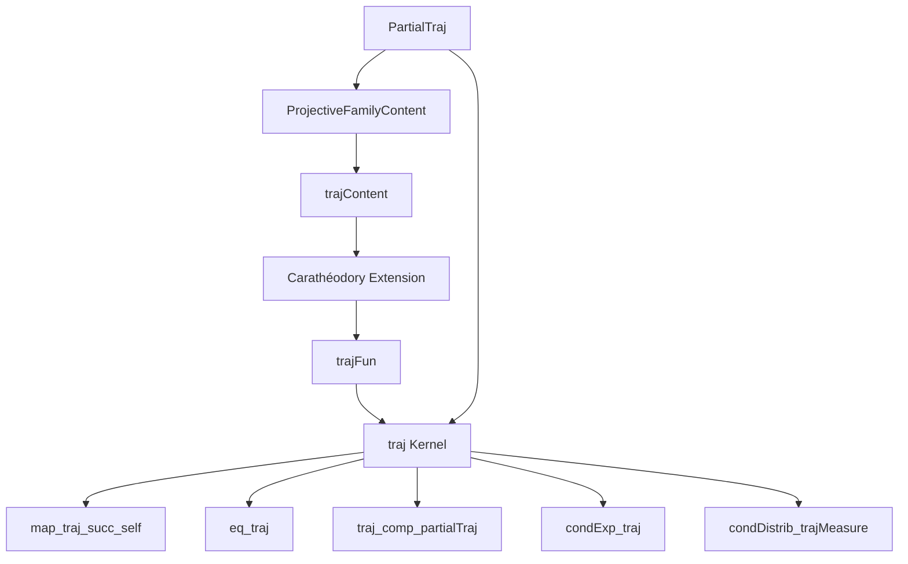
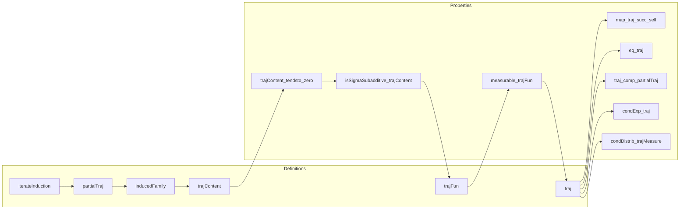

Here's a structured technical brief based on the provided `Traj.lean` file:

---

### **1. Key Definitions & Theorems**

| Name | Type / Signature | Purpose |
|------|------------------|---------|
| `traj κ a` | `Kernel (Π i : Iic a, X i) (Π n, X n)` | Constructs the *trajectory kernel*: given a trajectory up to time `a`, outputs the distribution over the full infinite trajectory via successive application of kernels `κ`. |
| `trajFun κ a x₀` | `Measure (Π n, X n)` | The measurable function underlying `traj κ a`, defined via Carathéodory extension from `trajContent`. |
| `trajContent κ x₀` | `AddContent ℝ≥0∞ (measurableCylinders X)` | An additive content on measurable cylinders, built from the projective family `partialTraj κ a ⋯ x₀`. |
| `partialTraj κ a b x₀` | `Measure (Π i : Iic b, X i)` | Distribution of the trajectory up to time `b`, given initial segment up to `a ≤ b`. |
| `inducedFamily μ S` | `Measure ((k : S) → X k)` | Projects a family of measures indexed by `Iic n` to a projective family over finite sets `S ⊆ ℕ`. |
| `iterateInduction x₀ ind` | `Π n, X n` | Extends a finite trajectory `x₀` using an inductive rule `ind` to an infinite trajectory. |
| `map_traj_succ_self` | `(traj κ a).map (fun x ↦ x (a + 1)) = κ a` | The next-step marginal of `traj κ a` recovers the original kernel `κ a`. |
| `eq_traj` | `(∀ b, η.map (frestrictLe b) = partialTraj κ a b) → η = traj κ a` | Uniqueness criterion: if a kernel matches all finite restrictions of `traj`, it *is* `traj`. |
| `traj_comp_partialTraj` | `(traj κ b) ∘ₖ (partialTraj κ a b) = traj κ a` for `a ≤ b` | Composition of finite and infinite kernels yields the full trajectory kernel. |
| `condExp_traj` | `condExp (traj κ a x₀) f | measurableSpace (Π i : Iic b, X i) = ∫⁻ y, f y ∂traj κ b x₀` (a.e.) | Conditional expectation w.r.t. `traj κ a` given info up to `b ≥ a` is integration against `traj κ b`. |
| `condDistrib_trajMeasure` | `condDistrib (trajMeasure μ₀ κ) (fun x ↦ x (a + 1)) = κ a` | Regular conditional distribution of next state given past equals kernel `κ a`. |
| `trajContent_tendsto_zero` | `Tendsto (n ↦ trajContent κ x₀ (A n)) atTop (𝓝 0)` for decreasing cylinders with empty intersection | Key technical lemma for σ-additivity of `trajContent`, enabling Carathéodory extension. |

---

### **2. Naming Conventions**

- **Prefixes**:
  - `traj*`: trajectory-related (e.g., `traj`, `trajFun`, `trajContent`)
  - `partialTraj*`: finite-horizon trajectory measures
  - `inducedFamily*`: induced projective families from a sequence of measures
  - `lmarginalPartialTraj*`: left-marginal of `partialTraj`
  - `frestrictLe*`: restriction to coordinates ≤ `n`
  - `updateFinset*`, `update*`: updating a function on a finite set of indices

- **Suffixes**:
  - `*Content`: additive content (pre-measure on cylinders)
  - `*Fun`: measurable function version of a kernel
  - `*Measure`: measure-theoretic object (e.g., `trajFun`, `trajMeasure`)
  - `*map*`: pushforward under a measurable map
  - `*comp*`: composition of kernels

---

### **3. Tactic Stack**

Frequently used tactics in proofs:

- `rw`, `simp`, `simp_rw`: rewriting and simplification (especially with `frestrictLe`, `updateFinset`, `cylinder`, `partialTraj`)
- `fun_prop`: functional properties (measurability, kernel properties)
- `convert`, `congr`: congruence and conversion steps
- `induction` (especially `Nat.case_strong_induction_on`)
- `obtain ⟨x, hx⟩`, `choose!`: existential and choice arguments
- `tendsto_*` lemmas (`tendsto_lintegral_of_dominated_convergence`, `tendsto_nhds_unique`)
- `ext`, `ext i`: extensionality for functions/measures
- `aesop`, `linarith`, `lia`: automation for arithmetic and linear reasoning
- `measure_*` lemmas (`measure_map`, `measure_univ`, `measure_compl`)
- ` measurable_*` lemmas (`measurable_frestrictLe`, `measurable_updateFinset`, `measurable_trajFun`)

---

### **4. Proof Logic**

The proof strategy follows a standard measure-theoretic construction:

1. **Finite approximations**:
   - Define `partialTraj κ a b x₀` as the composition of kernels from `a` to `b`.
   - Show it forms a *projective family* via `isProjectiveMeasureFamily_partialTraj`.

2. **From finite to infinite**:
   - Build `inducedFamily μ` to index measures over finite subsets.
   - Use `projectiveFamilyContent` to define `trajContent` on cylinders.

3. **σ-additivity**:
   - Prove `trajContent_tendsto_zero` for decreasing cylinders with empty intersection.
   - Use `addContent_iUnion_eq_sum_of_tendsto_zero` to get σ-subadditivity.
   - Apply Carathéodory extension to define `trajFun`.

4. **Kernel structure**:
   - Prove `measurable_trajFun` using induction on cylinder sets.
   - Lift to `traj : Kernel (Π i : Iic a, X i) (Π n, X n)`.

5. **Characterization & uniqueness**:
   - Show finite restrictions recover `partialTraj`.
   - Use `eq_traj` to prove uniqueness.
   - Derive integral formulas, conditional expectations, and conditional distributions.

---

### **5. Imports & Dependencies**

**Core imports** (define the ambient theory):

```lean
Mathlib.MeasureTheory.Constructions.ProjectiveFamilyContent
Mathlib.MeasureTheory.Function.FactorsThrough
Mathlib.MeasureTheory.Integral.Average
Mathlib.MeasureTheory.OuterMeasure.OfAddContent
Mathlib.Probability.Kernel.CondDistrib
Mathlib.Probability.Kernel.IonescuTulcea.PartialTraj
Mathlib.Probability.Kernel.SetIntegral
```

**Key dependencies**:
- `ProjectiveFamilyContent`: construction of measures from projective families.
- `PartialTraj`: finite approximations of trajectories and their properties.
- `Kernel` infrastructure: composition, pushforward, Markov kernels.
- `measurableCylinders`, `AddContent`, `Carathéodory`: measure-theoretic foundations.

---

### **6. Mermaid Diagrams**

#### **Dependency Graph (High-Level)**



#### **Overview of `Traj.lean` Structure**



---

Let me know if you'd like a formalized summary of the main theorem (`traj` existence + uniqueness) or a step-by-step proof sketch of `trajContent_tendsto_zero`.
