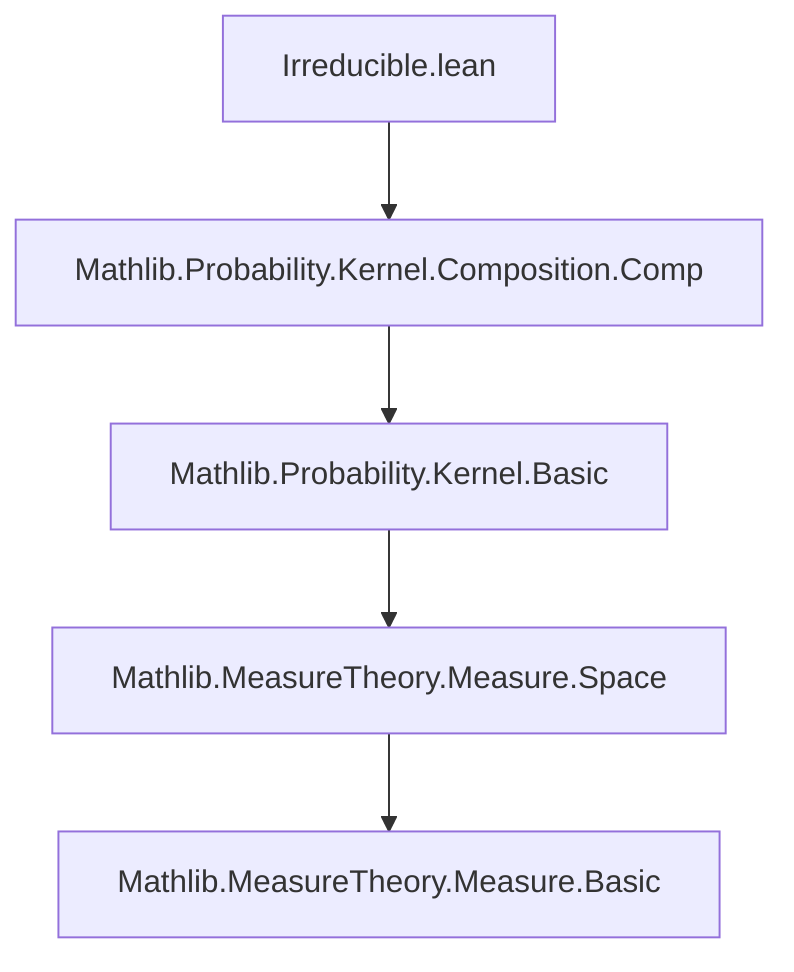

### Technical Brief: `Irreducible.lean`

---

#### **1. Key Definitions & Theorems**

| Name | Type | Purpose |
|------|------|---------|
| `IsIrreducible (φ : Measure α) (κ : Kernel α α)` | `Prop` | Defines that for every measurable set `A` with `φ(A) > 0` and every state `a : α`, there exists `n : ℕ` such that `(κ ^ n) a A > 0`. This models *φ-irreducibility* of a Markov kernel. |
| `isIrreducible_of_le_measure` | `φ₁ ≤ φ₂ → IsIrreducible φ₂ κ → IsIrreducible φ₁ κ` | Shows that irreducibility is preserved under domination of measures: if `κ` is `φ₂`-irreducible and `φ₁ ≤ φ₂`, then `κ` is also `φ₁`-irreducible. |
| `instance Subsingleton α → IsIrreducible φ Kernel.id` | `IsIrreducible φ Kernel.id` | Shows that the identity kernel is always irreducible when the space is subsingleton (i.e., at most one element), since any positive-measure set must contain the unique point, and one step suffices. |
| `instance c • φ` | `IsIrreducible φ κ → IsIrreducible (c • φ) κ` | Shows that scaling a measure by a positive constant preserves irreducibility. |

---

#### **2. Naming Conventions**

- **Prefixes**:
  - `isIrreducible_`: for lemmas about irreducibility (e.g., `isIrreducible_of_le_measure`).
  - `irreducible`: for the core property in the class (used in `irreducible ⦃A⦄ ...`).
- **Suffixes**:
  - `_of_le_measure`: indicates dependence on a measure inequality.
  - `_id`, `_•`: for specific instances (identity kernel, scalar multiplication).
- **Class naming**:
  - `IsIrreducible`: standard predicate-style naming for properties.

---

#### **3. Tactic Stack**

Frequent tactics used in proofs:
- `use`: to witness existential quantifiers (e.g., `use 1`).
- `simp` / `simp_all`: to simplify goals using definitions and hypotheses.
- `simpa`: to simplify and discharge the goal using a given expression.
- `have ha : ... := ...`: to introduce intermediate facts.
- `Std.lt_of_lt_of_le`: to chain strict and non-strict inequalities.
- `Subsingleton.mem_iff_nonempty.mpr`: to deduce membership in a subsingleton type from nonemptiness.

No heavy automation (e.g., `aesop`, `ring`, `linarith`) is used—proofs are mostly direct and definitional.

---

#### **4. Proof Logic**

- **Structure**: Most proofs are *direct* and *constructive*:
  - For existential claims (`∃ n`), an explicit `n` is provided (e.g., `n = 1` for identity kernel).
  - For implications (`→`), assumptions are unpacked and used to derive the conclusion.
- **Key reasoning patterns**:
  - Use of `Subsingleton.mem_iff_nonempty` to reduce set membership to nonemptiness.
  - Use of measure-theoretic facts: `nonempty_of_measure_ne_zero`, monotonicity of measures under scalar multiplication and domination (`φ₁ ≤ φ₂`).
  - `simpa` to reuse existing instances (e.g., `hκ.irreducible`).

---

#### **5. Imports & Dependencies**

- **Primary import**:
  ```lean
  import Mathlib.Probability.Kernel.Composition.Comp
  ```
  - Provides composition and powers of kernels (`κ ^ n`), needed for defining iterated transitions.

- **Scoped namespaces**:
  - `MeasureTheory`, `ENNReal`, `ProbabilityTheory`
  - Enables notation like `•` (scalar multiplication), `^` (kernel power), and measure-theoretic operations.

- **Core dependencies**:
  - `MeasureTheory.Measure.Space` (implicit via `Measure α`)
  - `ProbabilityTheory.Kernel` (via `Kernel α α`)
  - Standard library (`Std`, `Subsingleton`, etc.)

---

#### **6. Mermaid Diagrams**

##### **Dependency Graph (Module-Level)**



##### **Conceptual Overview (Theory Flow)**

```mermaid
graph LR
  A[Kernel κ : α → α] --> B[φ-irreducibility]
  B --> C[Definition: ∀ A, φ(A) > 0, ∃ n, (κ^n)a A > 0]
  B --> D[Preservation under measure domination]
  D --> E[If φ₁ ≤ φ₂ and κ is φ₂-irreducible, then κ is φ₁-irreducible]
  B --> F[Preservation under scalar multiplication]
  F --> G[κ is (c • φ)-irreducible if φ-irreducible]
  B --> H[Trivial case: identity kernel on subsingleton]
```

##### **Proof Structure (Example: `isIrreducible_of_le_measure`)**

```mermaid
graph TD
  A[Assume φ₁ ≤ φ₂, κ is φ₂-irreducible] --> B[Take measurable A with φ₁(A) > 0]
  B --> C[Then φ₂(A) > 0 by monotonicity]
  C --> D[Apply φ₂-irreducibility: ∃ n, (κ^n)a A > 0]
  D --> E[Conclude κ is φ₁-irreducible]
```

---

#### **7. Theoretical Context**

- **Motivation**: Models *φ-irreducibility* of Markov kernels, a key condition in Markov chain theory for ensuring eventual access to all φ-positive sets.
- **Reference alignment**:
  - Meyn & Tweedie (1993), Prop. 4.2.1(ii)
  - Robert & Casella (2004) — Monte Carlo methods context.

- **Role in larger theory**:
  - Likely a stepping stone toward:
    - Harris recurrence
    - Ergodic theorems
    - Convergence of MCMC algorithms

---

#### **8. Summary**

This module formalizes the foundational notion of *irreducibility* for Markov kernels with respect to a reference measure. It includes:
- A clean inductive class definition (`IsIrreducible`)
- Three key preservation lemmas (under domination, scaling, and subsingleton spaces)
- Minimal tactic usage, favoring direct, measure-theoretic reasoning.

It serves as a precise and reusable building block for deeper probabilistic and ergodic theory developments in `Mathlib`.
