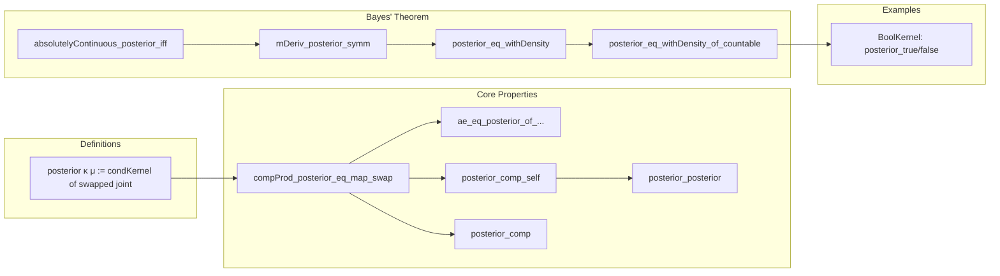

### Technical Brief: `Posterior.lean` — Posterior Kernel in Measure Theory

---

#### **1. Key Definitions & Theorems**

| Name | Type / Signature | Purpose |
|------|------------------|---------|
| `posterior κ μ` | `Kernel Ω 𝓧 → Measure Ω → Kernel 𝓧 Ω` | Defines the posterior kernel: given prior `μ` and likelihood kernel `κ`, returns a kernel mapping data to posterior over parameters. |
| `compProd_posterior_eq_map_swap` | `(κ ∘ₘ μ) ⊗ₘ κ†μ = (μ ⊗ₘ κ).map Prod.swap` | **Fundamental property**: joint distribution of (parameter, data) equals joint of (data, parameter) via posterior. |
| `ae_eq_posterior_of_compProd_eq` | `(η : Kernel 𝓧 Ω) → (κ ∘ₘ μ) ⊗ₘ η = (μ ⊗ₘ κ).map Prod.swap → η =ᵐ[κ ∘ₘ μ] κ†μ` | Uniqueness of posterior up to `κ ∘ₘ μ`-a.e. equality. |
| `posterior_comp_self` | `κ†μ ∘ₘ κ ∘ₘ μ = μ` | Posterior recovers the prior when composed with likelihood. |
| `posterior_posterior` | `(κ†μ)†(κ ∘ₘ μ) =ᵐ[μ] κ` | **Involution up to a.e. equality**: posterior of posterior recovers original kernel. |
| `posterior_comp` | `(η ∘ₖ κ)†μ =ᵐ[η ∘ₘ κ ∘ₘ μ] κ†μ ∘ₖ η†(κ ∘ₘ μ)` | **Contravariance**: posterior of composite kernel factorizes. |
| `posterior_eq_withDensity` | `∀ᵐ ω ∂μ, κ ω ≪ κ ∘ₘ μ ⇒ ∀ᵐ x ∂(κ ∘ₘ μ), κ†μ x = μ.withDensity (fun ω ↦ κ.rnDeriv (Kernel.const _ (κ ∘ₘ μ)) ω x)` | **Bayes’ theorem**: posterior expressed via Radon–Nikodym derivative. |
| `rnDeriv_posterior_symm` | `∀ᵐ x ∂(κ ∘ₘ μ), ∀ᵐ ω ∂μ, (κ†μ).rnDeriv (Kernel.const _ μ) x ω = κ.rnDeriv (Kernel.const _ (κ ∘ₘ μ)) ω x` | Symmetry of RN derivatives in joint measure. |
| `absolutelyContinuous_posterior_iff` | `(∀ᵐ b ∂(κ ∘ₘ μ), (κ†μ) b ≪ μ) ↔ ∀ᵐ ω ∂μ, κ ω ≪ κ ∘ₘ μ` | Equivalence of absolute continuity conditions (key for Bayes’ theorem applicability). |

---

#### **2. Naming Conventions**

- **Prefixes**:
  - `posterior_`: properties of the posterior kernel.
  - `compProd_`: properties involving product of kernels/measures and composition.
  - `ae_eq_`: almost-everywhere equality lemmas.
  - `absolutelyContinuous_`: absolute continuity conditions.
  - `rnDeriv_`: Radon–Nikodym derivative identities.

- **Suffixes**:
  - `_eq_swap`: equality involving `Prod.swap`.
  - `_comp`: composition-related lemmas.
  - `_self`: self-composition (e.g., posterior of posterior).
  - `_iff`: equivalence of conditions.

- **Infix**:
  - `†` (typed `\dag` or `\dagger`) for `posterior κ μ`.

---

#### **3. Tactic Stack**

Frequently used tactics in proofs:
- `rw`, `simp_rw`, `conv_rhs`: rewriting and simplification.
- `filter_upwards`: for handling almost-everywhere quantifiers.
- `lintegral_congr_ae`, `setLIntegral_congr_fun_ae`: integral equality via a.e. equality.
- `measurability`, `fun_prop`: measurability and product measurability.
- `exact`, `refine`, `calc`: structured proof construction.
- `simpa`, `convert`, `ext`: simplification and extensionality.
- `ae_restrict_of_ae`, `ae_eq_of_setLIntegral_prod_eq`: measure-theoretic a.e. reasoning.

---

#### **4. Proof Logic**

- **Structure**:
  - Most proofs follow a **measure-theoretic pattern**:
    1. Reduce to equality of integrals over a π-system (e.g., rectangles).
    2. Use known identities (e.g., `compProd_posterior_eq_map_swap`, Fubini, swap properties).
    3. Apply uniqueness theorems (e.g., `ae_eq_of_setLIntegral_prod_eq`, `Kernel.ae_eq_of_compProd_eq`).
  - **Induction is not used**; instead, rely on:
    - Disintegration (`condKernel`, `disintegrate`)
    - Radon–Nikodym derivatives (`rnDeriv`)
    - Standard Borel / countable assumptions for regularity.

- **Common flow**:
  ```text
  [Goal: A =ᵐ[ν] B]
  → refine ae_eq_of_... ?_
  → calc A = ... = ... = B
  ```

- **Key lemmas reused**:
  - `compProd_posterior_eq_map_swap`
  - `swap_compProd_posterior`
  - `parallelProd_posterior_comp_copy_comp`
  - `posterior_comp_self`

---

#### **5. Imports**

| Import | Role |
|--------|------|
| `Mathlib.Probability.Kernel.CompProdEqIff` | Characterization of product kernels via composition. |
| `Mathlib.Probability.Kernel.Composition.Lemmas` | Basic composition identities for kernels. |
| `Mathlib.Probability.Kernel.Disintegration.StandardBorel` | Disintegration theorem under Standard Borel assumptions. |

> **Scope**: This module formalizes **Bayesian updating** in measure-theoretic probability using **Markov kernels**, assuming:
> - Finite measures and kernels (`IsFiniteMeasure`, `IsFiniteKernel`)
> - Standard Borel spaces (`StandardBorelSpace`) for regularity
> - Countable or countably generated measurable spaces for absolute continuity results.

---

#### **6. Mermaid Diagrams**

##### **Dependency Graph (High-Level)**

```mermaid
graph TD
  A[Measure Theory Basics] --> B[Kernel Composition]
  B --> C[Product Kernels ⊗ₘ]
  C --> D[Disintegration & condKernel]
  D --> E[Posterior Kernel Definition]
  E --> F[Main Property: compProd_posterior_eq_map_swap]
  F --> G[Uniqueness (ae_eq_posterior_of_...)]
  F --> H[Recovery Laws (posterior_comp_self, posterior_posterior)]
  D --> I[Radon–Nikodym Derivatives]
  I --> J[Bayes’ Theorem (posterior_eq_withDensity)]
  G & H & J --> K[Applications: BoolKernel, Countable Ω]
```

##### **Overview of `Posterior.lean`**



---

#### **7. Notation Summary**

| Symbol | Meaning |
|--------|---------|
| `κ†μ` | `posterior κ μ` |
| `∘ₘ` | Kernel–measure composition (`κ ∘ₘ μ` = marginal of data) |
| `⊗ₘ` | Product of kernel and measure |
| `map Prod.swap` | Swap coordinates in product space |
| `condKernel` | Disintegration / conditional kernel |
| `withDensity f` | Measure with density `f` w.r.t. reference |
| `rnDeriv` | Radon–Nikodym derivative |

---

#### **8. Theoretical Significance**

- **Bayesian inference formalized**: The posterior kernel provides a rigorous foundation for updating beliefs.
- **Contravariance & involution**: `posterior_comp` and `posterior_posterior` show the posterior behaves like a *categorical inverse*.
- **Computational relevance**: `posterior_eq_withDensity_of_countable` gives an explicit formula for posterior in countable parameter spaces — useful for implementation.
- **Measure-theoretic rigor**: Handles null sets, absolute continuity, and regularity via Standard Borel assumptions.

--- 

Let me know if you'd like a formalized dependency graph (e.g., `.lean`-level imports), or a visualization of the `BoolKernel` example.
