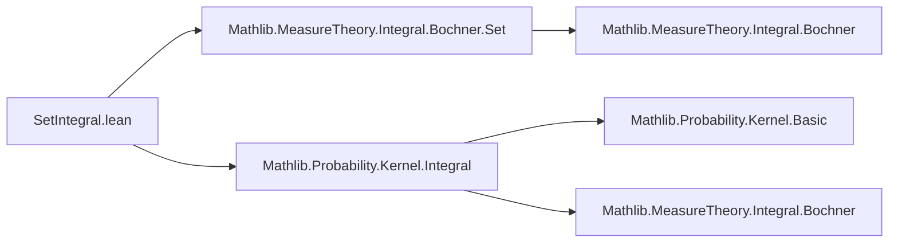
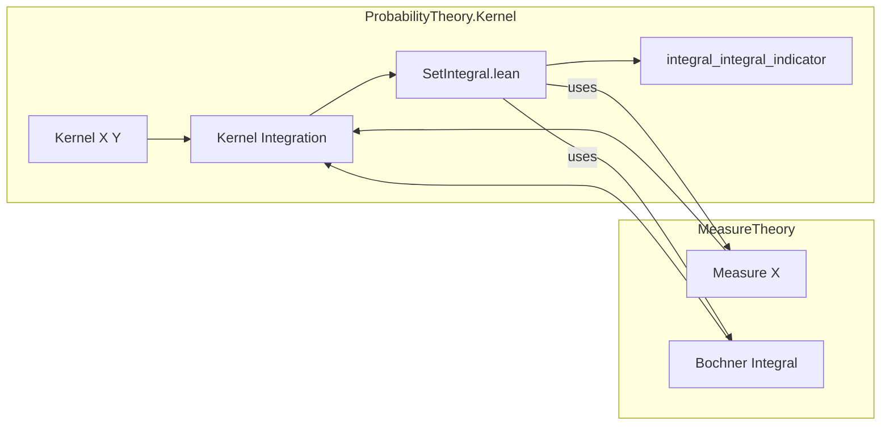

**Technical Brief: `SetIntegral.lean`**

---

### 1. **Key Definitions & Theorems**

- **`integral_integral_indicator`**  
  **Type**:  
  ```lean
  (μ : Measure X) → (f : X → Y → E) → (s : Set X) → MeasurableSet s → 
  ∫ x, ∫ y, s.indicator (f · y) x ∂κ x ∂μ = ∫ x in s, ∫ y, f x y ∂κ x ∂μ
  ```  
  **Purpose**:  
  Justifies moving integration over a set `s` into the inner integral with respect to a kernel `κ`, by rewriting the indicator function as a restriction of the domain—essentially a Fubini-type property for kernel integrals over measurable subsets.

- **`Kernel.integral_indicator₂`** (imported lemma):  
  A foundational result used in the proof, stating that integrating an indicator-modified function against a kernel equals integrating over the restricted domain.

- **`integral_indicator`** (imported lemma, from `MeasureTheory.Integral.Bochner.Set`):  
  Relates integration over a set via indicator functions to restricted integration:  
  $$
  \int x, s.\text{indicator}\,g\,x \partial\mu = \int x \in s, g\,x \partial\mu
  $$

---

### 2. **Naming Conventions**

- **Prefixes**:
  - `integral_`: for lemmas about Bochner/kernel integrals.
  - `indicator`: for operations involving set indicators (e.g., `integral_indicator`, `integral_indicator₂`).
- **Suffixes**:
  - `_₂`: often denotes a two-argument or “second” version of a lemma (e.g., `integral_indicator₂`).
- **Module-level namespace**: `ProbabilityTheory.Kernel` — indicates focus on probabilistic kernels.

---

### 3. **Tactic Stack**

- **`simp_rw`**: Primary tactic used to rewrite using equational lemmas (`← integral_indicator`, `Kernel.integral_indicator₂`).
- Implicit use of:
  - `simp` (via `simp_rw`, which combines `simp` + `rw`)
  - ` rfl` (not explicit, but likely used in background simplifications)
- No heavy automation (e.g., `aesop`, `ring`, `linarith`) appears in the visible snippet.

---

### 4. **Proof Logic**

- **Strategy**:  
  Direct equational reasoning via rewriting:
  1. Apply `← integral_indicator hs` to rewrite the outer integral with indicator.
  2. Apply `Kernel.integral_indicator₂` to commute indicator with kernel integration.
  3. Simplify to obtain the desired equality.

- **Structure**:
  - No induction or case analysis.
  - Purely definitional/rewriting proof relying on pre-established lemmas.

---

### 5. **Imports**

- **Core dependencies**:
  - `Mathlib.MeasureTheory.Integral.Bochner.Set`: provides `integral_indicator`, set-restricted integration.
  - `Mathlib.Probability.Kernel.Integral`: provides `Kernel.integral_indicator₂`, integration theory for kernels.

- **Type class assumptions**:
  - `[NormedAddCommGroup E]`, `[NormedSpace ℝ E]`: ensure $E$ is a real Banach space (required for Bochner integration).

---

### 6. **Mermaid Diagrams**

#### **Dependency Graph (File-Level)**



#### **Theoretical Overview (Module Scope)**



---

### Summary

This file formalizes a basic but crucial property of integrating over subsets in the context of **kernel-dependent integrals**, leveraging existing Bochner integral theory and kernel integration lemmas. Its brevity reflects a *lean* (pun intended) design: no new definitions, only a concise lemma combining two imported results via `simp_rw`. It serves as a stepping stone for more advanced Fubini/Tonelli-style results in probabilistic programming or stochastic processes.
