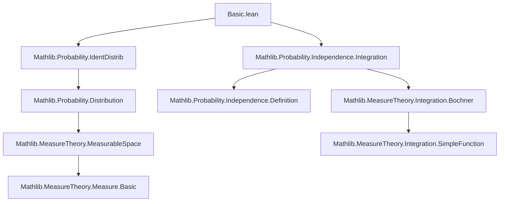

**Technical Brief: `Basic.lean` — Moments and Moment-Generating Functions in Lean 4**

---

### **1. Key Definitions & Theorems**

| Name | Type / Signature | Purpose |
|------|------------------|---------|
| `moment X p μ` | `Ω → ℝ → ℕ → Measure Ω → ℝ` | Computes the $p$th moment: $\mu[X^p]$ |
| `centralMoment X p μ` | `Ω → ℝ → ℕ → Measure Ω → ℝ` | Computes the $p$th central moment: $\mu[(X - \mu[X])^p]$ |
| `mgf X μ t` | `Ω → ℝ → Measure Ω → ℝ → ℝ` | Moment-generating function: $\mu[\exp(t X)]$ |
| `cgf X μ t` | `Ω → ℝ → Measure Ω → ℝ → ℝ` | Cumulant-generating function: $\log(\mu[\exp(t X)])$ |
| `IndepFun.mgf_add` | `X ⟂ᵢ[μ] Y → mgf (X + Y) μ t = mgf X μ t * mgf Y μ t` | MGF of sum of independent RVs factorizes |
| `IndepFun.cgf_add` | `X ⟂ᵢ[μ] Y → cgf (X + Y) μ t = cgf X μ t + cgf Y μ t` | CGF of sum of independent RVs adds |
| `measure_ge_le_exp_cgf` | `μ.real {ε ≤ X} ≤ exp(-t ε + cgf X μ t)` | Upper-tail Chernoff bound via CGF |
| `measure_le_le_exp_cgf` | `μ.real {X ≤ ε} ≤ exp(-t ε + cgf X μ t)` | Lower-tail Chernoff bound via CGF |
| `mgf_congr_identDistrib` | `IdentDistrib X X' μ μ' → mgf X μ t = mgf X' μ' t` | MGFs are invariant under identical distribution |
| `iIndepFun.mgf_sum` | `mgf (∑_{i∈s} X_i) μ t = ∏_{i∈s} mgf (X_i) μ t` | MGF of finite sum of *independent* RVs is product of MGFs |
| `iIndepFun.cgf_sum` | `cgf (∑_{i∈s} X_i) μ t = ∑_{i∈s} cgf (X_i) μ t` | CGF of finite sum of *independent* RVs is sum of CGFs |

---

### **2. Naming Conventions**

- **Prefixes**:
  - `is_`: e.g., `isProbabilityMeasure`, `isFiniteMeasure` — typeclass predicates.
  - `aestronglyMeasurable`, `aemeasurable`: properties of measurable functions modulo null sets.
  - `mgf_`, `cgf_`, `centralMoment_`, `moment_`: function-specific prefixes.
  - `IndepFun.`: for results about independence (`⟂ᵢ[μ]`).
  - `iIndepFun.`: for *independent families* of functions.

- **Suffixes**:
  - `_zero`, `_one`, `_two`: special cases for $p = 0,1,2$.
  - `_congr`, `_congr_ae`: congruence under a.e. equality.
  - `_undef`: when integrability fails (e.g., `mgf_undef`).
  - `_dirac`, `_dirac'`: special case for Dirac measures.
  - `_const`, `_const_mul`, `_const_add`: behavior under constant shifts/scalings.

- **Logical suffixes**:
  - `_mono`, `_anti`: monotonicity/antitonicity.
  - `_add`, `_mul`, `_sum`, `_prod`: algebraic behavior.

---

### **3. Tactic Stack**

Frequently used tactics in proofs:

| Tactic | Role |
|--------|------|
| `simp only [...]` | Simplify using definitional equalities and lemmas (e.g., `integral_const`, `exp_zero`) |
| `rw [...]` | Rewrite using equalities (e.g., `mgf`, `cgf`, `log_mul`) |
| `gcongr` | Prove inequalities via monotonicity (e.g., `exp` is increasing) |
| `filter_upwards [...]` | Handle almost-everywhere statements |
| `rcases ... with ...` | Case analysis on disjunctions/equalities (e.g., `eq_zero_or_isProbabilityMeasure`) |
| `have / refine / exact` | Build intermediate lemmas or apply known results |
| `ext` | Extensionality for function equality |
| ` positivity` | Prove non-negativity of expressions (e.g., `mgf_nonneg`) |
| `ring`, `linarith`, `nlinarith` | Algebraic simplifications and inequalities |
| `fun_prop` | Prove measurability/integrability under standard operations (e.g., composition, multiplication) |

---

### **4. Proof Logic**

- **Structure of proofs**:
  - **Case analysis** on measure type (`μ = 0` vs `IsProbabilityMeasure μ`) or sign of $t$ (`0 ≤ t` vs `t ≤ 0`).
  - **Reduction to known lemmas**: many proofs reduce to `integral_congr_ae`, `integral_map`, `integral_mul_eq_mul_integral`, or `log_mul`.
  - **Induction** on finite sets (`Finset.induction_on`) for sums/products over index sets.
  - **Measurability/integrability checks** via `fun_prop`, `aestronglyMeasurable.comp_aemeasurable`, `integrable_of_mem_Icc`.
  - **Chernoff bounds** follow a standard pattern:
    1. Use monotonicity of `exp` to relate events `{ε ≤ X}` to `{exp(t ε) ≤ exp(t X)}`.
    2. Apply Markov’s inequality: `μ(A) ≤ c⁻¹ ∫ 1_A * f ∂μ` for $f ≥ c$ on $A$.
    3. Simplify using `exp` algebra and `log_mul`.

- **Key logical flow**:
  ```
  Goal: bound μ({ω | ε ≤ X ω})
  → use exp(t·) monotonicity (t ≥ 0)
  → apply Markov: μ({exp(t ε) ≤ exp(t X)}) ≤ exp(-t ε) ∫ exp(t X) dμ
  → rewrite ∫ exp(t X) = mgf X μ t
  → optionally take log to get cgf form
  ```

---

### **5. Imports & Dependencies**

| Module | Role |
|--------|------|
| `Mathlib.Probability.IdentDistrib` | Defines `IdentDistrib`, used for distributional equivalence and MGF invariance |
| `Mathlib.Probability.Independence.Integration` | Provides independence tools (`IndepFun`, `iIndepFun`) and integration lemmas for independent functions |
| `MeasureTheory`, `Filter`, `Finset`, `Real` | Core analysis and measure theory infrastructure |
| `ENNReal`, `NNReal` | Extended non-negative reals for measure theory (e.g., `μ.real`) |
| `ProbabilityTheory` namespace | Main domain-specific definitions and results |

---

### **6. Mermaid Diagrams**

#### **Dependency Graph (Top-Level)**



#### **Overview of Theory Flow**

```mermaid
flowchart LR
  subgraph Definitions
    M[μ[X^p]] --> MGF[mgf X μ t = μ[exp(tX)]]
    M --> CM[centralMoment X p μ]
    MGF --> CGF[cgf X μ t = log(mgf X μ t)]
  end

  subgraph Properties
    MGF --> MGF_add[mgf(X+Y) = mgf X * mgf Y]
    CGF --> CGF_add[cgf(X+Y) = cgf X + cgf Y]
    MGF --> MGF_mono[Monotonicity for t ≥ 0]
    MGF --> MGF_anti[Antitonicity for t ≤ 0]
  end

  subgraph Applications
    CGF_add --> Chernoff[Chernoff bounds]
    MGF_mono --> Chernoff
    Chernoff --> CLT[Central Limit Theorem (future)]
  end

  MGF_congr[IdentDistrib ⇒ mgf equality] --> MGF
```

---

### **7. Summary**

This file formalizes foundational tools in probability theory centered around **moments**, **central moments**, and especially the **moment- and cumulant-generating functions**. It establishes:

- Basic algebraic and analytic properties (e.g., behavior under addition, scaling, constants).
- Key results for **independent random variables**, including factorization of MGFs and additivity of CGFs.
- **Chernoff bounds**, both in MGF and CGF forms, for tail probability estimation.
- Invariance under identical distribution (`IdentDistrib`), enabling transfer of results across probability spaces.

The formalization is clean, modular, and leverages Lean’s `MeasureTheory` and `Probability` libraries extensively. It sets the stage for deeper probabilistic limit theorems (e.g., CLT, large deviations) and statistical applications.

--- 

*End of Technical Brief.*
