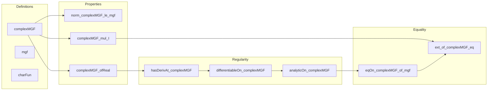

### Technical Brief: `ComplexMGF.lean`

---

#### **1. Key Definitions & Theorems**

| Name | Type / Signature | Purpose |
|------|------------------|---------|
| `complexMGF` | `Ω → ℝ → Measure Ω → ℂ → ℂ` | Complex extension of the moment-generating function: $ z \mapsto \int \exp(z X(\omega)) \, d\mu(\omega) $ |
| `complexMGF_undef` | `AEMeasurable X μ → ¬Integrable (rexp ∘ (z.re * X)) μ → complexMGF X μ z = 0` | Handles undefined case via integral of non-integrable function |
| `complexMGF_id_map` | `AEMeasurable X μ → complexMGF id (μ.map X) = complexMGF X μ` | Relates `complexMGF` under pushforward measure |
| `complexMGF_congr_identDistrib` | `IdentDistrib X Y μ μ' → complexMGF X μ = complexMGF Y μ'` | Shows invariance under distributional equivalence |
| `norm_complexMGF_le_mgf` | `‖complexMGF X μ z‖ ≤ mgf X μ z.re` | Bounds complex MGF by real MGF |
| `complexMGF_ofReal` | `complexMGF X μ (x : ℝ) = mgf X μ x` | Restriction to reals recovers real MGF |
| `re_complexMGF_ofReal` | `(complexMGF X μ x).re = mgf X μ x` | Real part of complex MGF on reals equals MGF |
| `complexMGF_mul_I` | `AEMeasurable X μ → complexMGF X μ (t * I) = charFun (μ.map X) t` | On imaginary axis, complex MGF equals characteristic function |
| `hasDerivAt_complexMGF` | `z.re ∈ interior (integrableExpSet X μ) → HasDerivAt (complexMGF X μ) (μ[X * exp (z * X)]) z` | Differentiability of complex MGF with explicit derivative |
| `differentiableOn_complexMGF` | `DifferentiableOn ℂ (complexMGF X μ) {z | z.re ∈ interior (integrableExpSet X μ)}` | Holomorphicity on vertical strip |
| `analyticOn_complexMGF` | `AnalyticOn ℂ (complexMGF X μ) {z | z.re ∈ interior (integrableExpSet X μ)}` | Analyticity on same strip |
| `analyticAt_complexMGF` | `z.re ∈ interior (integrableExpSet X μ) → AnalyticAt ℂ (complexMGF X μ) z` | Pointwise analyticity |
| `hasDerivAt_iteratedDeriv_complexMGF` | `z.re ∈ interior (integrableExpSet X μ) → HasDerivAt (iteratedDeriv n (complexMGF X μ)) (μ[X^(n+1) * exp (z * X)]) z` | Derivatives of iterated derivatives |
| `iteratedDeriv_complexMGF` | `z.re ∈ interior (integrableExpSet X μ) → iteratedDeriv n (complexMGF X μ) z = μ[X^n * exp (z * X)]` | Explicit formula for $n$-th derivative |
| `eqOn_complexMGF_of_mgf'` | `mgf X μ = mgf Y μ' ∧ μ = 0 ↔ μ' = 0 ⇒ EqOn (complexMGF X μ) (complexMGF Y μ') strip` | Equality of MGFs ⇒ equality of complex MGFs on strip |
| `eqOn_complexMGF_of_mgf` | `[IsProbabilityMeasure μ] → mgf X μ = mgf Y μ' ⇒ EqOn (complexMGF X μ) (complexMGF Y μ') strip` | Special case for probability measures |
| `Measure.ext_of_complexMGF_eq` | `[IsFiniteMeasure μ] [IsFiniteMeasure μ'] → complexMGF X μ = complexMGF Y μ' ⇒ μ.map X = μ'.map Y` | Complex MGF separates distributions |
| `Measure.ext_of_complexMGF_id_eq` | `complexMGF id μ = complexMGF id μ' ⇒ μ = μ'` | Identity random variable case |

---

#### **2. Naming Conventions**

- **Prefixes**:
  - `complexMGF_`: for definitions/lemmas about the complex MGF.
  - `hasDerivAt_`, `iteratedDeriv_`: for differentiability and higher derivatives.
  - `eqOn_`, `ext_`: for extensionality/equality results.
  - `analyticOn_`, `analyticAt_`, `differentiableOn_`: regularity properties.
- **Suffixes**:
  - `_ofReal`: restriction to real inputs.
  - `_mul_I`: evaluation on imaginary axis.
  - `_id_map`: behavior under pushforward via identity map.
  - `_congr_identDistrib`: invariance under distributional equivalence.
  - `_le_mgf`: inequality comparison with real MGF.
  - `_undef`: undefined case handling.

---

#### **3. Tactic Stack**

Frequently used tactics:
- `rw`, `simp`, `simp_rw`: for rewriting and simplification (especially with `integral_map`, `complexMGF`, `charFun`, `mgf`).
- `have`, `obtain`, `refine`, `convert`: for intermediate constructions and applying lemmas.
- `induction`: for inductive proofs (e.g., on `n` for derivatives).
- `filter_upwards`, `eventually_of_forall`: for filter-based arguments (e.g., neighborhoods).
- `gcongr`, `linarith`, ` positivity`: for inequalities and positivity checks.
- `aesop`, `ring`, `ring_nf`: for algebraic simplifications.
- `exact`, `assumption`, `apply`: for direct proof steps.
- `rw [← ...]`, `congr with ...`: for structural equivalences.

---

#### **4. Proof Logic**

- **Structure**:
  - **Main definitions** are noncomputable and rely on `integral_map`, `cexp`, and `mgf`.
  - **Differentiability** is proven via dominated convergence / parameter-dependent integral theorems (`hasDerivAt_integral_of_dominated_loc_of_deriv_le`), requiring integrability bounds and local domination.
  - **Analyticity** follows from holomorphicity on open sets (`analyticOnNhd`), using openness of the interior of `integrableExpSet`.
  - **Equality results** (`eqOn_complexMGF_of_mgf`, `ext_of_complexMGF_eq`) use:
    - Analytic continuation (via `AnalyticOnNhd.eqOn_of_preconnected_of_frequently_eq`).
    - Density of reals in strip and equality on reals (via `complexMGF_ofReal`).
    - Characteristic function inversion theorems (`Measure.ext_of_integral_char_eq`) for distributional uniqueness.

- **Inductive patterns**:
  - Induction on `n` for iterated derivatives.
  - Case analysis on whether `interior (integrableExpSet X μ)` is empty.

- **Key logical flow**:
  1. Define `complexMGF`.
  2. Prove basic properties (bounds, restriction to reals/imaginary axis).
  3. Prove differentiability ⇒ holomorphicity ⇒ analyticity.
  4. Use analytic continuation to lift equality from reals to strip.
  5. Use Fourier inversion to lift equality of complex MGFs to equality of distributions.

---

#### **5. Imports**

| Import | Role |
|--------|------|
| `Mathlib.Analysis.Calculus.ParametricIntegral` | For differentiating under the integral sign |
| `Mathlib.Analysis.Complex.CauchyIntegral` | For complex analysis tools (holomorphicity, analyticity) |
| `Mathlib.MeasureTheory.Measure.CharacteristicFunction` | For characteristic functions and Fourier inversion |
| `Mathlib.Probability.Moments.Basic` | For MGF definitions and basic properties |
| `Mathlib.Probability.Moments.IntegrableExpMul` | For integrability conditions on `exp(t * X)` |

---

#### **6. Mermaid Diagrams**

##### **Dependency Graph (Top-Level)**

```mermaid
graph TD
  A[ComplexMGF.lean] --> B[Mathlib.Analysis.Calculus.ParametricIntegral]
  A --> C[Mathlib.Analysis.Complex.CauchyIntegral]
  A --> D[Mathlib.MeasureTheory.Measure.CharacteristicFunction]
  A --> E[Mathlib.Probability.Moments.Basic]
  A --> F[Mathlib.Probability.Moments.IntegrableExpMul]

  B --> G[Parametric Integral Theorems]
  C --> H[Holomorphicity, Analyticity]
  D --> I[Fourier Inversion, Characteristic Functions]
  E --> J[Moment Generating Function]
  F --> K[Integrability of exp(tX)]
```

##### **Overview of Theory Flow**



---

#### **7. Summary**

This file formalizes the **complex-valued moment-generating function** and establishes its core analytic and probabilistic properties:

- It extends the real MGF to a holomorphic function on a vertical strip in ℂ.
- It coincides with the characteristic function on the imaginary axis.
- It is analytic on its domain of definition.
- Equality of complex MGFs implies equality of distributions (via Fourier inversion).
- Equality of real MGFs implies equality of complex MGFs on the strip (via analytic continuation).

The formalization leverages advanced analysis (parameter-dependent integrals, analytic continuation) and probability theory (characteristic functions, pushforward measures), and is structured to support future proofs like the uniqueness theorem for MGFs.

--- 

Let me know if you'd like a dependency graph for specific lemmas or a proof sketch for a particular theorem.
