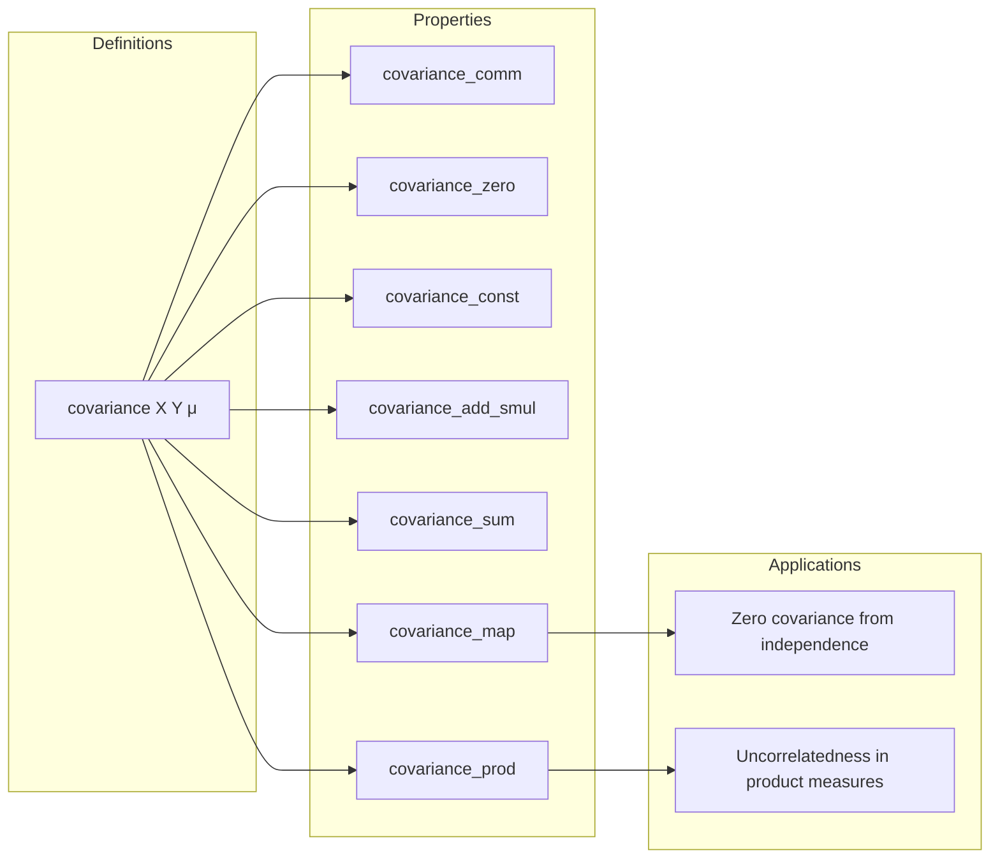

### Technical Brief: Covariance Module (`Covariance.lean`)

---

#### **1. Key Definitions & Theorems**

| Name | Type / Signature | Purpose |
|------|------------------|---------|
| `covariance` | `covariance (X Y : Ω → ℝ) (μ : Measure Ω) : ℝ` | Defines covariance as the integral of centered product: $ \int (X - \mathbb{E}[X])(Y - \mathbb{E}[Y]) \, d\mu $. |
| `covariance_eq_sub` | `cov[X, Y; μ] = μ[X * Y] - μ[X] * μ[Y]` | Alternative formula for covariance under finite probability measures and $L^2$ integrability. |
| `covariance_self` *(not in file but implied)* | `cov[X, X; μ] = Var[X; μ]` | Connects covariance with variance (standard identity; likely elsewhere or provable). |
| `covariance_comm` | `cov[X, Y; μ] = cov[Y, X; μ]` | Symmetry of covariance. |
| `covariance_zero_left/right` | `cov[0, Y; μ] = 0`, `cov[X, 0; μ] = 0` | Covariance with zero function vanishes. |
| `covariance_const_left/right` | `cov[const c, Y; μ] = 0` | Covariance with constant function vanishes (under probability measure). |
| `covariance_add_left/right` | `cov[X + Y, Z] = cov[X, Z] + cov[Y, Z]`, etc. | Bilinearity in each argument (under finite measure and $L^2$). |
| `covariance_smul_left/right` | `cov[c • X, Y] = c * cov[X, Y]`, etc. | Homogeneity in each argument. |
| `covariance_neg_left/right` | `cov[-X, Y] = -cov[X, Y]`, etc. | Oddness in each argument. |
| `covariance_sub_left/right` | `cov[X - Y, Z] = cov[X, Z] - cov[Y, Z]`, etc. | Additive inverses handled via subtraction. |
| `covariance_sum_left/right'` | `cov[∑_{i∈s} X_i, Y] = ∑_{i∈s} cov[X_i, Y]` | Finite sum linearity (Finset version). |
| `covariance_sum_sum'` | `cov[∑_{i∈s} X_i, ∑_{j∈t} Y_j] = ∑_{i∈s} ∑_{j∈t} cov[X_i, Y_j]` | Double sum expansion. |
| `covariance_map` | `cov[X, Y; μ.map Z] = cov[X ∘ Z, Y ∘ Z; μ]` | Covariance transforms covariantly under measurable pushforward. |
| `IndepFun.covariance_eq_zero` | `X ⟂ᵢ[μ] Y ⇒ cov[X, Y; μ] = 0` (under $L^2$) | Independence implies zero covariance. |
| `covariance_fst_snd_prod` | `cov[π₁ ∘ X, π₂ ∘ Y; μ × ν] = 0` | Product measure: functions on different factors are uncorrelated. |

---

#### **2. Naming Conventions**

- **Prefixes**:
  - `covariance_`: core definitions and lemmas.
  - `is_`/`memLp_`: properties of functions (e.g., `MemLp`, `aestronglyMeasurable`).
  - `integral_`, `probReal_univ`, `one_smul`: measure-theoretic helpers.
- **Suffixes**:
  - `_left`, `_right`: argument position (left/right argument of `covariance`).
  - `_add_const`, `_const_add`, `_sub_const`, `_const_sub`: behavior under constant shifts.
  - `_smul`, `_const_mul`, `_mul_const`: behavior under scalar multiplication.
  - `_neg`, `_fun_neg`: behavior under negation.
  - `_sum_left/right`, `_sum_sum`: behavior under finite sums.
  - `_map`, `_map_equiv`: behavior under measurable maps.
- **Notation**:
  - `cov[X, Y; μ]` for conditional covariance w.r.t. measure `μ`.
  - `cov[X, Y]` for covariance w.r.t. volume measure (`MeasureSpace.volume`).

---

#### **3. Tactic Stack**

- **Core tactics**:
  - `simp`, `simp_rw`: extensive use for rewriting definitions and simplifying expressions.
  - `congr`: for functional extensionality (e.g., `congr with x`).
  - `ring`: simplifying algebraic expressions in reals.
  - `rw`: applying lemmas like `integral_sub`, `integral_add`, `integral_const_mul`.
  - `exact`, `apply`, `refine`: for constructing proofs step-by-step.
  - `induction`: `Finset.induction` for finite sum lemmas.
  - `convert`: to align goals up to definitional equality (e.g., `cov[fun ω ↦ ..., Y]` vs `cov[∑ ..., Y]`).
  - `filter_upwards`, `aesop`: for measure-theoretic arguments (e.g., a.e. statements).
  - `by_cases`: branching on measure-theoretic conditions (e.g., `∀ᵐ ω, X ω = 0`).
  - `calc`: for multi-step equational reasoning.

---

#### **4. Proof Logic**

- **Structure**:
  - Most proofs follow a **"unfold → simplify → apply measure-theoretic lemmas → algebraic simplification"** pattern.
  - For bilinearity lemmas (`covariance_add_left`, `covariance_sum_left`, etc.):
    1. Unfold `covariance`.
    2. Use `integral_add` / `integral_sub` / `integral_const_mul`.
    3. Apply integrability assumptions (`MemLp` → `integrable`).
    4. Simplify using `ring` or `congr`.
  - For independence-related results (`IndepFun.covariance_eq_zero`):
    - Use independence to factor expectation of product: `μ[X * Y] = μ[X] * μ[Y]`.
    - Combine with `covariance_eq_sub`.
  - For pushforward/map lemmas:
    - Use `integral_map` / `integral_map_equiv`.
    - Ensure measurability conditions (`AEStronglyMeasurable`, `AEMeasurable`).
  - For product measure lemmas:
    - Use `indepFun_prod₀` to get independence of pullbacks.
    - Apply `covariance_eq_zero`.

- **Induction style**:
  - `Finset.induction` used for finite sums.
  - `Fintype` instances allow extending finite lemmas to total sums.

---

#### **5. Imports & Dependencies**

| Import | Purpose |
|--------|---------|
| `Mathlib.MeasureTheory.Integral.Bochner.Basic` | Bochner integral, integrability, `MemLp`, `Integrable`. |
| `Mathlib.Probability.Independence.Basic` | Independence of functions (`⟂ᵢ`), `indepFun`. |
| `Mathlib.Probability.Independence.Integration` | Integration under independence (e.g., `integral_mul_eq_mul_integral`). |
| `Mathlib.Probability.Notation` | Standard probability notation (`𝔼`, `Var`, etc.). |

**Key dependencies**:
- `MemLp X p μ`: $X \in L^p(\mu)$.
- `IsProbabilityMeasure μ`, `IsFiniteMeasure μ`: measure normalization.
- `AEStronglyMeasurable`, `AEMeasurable`: measurability modulo null sets.
- `Measure.map`, `Measure.prod`: pushforward and product measures.

---

#### **6. Mermaid Diagrams**

##### **Dependency Graph (Module-Level)**

```mermaid
graph TD
  A[Covariance.lean] --> B[Mathlib.MeasureTheory.Integral.Bochner.Basic]
  A --> C[Mathlib.Probability.Independence.Basic]
  A --> D[Mathlib.Probability.Independence.Integration]
  A --> E[Mathlib.Probability.Notation]

  B --> F[Bochner Integral]
  B --> G[MemLp, Integrable]
  C --> H[Independence (⟂ᵢ)]
  D --> I[Integration Rules under Independence]
  E --> J[Notation (𝔼, Var, etc.)]
```

##### **Overview of Theory Flow**



---

#### **7. Summary**

This module formalizes **covariance** in the context of measure-theoretic probability, with full support for:
- **Algebraic properties** (symmetry, bilinearity, homogeneity, behavior under shifts/negation).
- **Summation and product structures** (finite sums, product measures).
- **Transformation rules** (pushforward, equivalence).
- **Statistical implications** (independence ⇒ zero covariance).

It leverages Lean’s `MemLp` and `Integrable` infrastructure to ensure correctness under integrability assumptions, and integrates tightly with independence theory. The design reflects a **Lean-idiomatic** approach: notation-heavy, modular, and proof-structured around measure-theoretic primitives.

--- 

Let me know if you'd like a formalized dependency graph (e.g., for `leanpkg`), or a comparison with other covariance formalizations (e.g., in Isabelle/HOL or Coq).
