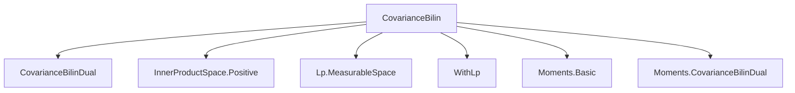
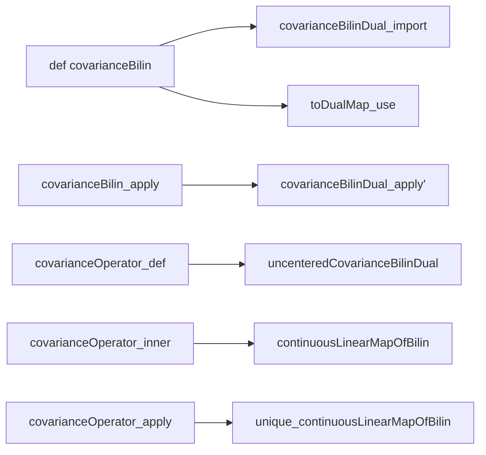

### Technical Brief: `CovarianceBilin.lean`

---

#### **1. Key Definitions & Theorems**

| Name | Type / Signature | Purpose |
|------|------------------|---------|
| `covarianceBilin μ` | `E →L[ℝ] E →L[ℝ] ℝ` | Continuous bilinear form representing covariance of a measure `μ` on a Hilbert space `E`, via duality with `covarianceBilinDual`. |
| `covarianceBilinDual μ` | *(imported)* `StrongDual ℝ E →L[ℝ] StrongDual ℝ E →L[ℝ] ℝ` | Covariance bilinear form on the strong dual; used as the base for `covarianceBilin`. |
| `covarianceOperator μ` | `E →L[ℝ] E` | Bounded linear operator representing the Riesz representative of the *uncentered* covariance bilinear form: $ \langle \text{covarianceOperator}\ \mu\ x, y \rangle = \int \langle x, z \rangle \langle y, z \rangle \, d\mu(z) $. |
| `covarianceBilin_eq_covarianceBilinDual` | `covarianceBilin μ x y = covarianceBilinDual μ (toDualMap x) (toDualMap y)` | Connects `covarianceBilin` to `covarianceBilinDual` via the Riesz map `toDualMap`. |
| `covarianceBilin_apply` | `covarianceBilin μ x y = ∫ z, ⟨x, z - μ[id]⟩ * ⟨y, z - μ[id]⟩ ∂μ` | Explicit integral formula for centered covariance (under integrability). |
| `covarianceBilin_apply_eq_cov` | `covarianceBilin μ x y = cov[λ u ↦ ⟨x, u⟩, λ u ↦ ⟨y, u⟩; μ]` | Identifies `covarianceBilin` with classical scalar-valued covariance of linear functionals. |
| `covarianceBilin_self` | `covarianceBilin μ x x = Var[λ u ↦ ⟨x, u⟩; μ]` | Diagonal of `covarianceBilin` equals variance of the linear functional. |
| `covarianceBilin_comm` | `covarianceBilin μ x y = covarianceBilin μ y x` | Symmetry of covariance bilinear form. |
| `covarianceBilin_real` | `covarianceBilin μ x y = x * y * Var[id; μ]` | Specialization to `E = ℝ`. |
| `covarianceBilin_map` | `covarianceBilin (μ.map L) u v = covarianceBilin μ (L.adjoint u) (L.adjoint v)` | Functoriality under pushforward by bounded linear maps. |
| `covarianceBilin_map_const_add` | `covarianceBilin (μ.map (c + ·)) = covarianceBilin μ` | Invariance under translation. |
| `covarianceBilin_apply_basisFun` | `covarianceBilin (μ.map (toLp 2 (X ·))) (basisFun i) (basisFun j) = cov[X i, X j; μ]` | Covariance bilinear form on coordinate basis corresponds to covariance of random variables. |
| `covarianceOperator_inner` | `⟨covarianceOperator μ x, y⟩ = ∫ ⟨x, z⟩ ⟨y, z⟩ ∂μ` | Defining property of the covariance operator (uncentered). |
| `covarianceOperator_apply` | `covarianceOperator μ x = ∫ ⟨x, y⟩ • y ∂μ` | Integral representation of the operator. |
| `isPosSemidef_covarianceBilin` | `(covarianceBilin μ).toBilinForm.IsPosSemidef` | Positivity semidefiniteness of the bilinear form. |
| `isPositive_covarianceOperator` | `(covarianceOperator μ).toLinearMap.IsPositive` | Positivity of the operator. |

---

#### **2. Naming Conventions**

- **Prefixes**:
  - `covarianceBilin*`: for bilinear forms (centered or dual-based).
  - `covarianceOperator*`: for the associated bounded operator.
  - `uncenteredCovarianceBilinDual*`: imported from `CovarianceBilinDual`, used for the *uncentered* version.
- **Suffixes**:
  - `_eq_*`: equational lemmas linking definitions.
  - `_apply`: formulas for application on elements.
  - `_self`: diagonal case (variance).
  - `_map`: behavior under pushforward.
  - `_real`: specialization to `ℝ`.
  - `_basisFun`, `_pi`: coordinate-wise behavior in finite-dimensional settings.
- **`toDualMap`**: Riesz representation map `E → StrongDual ℝ E`.
- **`toLp`**: embedding into $L^2$ space (used in finite-dimensional constructions).

---

#### **3. Tactic Stack**

Frequent tactics used:
- `simp`, `simp_rw`, `ext`, `congr`
- `rw`, `refine`, `convert`
- `fun_prop`, `measurable` (for measurability/integrability goals)
- ` positivity`, `ring`, `field_simp`
- `exact`, `apply`, `have`, `by_cases`
- `integral_map`, `integral_add`, `integral_smul`, `integral_inner` (analysis lemmas)
- `unique_continuousLinearMapOfBilin` (uniqueness for Riesz representation)

---

#### **4. Proof Logic**

- **Structure**: Most proofs follow a pattern:
  1. Reduce to known results via `covarianceBilin_eq_covarianceBilinDual`.
  2. Use `covarianceBilinDual_*` lemmas (from imported file).
  3. Apply integral identities (`integral_map`, `integral_inner`, etc.).
  4. Use Riesz representation (`toDualMap`, `continuousLinearMapOfBilin`) to lift bilinear forms to operators.
- **Induction/Case Analysis**:
  - `by_cases h : MemLp id 2 μ` is common to split on integrability.
  - For finite-dimensional cases (`ι : Type* [Fintype ι]`), use basis expansions and `sum_repr'`.
- **Uniqueness arguments**:
  - `unique_continuousLinearMapOfBilin` used to identify operators via inner product equality.

---

#### **5. Imports & Dependencies**

| Module | Role |
|--------|------|
| `Mathlib.Analysis.InnerProductSpace.Positive` | Positivity and inner product geometry. |
| `Mathlib.Analysis.Normed.Lp.MeasurableSpace` | Measurability in $L^p$ spaces. |
| `Mathlib.MeasureTheory.SpecificCodomains.WithLp` | Codomain restrictions for $L^p$ embeddings. |
| `Mathlib.Probability.Moments.Basic` | Moments, expectations, variance. |
| `Mathlib.Probability.Moments.CovarianceBilinDual` | Dual-space covariance bilinear form (base for `covarianceBilin`). |

---

#### **6. Mermaid Diagrams**

##### **Dependency Graph (Module-Level)**



##### **Conceptual Overview (Theory Flow)**

```mermaid
flowchart LR
  A[Measure μ on Hilbert space E] --> B[StrongDual Dual space]
  B --> C[CovarianceBilinDual μ]
  C --> D[CovarianceBilin μ via toDualMap]
  D --> E[Symmetric, PosSemidef Bilinear Form]
  D --> F[CovarianceOperator μ via Riesz]
  F --> G[Positive Bounded Operator]
  E --> H[Var, Cov of linear functionals]
  G --> I[Integral representation ∫⟨x,z⟩z dμ]
  H --> J[Finite-dim: cov[Xi,Xj] via basisFun]
```

##### **Key Logical Dependencies**



---

#### **7. Summary**

This file formalizes **covariance in Hilbert spaces** using two complementary perspectives:
- As a **continuous symmetric bilinear form** (`covarianceBilin`), centered and derived from the dual-space version.
- As a **bounded positive operator** (`covarianceOperator`), representing the Riesz dual of the *uncentered* bilinear form.

It bridges abstract functional-analytic constructions with concrete probabilistic quantities (variance, covariance of random variables), and validates key properties: symmetry, positivity, functoriality under linear maps, translation invariance, and finite-dimensional coordinate expressions.

The formalization is highly modular, relying on `CovarianceBilinDual` and standard measure-theoretic infrastructure in Mathlib.
