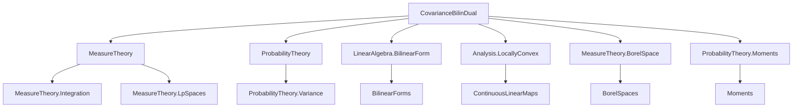
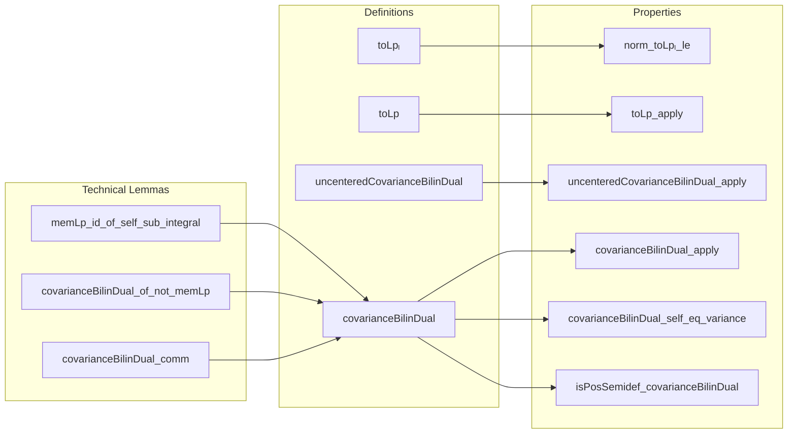

### Technical Brief: `CovarianceBilinDual.lean`

---

#### **1. Key Definitions & Theorems**

| Name | Type / Signature | Purpose |
|------|------------------|---------|
| `StrongDual.toLpₗ μ p` | `StrongDual 𝕜 E →ₗ[𝕜] Lp 𝕜 p μ` | Linear map from strong dual to $L^p$, defined as `MemLp.toLp` if `MemLp id p μ`, else 0. |
| `StrongDual.toLp μ p` | `StrongDual 𝕜 E →L[𝕜] Lp 𝕜 p μ` | Continuous version of `toLpₗ`, requires `1 ≤ p`. |
| `uncenteredCovarianceBilinDual μ` | `StrongDual ℝ E →L[ℝ] StrongDual ℝ E →L[ℝ] ℝ` | Continuous bilinear form: $(L_1, L_2) \mapsto \int x, L_1 x \cdot L_2 x \, d\mu$. Not centered. |
| `covarianceBilinDual μ` | `StrongDual ℝ E →L[ℝ] StrongDual ℝ E →L[ℝ] ℝ` | Covariance bilinear form: $(L_1, L_2) \mapsto \int x, (L_1 x - \mu[L_1]) (L_2 x - \mu[L_2]) \, d\mu$, defined via pushforward by $x \mapsto x - \int x \, d\mu$. |
| `covarianceBilinDual_apply` | `h : MemLp id 2 μ ⇒ covarianceBilinDual μ L₁ L₂ = ∫ x, (L₁ x - μ[L₁]) * (L₂ x - μ[L₂]) ∂μ` | Explicit formula for covariance when second moment exists. |
| `covarianceBilinDual_self_eq_variance` | `h : MemLp id 2 μ ⇒ covarianceBilinDual μ L L = Var[L; μ]` | Covariance of a functional with itself equals its variance. |
| `isPosSemidef_covarianceBilinDual` | `IsPosSemidef (covarianceBilinDual μ).toBilinForm` | Covariance bilinear form is positive semidefinite. |

---

#### **2. Naming Conventions**

- **Prefixes**:
  - `toLpₗ`, `toLp`: linear / continuous linear maps into $L^p$.
  - `uncenteredCovarianceBilinDual`, `covarianceBilinDual`: bilinear forms; "uncentered" vs "centered".
  - `norm_..._le`: norm bounds.
  - `of_not_memLp`: behavior when integrability fails.
- **Suffixes**:
  - `_dual`: refers to dual space objects (`StrongDual`).
  - `_apply`: evaluation formula.
  - `_self_...`: diagonal case $L_1 = L_2$.
- **Variables**:
  - `μ`: measure.
  - `L`, `L₁`, `L₂`: elements of `StrongDual`.
  - `h`, `h_Lp`: integrability hypotheses (`MemLp id p μ` or variants).
  - `h_not`: negated integrability.

---

#### **3. Tactic Stack**

Frequent tactics used:
- `simp`, `simp only`, `simp_rw`: simplification with lemmas and rewrite rules.
- `rw`: rewriting using equalities (especially integral identities).
- `gcongr`: for monotonicity in inequalities.
- `lintegral_mono`, `integral_mono_ae`, `ae_of_all`: measure-theoretic monotonicity.
- `push_cast`: casting between types (e.g., `ℝ≥0∞` to `ℝ`).
- `by_cases`, `swap`: case analysis on `MemLp` or its negation.
- `exact`, `refine`, `apply`: constructing proofs.
- `ring`, `abel_nf`: algebraic simplifications.
- ` positivity`: for nonnegativity goals.
- `ext`: extensionality for functions/bilinear maps.
- `filter_upwards`: for almost-everywhere arguments.

---

#### **4. Proof Logic**

- **Structure**:
  - Most proofs proceed by **case analysis** on whether `MemLp id p μ` holds.
    - If yes: use `toLp_apply`, `covarianceBilinDual_apply`, etc.
    - If no: use `toLp_of_not_memLp`, `covarianceBilinDual_of_not_memLp`, etc.
- **Measure-theoretic arguments**:
  - Use of `integral_map`, `lintegral_const_mul`, `norm_integral_le_integral_norm`.
  - Control of norms via `le_opNorm`, `essSup_mono_ae`.
- **Algebraic manipulations**:
  - Use of `mul_comm`, `mul_assoc`, `rpow_add`, `rpow_mul`.
- **Functional-analytic arguments**:
  - Continuity via `continuous_of_locally_bounded`.
  - Positive semidefiniteness via `real_inner_self_nonneg`.
- **Key lemma**: `memLp_id_of_self_sub_integral` shows integrability of identity follows from integrability of centered identity — crucial for consistency of definitions.

---

#### **5. Imports & Dependencies**

| Module | Role |
|--------|------|
| `Mathlib.Analysis.LocallyConvex.ContinuousOfBounded` | For continuity criteria of linear maps. |
| `Mathlib.LinearAlgebra.BilinearForm.Properties` | For bilinear forms, `IsPosSemidef`, etc. |
| `Mathlib.MeasureTheory.Constructions.BorelSpace.ContinuousLinearMap` | For measurable structure and Borel spaces. |
| `Mathlib.Probability.Moments.Variance` | For variance and covariance definitions. |

Also uses:
- `MeasureTheory`, `ProbabilityTheory`, `Complex`, `NormedSpace`.
- `ENNReal`, `NNReal`, `Real`, `Topological` scopes.

---

#### **6. Mermaid Diagrams**

##### **Dependency Graph (High-Level)**

##### **Overview of File Structure**

---

#### **7. Summary**

This file formalizes **covariance as a continuous bilinear form on the strong dual** of a Banach space, generalizing classical covariance to infinite-dimensional settings. It carefully handles integrability conditions via `MemLp`, defines both centered and uncentered versions, and proves key properties (symmetry, positive semidefiniteness, relation to variance). The formalization is robust, with explicit junk-value semantics when integrability fails, and leverages Lean’s `Lp` theory and measure-theoretic tools extensively.

--- 

Let me know if you'd like a **dependency graph of definitions** or a **proof outline for `covarianceBilinDual_apply`**.
