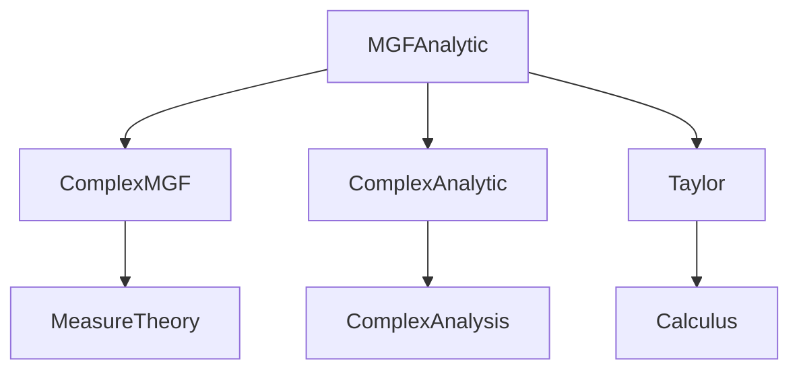
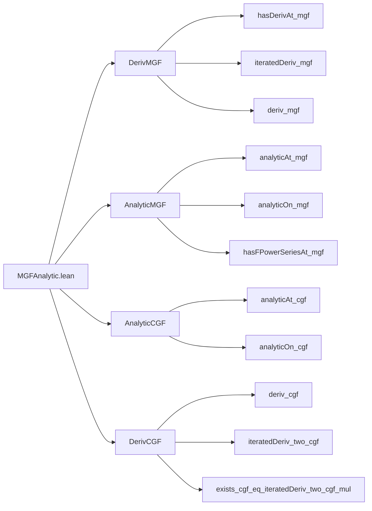

### Technical Brief: `MGFAnalytic.lean`

---

#### **1. Key Definitions & Theorems**

| Name | Type / Signature | Purpose |
|------|------------------|---------|
| `mgf X μ` | `ℝ → ℝ` (defined as `t ↦ ∫ ω, exp (t * X ω) ∂μ`) | Moment-generating function of random variable `X` w.r.t. measure `μ`. |
| `cgf X μ` | `ℝ → ℝ` (`t ↦ log (mgf X μ t)`) | Cumulant-generating function. |
| `integrableExpSet X μ` | `Set ℝ` | Set of `t ∈ ℝ` such that `exp (t * X)` is integrable w.r.t. `μ`. |
| `hasDerivAt_integral_pow_mul_exp_real` | `t ∈ interior (integrableExpSet X μ) → ℕ → Prop` | Derivative of `t ↦ μ[Xⁿ * exp(t * X)]` is `μ[Xⁿ⁺¹ * exp(t * X)]`. |
| `hasDerivAt_mgf` | `t ∈ interior (integrableExpSet X μ) → HasDerivAt (mgf X μ) (μ[X * exp(t * X)]) t` | First derivative of `mgf`. |
| `iteratedDeriv_mgf` | `t ∈ interior (integrableExpSet X μ) → ℕ → iteratedDeriv n (mgf X μ) t = μ[Xⁿ * exp(t * X)]` | n-th derivative of `mgf`. |
| `analyticAt_mgf` | `t ∈ interior (integrableExpSet X μ) → AnalyticAt ℝ (mgf X μ) t` | `mgf` is analytic at each interior point. |
| `analyticOn_mgf` | `AnalyticOn ℝ (mgf X μ) (interior (integrableExpSet X μ))` | `mgf` is analytic on the interior of its domain. |
| `analyticAt_cgf` | `v ∈ interior (integrableExpSet X μ) → AnalyticAt ℝ (cgf X μ) v` | `cgf` is analytic on interior of domain. |
| `analyticOn_cgf` | `AnalyticOn ℝ (cgf X μ) (interior (integrableExpSet X μ))` | `cgf` analytic on interior. |
| `deriv_cgf` | `v ∈ interior (integrableExpSet X μ) → deriv (cgf X μ) v = μ[X * exp(v * X)] / mgf X μ v` | First derivative of `cgf`. |
| `iteratedDeriv_two_cgf` | `v ∈ interior (integrableExpSet X μ) → iteratedDeriv 2 (cgf X μ) v = μ[X² * exp(v * X)] / mgf - (deriv cgf)²` | Second derivative of `cgf`. |
| `iteratedDeriv_two_cgf_eq_integral` | Same premise, expresses second derivative as variance-like expectation. | Connects CGF curvature to conditional variance. |
| `exists_cgf_eq_iteratedDeriv_two_cgf_mul` | Taylor’s theorem with Lagrange remainder for `cgf`. | Used in concentration inequalities (e.g., sub-Gaussian bounds). |

---

#### **2. Naming Conventions**

- **Prefixes**:
  - `hasDerivAt_`: asserts existence of derivative at a point.
  - `deriv_`: gives explicit derivative value (uses `hasDerivAt` + uniqueness).
  - `iteratedDeriv_`: n-th derivative.
  - `analyticAt_`, `analyticOn_`, `analyticOnNhd_`: analyticity at point / on set / on neighborhood.
  - `differentiableAt_`, `differentiableOn_`: differentiability.
  - `continuousOn_`, `continuous_`: continuity.
  - `hasFPowerSeriesAt_`: formal power series representation.

- **Suffixes**:
  - `_real`: indicates real-valued version of a complex-analytic statement.
  - `_zero`: specialization at `t = 0`.
  - `_mgf`, `_cgf`: distinguishes between mgf and cgf results.

- **Pattern**:
  - `μ[fun ω ↦ ...]` for integrals (using `MeasureTheory.integral` notation).
  - `X ω ^ n`, `exp (t * X ω)` for standard expressions.

---

#### **3. Tactic Stack**

| Tactic | Usage Frequency | Purpose |
|--------|-----------------|---------|
| `rw` | Very High | Rewriting definitions, lemmas, and equalities. |
| `simp` / `simp_rw` | Very High | Simplification using definitional equalities and lemmas. |
| `exact` / `convert` | High | Finishing proofs or aligning goals with known lemmas. |
| `induction` | Medium | Structural induction on `n` for iterated derivatives. |
| `have` / `suffices` | High | Introducing intermediate claims. |
| `filter_upwards` | Medium | Handling filter-based eventual equalities. |
| `ring` | Medium | Algebraic simplification of polynomial expressions. |
| `norm_cast` | Low | Managing coercions between `ℝ` and `ℂ`. |
| `congr` | Medium | Congruence reasoning (e.g., for integrals, equalities under λ-abstraction). |
| `convert_using` / `nth_rw` | Low | Advanced term manipulation (e.g., Taylor’s theorem). |
| `by_cases` | Medium | Splitting on `μ = 0` or other dichotomies. |

---

#### **4. Proof Logic**

- **Inductive structure** for iterated derivatives:
  - Base case (`n = 0`) uses definition of `mgf`.
  - Inductive step uses `hasDerivAt_iteratedDeriv_mgf`, which itself is proven by induction and relies on `hasDerivAt_integral_pow_mul_exp_real`.

- **Analyticity proofs**:
  - Reduce to complex MGF analyticity (`analyticAt_complexMGF`) via real part extraction (`re_ofReal`).
  - For `cgf`, use `log` of analytic, non-vanishing function (`mgf_pos'` ensures positivity).

- **Derivative computations**:
  - Use dominated convergence / differentiation under integral sign implicitly via `hasDerivAt_integral_pow_mul_exp` (from `ComplexMGF`).
  - For `cgf`, apply chain rule (`deriv.log`) and quotient rule (`deriv_fun_div`).

- **Taylor remainder**:
  - Uses `taylor_mean_remainder_lagrange_iteratedDeriv`, requiring `contDiffOn` (from `analyticOn_cgf`) and `UniqueDiffOn` on intervals.

- **Measure-zero case**:
  - Often handled separately via `by_cases hμ : μ = 0`, simplifying to constants.

---

#### **5. Imports & Dependencies**

| Module | Role |
|--------|------|
| `Mathlib.Probability.Moments.ComplexMGF` | Defines complex MGF, its analyticity, and derivative formulas. |
| `Mathlib.Analysis.SpecialFunctions.Complex.Analytic` | General analytic function theory (e.g., `analyticAt`, `analyticOn`). |
| `Mathlib.Analysis.Calculus.Taylor` | Taylor’s theorem with Lagrange remainder. |

**Key underlying theories**:
- Measure theory (`MeasureTheory`)
- Real and complex analysis (`Analysis`)
- Probability theory (`ProbabilityTheory`)
- Differential calculus (`Calculus`)

---

#### **6. Mermaid Diagrams**

##### **Dependency Graph (Module-Level)**



##### **Overview of File Structure**



##### **Logical Flow (High-Level)**

```mermaid
flowchart TD
  Start[Start: t ∈ interior(integrableExpSet)] --> Deriv[Derivative of integral]
  Deriv --> IteratedDeriv[Iterated derivatives via induction]
  IteratedDeriv --> Analytic[Analyticity via complex MGF]
  Analytic --> CGF[CGF = log(MGF), analytic via log rule]
  CGF --> DerivCGF[Deriv of CGF via chain rule]
  DerivCGF --> Taylor[Taylor expansion with remainder]
  Taylor --> Applications[Applications: concentration, CLT, etc.]
```

---

#### **7. Summary**

This file formalizes foundational analytic properties of the **moment-generating function (MGF)** and **cumulant-generating function (CGF)** in Lean 4. It establishes:

- Explicit formulas for all derivatives of `mgf` and `cgf`.
- Analyticity of both functions on the interior of their domain.
- A Taylor expansion with Lagrange remainder for `cgf`, crucial for probabilistic inequalities.

The proofs rely heavily on:
- Differentiation under the integral sign (via `ComplexMGF`).
- Complex-analytic tools (real part extraction, log of analytic functions).
- Measure-theoretic integrability conditions (`integrableExpSet`).

The structure is modular, with clear separation between derivative computations, analyticity, and applications (e.g., Taylor’s theorem). The `by_cases μ = 0` pattern ensures robustness for degenerate measures.

--- 

Let me know if you'd like a formalized dependency graph (e.g., for `leanproject`), or a summary of how this fits into a larger project (e.g., large deviations, CLT).
