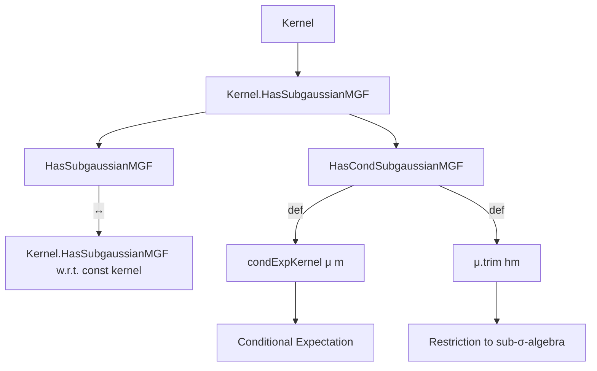
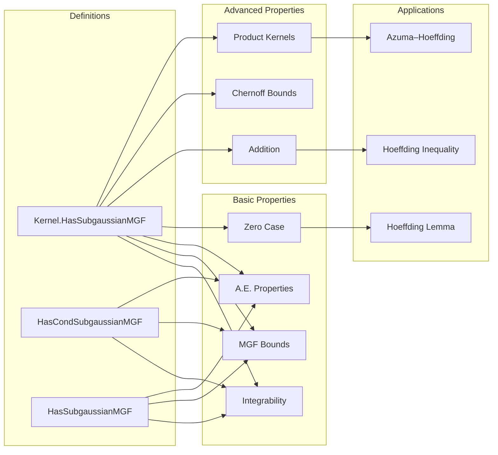

### Technical Brief: `SubGaussian.lean`

---

#### **1. Key Definitions & Theorems**

| Name | Type | Purpose |
|------|------|---------|
| `Kernel.HasSubgaussianMGF` | `structure` | Defines sub-Gaussian mgf w.r.t. a kernel `κ` and measure `ν`. Ensures mgf bounded by `exp(c * t² / 2)` a.e. and integrability of `exp(t * X)` under `κ ∘ₘ ν`. |
| `HasCondSubgaussianMGF` | `def` | Conditional sub-Gaussian mgf: `Kernel.HasSubgaussianMGF` w.r.t. `condExpKernel μ m` and `μ.trim hm`. Captures mgf bounded a.s. by `exp(c * t² / 2)` conditionally on `m`. |
| `HasSubgaussianMGF` | `structure` | Standard sub-Gaussian mgf w.r.t. a measure `μ`. Equivalent to `Kernel.HasSubgaussianMGF` with constant kernel. |
| `Kernel.HasSubgaussianMGF.congr` | `lemma` | Sub-Gaussian property is invariant under `κ ∘ₘ ν`-a.e. equality. |
| `Kernel.HasSubgaussianMGF.add` | `lemma` | Sum of independent (or just jointly measurable) sub-Gaussians is sub-Gaussian with parameter `(√c₁ + √c₂)²`. |
| `Kernel.HasSubgaussianMGF.add_compProd` | `lemma` | Generalization of `add` to product kernels. |
| `Kernel.HasSubgaussianMGF.measure_ge_le` | `lemma` | Chernoff bound: tail probability bounded by `exp(-ε² / (2c))`. |
| `Kernel.HasSubgaussianMGF.ae_eq_zero_of_hasSubgaussianMGF_zero` | `lemma` | If `c = 0`, then `X = 0` a.e. under `κ ω'` for `ν`-a.e. `ω'`. |
| `HasSubgaussianMGF_iff_kernel` | `lemma` | Equivalence between `HasSubgaussianMGF` and `Kernel.HasSubgaussianMGF` w.r.t. constant kernel. |
| `measure_sum_ge_le_of_iIndepFun` | *TODO* | Hoeffding inequality for sums of *independent* sub-Gaussian RVs. |
| `hasSubgaussianMGF_of_mem_Icc_of_integral_eq_zero` | *TODO* | Hoeffding’s lemma: bounded zero-mean RVs are sub-Gaussian. |
| `measure_sum_ge_le_of_HasCondSubgaussianMGF` | *TODO* | Azuma–Hoeffding inequality for conditionally sub-Gaussian RVs. |

---

#### **2. Naming Conventions**

- **Prefixes**:
  - `hasSubgaussianMGF`: for properties of `HasSubgaussianMGF`.
  - `ae_`: for almost-everywhere statements.
  - `mgf_`, `cgf_`: moment-generating / cumulant-generating functions.
  - `integrable_`, `memLp_`: integrability / $L^p$-membership.
  - `measure_`: tail bounds / measure estimates.
- **Suffixes**:
  - `_le`: upper bounds (e.g., `mgf_le`, `cgf_le`).
  - `_ge`: lower bounds (e.g., `measure_ge_le`).
  - `_compProd`, `_comp`: for product-kernel constructions.
  - `_of_`: derived from assumptions (e.g., `ae_eq_zero_of_hasSubgaussianMGF_zero`).
- **Structure/Def names**:
  - `Has*MGF`: property of a random variable.
  - `Kernel.Has*MGF`: same, relative to a kernel.

---

#### **3. Tactic Stack**

| Tactic | Usage |
|--------|-------|
| `simp_rw` | Rewriting with definitional equalities (e.g., `mgf`, `exp_mul`). |
| `filter_upwards` | Handling almost-everywhere quantifiers. |
| `gcongr` | Monotonicity of `exp`, `log`, integrals. |
| `field_simp`, `linear_combination` | Algebraic simplifications in inequalities. |
| `rw`, `convert`, `ext` | Equality proofs, especially for functions/sets. |
| `aesop`, `norm_cast`, `linarith` | Routine automation (used sparingly, per style). |
| `exact`, `refine`, `apply` | Direct proof steps. |
| `have`, `suffices` | Intermediate claims. |
| `by_cases` | Splitting on zero/non-zero parameters (e.g., `c = 0`). |
| `rw [← ...]` | Changing measure representations (e.g., `condExpKernel_comp_trim`). |

---

#### **4. Proof Logic**

- **Structure**: Most proofs follow a *two-step* pattern:
  1. **Integrability**: Show `exp(t * X)` is integrable under the relevant measure (often via `MemLp` or `integrable_mul`).
  2. **MGF Bound**: Prove `mgf ≤ exp(c * t² / 2)` a.e., usually via:
     - Pointwise bounds (`mgf_le` hypothesis),
     - Hölder / Young inequalities (e.g., in `add` lemma),
     - Optimization (e.g., minimizing `exp(-tε + ct²/2)` over `t ≥ 0` in `measure_ge_le`).
- **Induction / Approximation**:
  - Rational approximation (`of_rat`) extends bounds from `ℚ` to `ℝ`.
  - Countable unions (e.g., `{0 < X} = ⋃_{q > 0} {q ≤ X}`) for null-set arguments.
- **Kernel Calculus**:
  - Use of `map`, `compProd`, `prodMkLeft`, `condExpKernel` to lift properties across measurable spaces.
  - Key identity: `condExpKernel μ m ∘ₘ μ.trim hm = μ`.

---

#### **5. Imports**

| Module | Role |
|--------|------|
| `Mathlib.Probability.Kernel.Condexp` | Conditional expectation kernels (`condExpKernel`), trimming measures. |
| `Mathlib.Probability.Moments.MGFAnalytic` | Analytic properties of mgf, integrability, $L^p$-bounds. |
| `Mathlib.Probability.Moments.Tilted` | Tilted measures, used in mgf analysis. |

---

#### **6. Mermaid Diagrams**

##### **Dependency Graph (Core Concepts)**

##### **Overview of File Structure**

---

#### **7. Summary**

This file formalizes a *kernel-based* approach to sub-Gaussian random variables, unifying unconditional, conditional, and kernel-relative notions under `Kernel.HasSubgaussianMGF`. It emphasizes:
- **Integrability-first** definitions (stronger than a.e. integrability),
- **Chernoff method** as the central proof technique,
- **Closure under addition** with explicit constant tracking (`(√c₁ + √c₂)²`),
- **Equivalence** of definitions via `HasSubgaussianMGF_iff_kernel`.

The structure is designed to support future concentration inequalities (`Hoeffding`, `Azuma–Hoeffding`, etc.), with `HasCondSubgaussianMGF` enabling martingale analogues.

--- 

*End of Technical Brief.*
