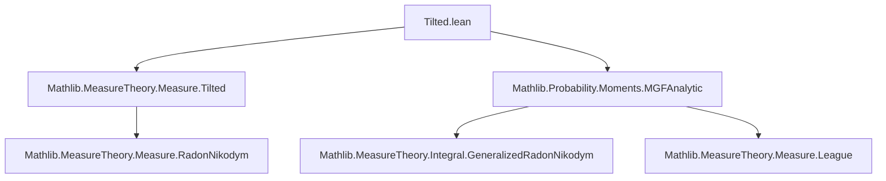
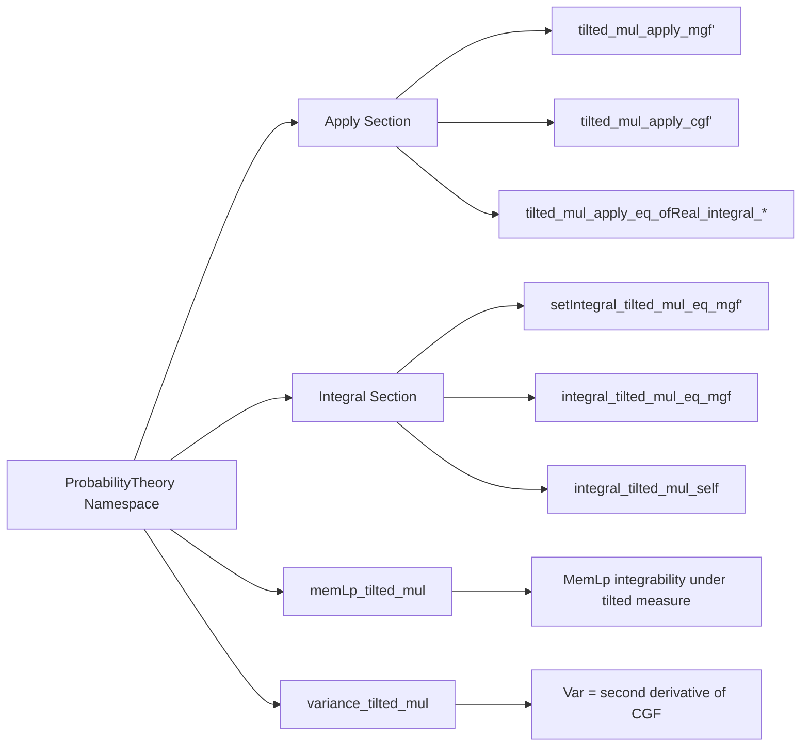

### Technical Brief: `Tilted.lean`

---

#### **1. Key Definitions & Theorems**

| Name | Type / Signature | Purpose |
|------|------------------|---------|
| `tilted` | `Measure Ω → (Ω → ℝ) → Measure Ω` | Constructs a *tilted measure* via Radon–Nikodym derivative `exp(t * X)`. |
| `mgf` | `X : Ω → ℝ → μ : Measure Ω → ℝ≥0∞` | Moment-generating function: $M_X^\mu(t) = \int \exp(t X)\,d\mu$. |
| `cgf` | `X : Ω → ℝ → μ : Measure Ω → ℝ` | Cumulant-generating function: $K_X^\mu(t) = \log M_X^\mu(t)$. |
| `integral_tilted_mul_self` | `(t ∈ interior (integrableExpSet X μ)) → (μ.tilted (t * X ·))[X] = deriv (cgf X μ) t` | First moment under tilted measure = first derivative of CGF. |
| `variance_tilted_mul` | `(t ∈ interior (integrableExpSet X μ)) → Var[X; μ.tilted (t * X ·)] = iteratedDeriv 2 (cgf X μ) t` | Variance under tilted measure = second derivative of CGF. |
| `memLp_tilted_mul` | `(t ∈ interior (integrableExpSet X μ)) → p ≥ 0 → MemLp X p (μ.tilted (t * X ·))` | Ensures $X \in L^p$ under tilted measure for $p \ge 0$. |

---

#### **2. Naming Conventions**

- **Prefixes**:
  - `tilted_`: Relates to properties of `tilted` measures.
  - `mgf` / `cgf`: Used in lemmas linking tilted measures to MGF/CGF.
  - `integral_`, `setIntegral_`: For integrals w.r.t. tilted measures.
- **Suffixes**:
  - `'`: Variant assuming only `MeasurableSet s`, no `SFinite`.
  - No `'`: Variant assuming `SFinite μ`.
- **Structure**:
  - `tilted_mul_apply_*`: Expression for measure of a set under tilted measure.
  - `setIntegral_tilted_mul_*`: Expression for integral over a set.
  - `integral_tilted_mul_*`: Full integral (no set restriction).
  - `*_eq_mgf_*`, `*_eq_cgf_*`: Distinguishes whether MGF or CGF normalization is used.

---

#### **3. Tactic Stack**

- `rw [...]`: Rewriting using definitions (`tilted_apply`, `mgf`, `cgf`, `exp_sub`, etc.).
- `simp`, `simp_rw [...]`: Simplification with rewrite rules, especially for `ENNReal.ofReal`, `exp`, division.
- `rcases eq_zero_or_neZero μ with rfl | hμ`: Case split on whether the measure is zero.
- `rwa [...]`: Rewrite and then apply a lemma (e.g., `exp_cgf`).
- `congr with ω`: Congruence proof by pointwise equality.
- `ring`: Simplify algebraic expressions (e.g., $t X - \log M = t X - K$).
- `exact`, `refine`, `swap`: For structured proof construction.
- `have`, `by_cases`: Local assumptions and case splits.

---

#### **4. Proof Logic**

- **Structure**:
  - Most proofs follow a *two-step normalization* pattern:
    1. Express tilted measure density via MGF: $\frac{e^{tX}}{M_X(t)}$.
    2. Replace $M_X(t)$ with $\exp(K_X(t))$ using `exp_cgf`, yielding density $e^{tX - K_X(t)}$.
  - For derivative identities (`integral_tilted_mul_self`, `variance_tilted_mul`):
    - Use known derivative formulas for CGF (`deriv_cgf`, `iteratedDeriv_two_cgf_eq_integral`).
    - Replace integrals w.r.t. tilted measure using `integral_tilted_mul_eq_mgf` or `eq_cgf`.
    - Reduce to algebraic simplifications (`ring`).
- **Technical conditions**:
  - `t ∈ interior (integrableExpSet X μ)` ensures differentiability of CGF and integrability of exponentials.
  - `SFinite μ` or `MeasurableSet s` assumptions distinguish between general and restricted cases.

---

#### **5. Imports**

- `Mathlib.MeasureTheory.Measure.Tilted`: Core theory of tilted measures.
- `Mathlib.Probability.Moments.MGFAnalytic`: Definitions and properties of MGF/CGF, including differentiability on interior of domain.

---

#### **6. Mermaid Diagrams**

##### **Dependency Graph (Module-Level)**

##### **Overview of File Structure**

---

#### **7. Summary**

This file formalizes the foundational link between *tilted measures* and *cumulant-generating functions*. It shows how expectations and variances under tilted measures correspond to derivatives of the CGF — a key result in large deviations theory and exponential families. The proofs rely on careful manipulation of densities, exponential identities, and integrability conditions encoded via `integrableExpSet`. The structure reflects Lean’s modular style: reusable lemmas (`*_eq_mgf`, `*_eq_cgf`) feed into main theorems (`integral_tilted_mul_self`, `variance_tilted_mul`).
