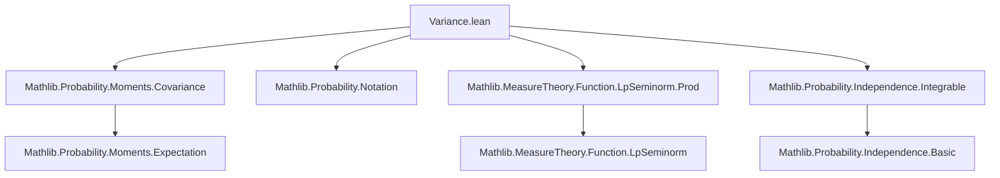
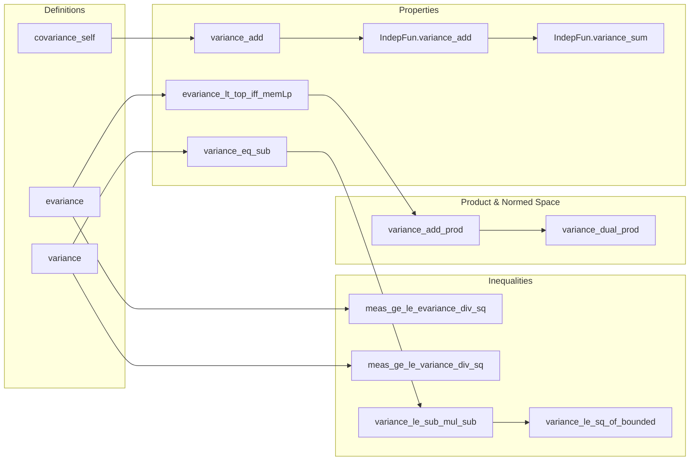

### Technical Brief: `Variance.lean`

---

#### **1. Key Definitions & Theorems**

| Name | Type / Signature | Purpose |
|------|------------------|---------|
| `evariance` | `Ω → ℝ → Measure Ω → ℝ≥0∞` | Extended non-negative real-valued variance: $ \int \|X - \mathbb{E}[X]\|^2 \, d\mu $ |
| `variance` | `Ω → ℝ → Measure Ω → ℝ` | Real-valued variance: $ \text{ENNReal.toReal}(\text{evariance}) $; set to 0 if infinite |
| `covariance_self` | `cov[X, X; μ] = Var[X; μ]` | Variance as a special case of covariance |
| `evariance_lt_top_iff_memLp` | `evariance X μ < ∞ ↔ MemLp X 2 μ` | Characterizes finiteness of variance via $L^2$ integrability |
| `variance_eq_sub` | `Var[X; μ] = μ[X^2] - μ[X]^2` | Classical formula for variance under finite measure (probability) |
| `variance_add` | `Var[X + Y] = Var[X] + 2·cov[X,Y] + Var[Y]` | Variance of sum in terms of covariance |
| `IndepFun.variance_add` | `X ⟂ᵢ Y ⇒ Var[X+Y] = Var[X] + Var[Y]` | Additivity of variance for independent r.v.s |
| `IndepFun.variance_sum` | Pairwise independence ⇒ variance of sum = sum of variances | Generalization to finite sums |
| `meas_ge_le_evariance_div_sq` | Chebyshev (extended real version) | $ \mu\{c ≤ |X - \mathbb{E}[X]|\} ≤ \text{eVar}[X]/c^2 $ |
| `meas_ge_le_variance_div_sq` | Chebyshev (real-valued version) | Same, assuming $X ∈ L^2$ |
| `variance_le_sub_mul_sub` | Bhatia–Davis inequality | $ \text{Var}[X] ≤ (b - \mathbb{E}X)(\mathbb{E}X - a) $ if $a ≤ X ≤ b$ a.e. |
| `variance_le_sq_of_bounded` | Popoviciu’s inequality | $ \text{Var}[X] ≤ ((b-a)/2)^2 $ under same boundedness |

---

#### **2. Naming Conventions**

- **Prefixes**:
  - `evariance`, `eVar[...]`: extended non-negative real-valued variance.
  - `variance`, `Var[...]`: real-valued variance.
  - `indepFun.`: for results about independent random variables.
- **Suffixes**:
  - `_congr`: congruence under almost-everywhere equality.
  - `_eq_zero_iff`: characterization of zero variance.
  - `_lt_top`, `_ne_top`, `_eq_top`: properties about finiteness.
  - `_mul`, `_const_mul`, `_smul`: behavior under scalar multiplication.
  - `_add`, `_sub`, `_sum`, `_sum'`: behavior under addition/subtraction/finite sums.
  - `_map`, `_comp`, `_prod`: behavior under pushforward, composition, product measures.
- **Notation scopes**:
  - `eVar[X; μ]`, `Var[X; μ]`, `eVar[X]`, `Var[X]` (default to volume measure).

---

#### **3. Tactic Stack**

Frequent tactics used:
- `simp`, `simp_rw`, `congr`, `ext`: simplification and extensionality.
- `rw`, `convert`, `apply`, `exact`: rewriting and proof construction.
- `by_cases`, `by_contra`, `contrapose!`: case analysis and contradiction.
- `filter_upwards`, `ae_of_all`, `ae_all_iff`: handling almost-everywhere statements.
- `ring`, `linarith`, `norm_num`: algebraic simplifications and linear arithmetic.
- `lintegral_congr_ae`, `integral_congr_ae`, `integral_map`, `integral_const_mul`: measure-theoretic lemmas.
- `fun_prop`, `aemeasurable`, `aestronglyMeasurable`: measurable function propagation.
- `memLp`, `memLp_const`, `memLp_finset_sum'`: $L^p$ membership reasoning.

---

#### **4. Proof Logic**

- **Structure**:
  - Most proofs follow a pattern: reduce to known lemmas (e.g., covariance, $L^p$ properties), then apply algebraic simplifications.
  - Many results are conditional on $X ∈ L^2(μ)$ or $X$ being a.e. bounded.
  - For independence results (`IndepFun.*`), they often reduce to `covariance_eq_zero` under independence.
  - Chebyshev inequalities use the general Markov inequality for $L^p$ norms (`meas_ge_le_mul_pow_eLpNorm_enorm`).
  - Bounded-variance inequalities (`variance_le_sub_mul_sub`, `variance_le_sq_of_bounded`) use integral estimates and ring simplifications.
  - Product measure results (`variance_add_prod`, `variance_dual_prod`) rely on independence of components under product measure and change-of-variable lemmas.

- **Induction**: Not used directly; finite sums handled via `Finset.sum_congr`, `Finset.sum_eq_single_of_mem`, etc.

---

#### **5. Imports & Dependencies**

| Import | Purpose |
|--------|---------|
| `Mathlib.Probability.Moments.Covariance` | Covariance definitions and basic properties |
| `Mathlib.Probability.Notation` | Standard probability notation (`𝔼`, `Var`, etc.) |
| `Mathlib.MeasureTheory.Function.LpSeminorm.Prod` | $L^p$ theory for product measures |
| `Mathlib.Probability.Independence.Integrable` | Independence and integrability interactions |

**Core theories involved**:
- Measure theory (integration, $L^p$ spaces, a.e. properties)
- Probability theory (expectation, independence, product measures)
- Real analysis (inequalities, boundedness, continuity)

---

#### **6. Mermaid Diagrams**

##### **Dependency Graph (Top-Level)**

##### **Overview of Theoretical Flow**

---

#### **7. Summary**

This module formalizes the theory of variance for real-valued random variables in the context of measure-theoretic probability. It provides:
- Two variants of variance (`evariance`, `variance`) to handle infinite cases robustly.
- Core algebraic identities (e.g., variance of sum, scalar multiplication).
- Fundamental inequalities (Chebyshev, Bhatia–Davis, Popoviciu).
- Additivity under independence (finite sums, product measures).
- Compatibility with product measures and dual spaces.

The formalization is clean, modular, and leverages Lean’s `MeasureTheory` and `ProbabilityTheory` locales for seamless integration with existing libraries.

--- 

Let me know if you'd like a dependency graph for specific sub-theories (e.g., Chebyshev or product variance).
