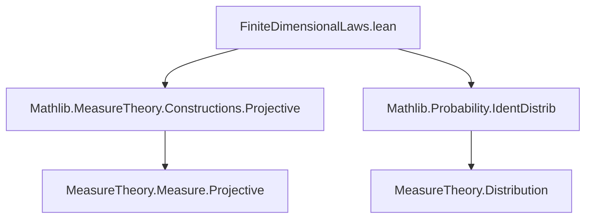

**Technical Brief: `FiniteDimensionalLaws.lean`**

---

### 1. **Key Definitions & Theorems**

| Name | Type / Signature | Purpose |
|------|------------------|---------|
| `isProjectiveMeasureFamily_map_restrict` | `IsProjectiveMeasureFamily (fun I ↦ P.map (fun ω ↦ I.restrict (X · ω)))` | Shows that finite-dimensional distributions form a *projective measure family*, assuming each coordinate $X_t$ is almost everywhere measurable. |
| `isProjectiveLimit_map` | `IsProjectiveLimit (P.map (fun ω ↦ (X · ω))) (fun I ↦ P.map (fun ω ↦ I.restrict (X · ω)))` | Establishes that the *law* (i.e., pushforward of $P$ by the full process) is the projective limit of its finite-dimensional distributions. |
| `map_eq_iff_forall_finset_map_restrict_eq` | `P.map X = P.map Y ↔ ∀ I, P.map (I.restrict ∘ X) = P.map (I.restrict ∘ Y)` | Core equivalence: two processes have the same law iff all finite-dimensional distributions coincide. |
| `identDistrib_iff_forall_finset_identDistrib` | `IdentDistrib X Y ↔ ∀ I, IdentDistrib (I.restrict ∘ X) (I.restrict ∘ Y)` | Same as above, but phrased in terms of *identically distributed* random variables (via `IdentDistrib`). |
| `map_restrict_eq_of_forall_ae_eq` | `∀ t, X t =ᵐ[P] Y t ⇒ ∀ I, P.map (I.restrict ∘ X) = P.map (I.restrict ∘ Y)` | If two processes are *modifications* (equal almost surely at each time), then all finite-dimensional distributions agree. |
| `map_eq_of_forall_ae_eq` | `∀ t, X t =ᵐ[P] Y t ⇒ P.map X = P.map Y` | If two processes are modifications, then they have the same law (full distribution). |

---

### 2. **Naming Conventions**

- **Prefixes**:
  - `map_`: pushforward of a measure under a measurable function.
  - `identDistrib_`: statements about equality in distribution (`IdentDistrib`).
  - `isProjective_`: properties of projective families/limits.
- **Suffixes**:
  - `_eq`: equality of measures or distributions.
  - `_aemeasurable`: assumptions about almost-everywhere measurability.
- **Functional notation**:
  - `I.restrict (X · ω)` denotes the restriction of the process $X(-,\omega)$ to the finite index set $I$.
  - `fun ω ↦ (X · ω)` is the canonical map from $\Omega$ to $\prod_{t \in T} \mathcal{X}_t$, i.e., the *path map*.

---

### 3. **Tactic Stack**

- `rw`: rewriting using equalities (especially measure pushforward identities).
- `simp_rw`: simplification with rewriting (used in `isProjectiveLimit_map` and `identDistrib_iff_forall_finset_identDistrib`).
- `exact`: direct proof application.
- `filter_upwards`: for proving almost-everywhere statements (used in `map_restrict_eq_of_forall_ae_eq`).
- `funext`: extensionality for functions (used in the congruence step).
- `aesop` / `fun_prop`: likely used implicitly for measurable function propagation (e.g., `by fun_prop` in `map_eq_iff...`).
- `aemeasurable_*` lemmas: e.g., `AEMeasurable.map_map_of_aemeasurable`, `Finset.measurable_restrict`, etc.

---

### 4. **Proof Logic**

- **Structure**: Most proofs follow a *two-directional* pattern (`↔` or `↔`-introduction), splitting into `→` and `←`.
- **Key logical flow**:
  1. **Forward direction (`→`)**: Use functoriality of pushforward (`map_map`) to reduce equality of full laws to equality of finite-dimensional ones.
  2. **Reverse direction (`←`)**: Use uniqueness of projective limits (`IsProjectiveLimit.unique`) — relies on:
     - The finite-dimensional distributions forming a projective family (`isProjectiveMeasureFamily_map_restrict`).
     - The full law being a projective limit (`isProjectiveLimit_map`).
- **Modification arguments**:
  - Use `Measure.map_congr` + `ae_all_iff` to lift pointwise a.e. equality to finite-dimensional distributions.
  - Then apply the main equivalence (`map_eq_iff_forall_finset_map_restrict_eq`) to lift to full law.

---

### 5. **Imports & Dependencies**

| Import | Role |
|--------|------|
| `Mathlib.MeasureTheory.Constructions.Projective` | Provides `IsProjectiveMeasureFamily`, `IsProjectiveLimit`, and related theory. |
| `Mathlib.Probability.IdentDistrib` | Provides `IdentDistrib`, its properties, and relation to pushforwards. |

Additional implicit dependencies:
- `MeasureTheory.Measure.Map` (pushforward measures)
- `MeasureTheory.AEMeasurable`
- `MeasureTheory.Measure.AeAll`
- `MeasureTheory.Measure.Congr`
- `MeasureTheory.Measure.MapCongr`

---

### 6. **Mermaid Diagrams**

#### **Dependency Graph (Module Level)**



#### **Theoretical Overview (Conceptual Flow)**

```mermaid
graph LR
  X[Process X] -->|pushforward| Law[P.map X]
  X -->|restrict to I| FinDim[P.map (I.restrict ∘ X)]
  Y[Process Y] -->|pushforward| Law'[P.map Y]
  Y -->|restrict to I| FinDim'[P.map (I.restrict ∘ Y)]

  FinDim -.->|projective family| ProjLim[IsProjectiveLimit]
  Law .->|is projective limit| ProjLim

  Law = Law' ↔ FinDim = FinDim' ∀ I
  Mod[Modification: X t =ᵐ P Y t] -->|⇒| FinDim = FinDim' -->|⇒| Law = Law'
```

---

### 7. **Summary**

This file formalizes the foundational result that the law of a stochastic process is uniquely determined by its finite-dimensional distributions — a cornerstone of probability theory. It leverages the categorical structure of projective limits in measure theory and connects it to the classical probabilistic notion of *modifications* (processes equal almost surely at each time). The formalization is clean, modular, and aligns with the Lean/Mathlib style: heavy use of `AEMeasurable`, `map`, and `IdentDistrib`, with proofs structured around universal properties (projective limits) and measure-theoretic congruences.
