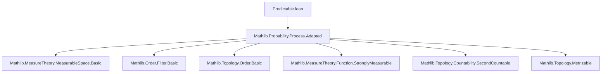

### Technical Brief: Predictable σ-Algebra in Lean 4 (Predictable.lean)

---

#### **1. Key Definitions & Theorems**

| Name | Type / Signature | Purpose |
|------|------------------|---------|
| `predictable` | `Filtration ι m → MeasurableSpace (ι × Ω)` | Defines the predictable σ-algebra on `ι × Ω` as the σ-algebra generated by sets of the form `{⊥} × A` (for `A ∈ 𝓕 ⊥`) and `(i, ∞) × A` (for `A ∈ 𝓕 i`). |
| `IsPredictable` | `Filtration ι m → (ι → Ω → E) → Prop` | A process `u` is predictable if `uncurry u` is strongly measurable w.r.t. `𝓕.predictable`. |
| `measurableSet_predictable_singleton_bot_prod` | `MeasurableSet[𝓕 ⊥] s → MeasurableSet[𝓕.predictable] ({⊥} ×ˢ s)` | Shows singleton-at-bottom times measurable sets are predictable. |
| `measurableSet_predictable_Ioi_prod` | `MeasurableSet[𝓕 i] s → MeasurableSet[𝓕.predictable] (Set.Ioi i ×ˢ s)` | Shows upper rays times measurable sets are predictable. |
| `measurableSet_predictable_Ioc_prod` | `MeasurableSet[𝓕 i] s → MeasurableSet[𝓕.predictable] (Set.Ioc i j ×ˢ s)` | Extends to half-open intervals `(i, j] × A`. |
| `progMeasurable` | `IsPredictable 𝓕 u → ProgMeasurable 𝓕 u` | Predictable processes are progressively measurable. |
| `adapted` | `IsPredictable 𝓕 u → StronglyAdapted 𝓕 u` | Predictable processes are adapted. |
| `measurableSet_prodMk_add_one_of_predictable` | `MeasurableSet[𝓕.predictable] s → MeasurableSet[𝓕 n] {ω | (n + 1, ω) ∈ s}` | For discrete filtrations, sections at time `n+1` are `𝓕 n`-measurable. |
| `measurable_add_one` | `IsPredictable 𝓕 u → Measurable[𝓕 n] (u (n + 1))` | Consequence: `u(n+1)` is `𝓕 n`-measurable. |
| `isPredictable_of_measurable_add_one` | `(Measurable[𝓕 0] (u 0)) → (∀ n, Measurable[𝓕 n] (u (n + 1))) → IsPredictable 𝓕 u` | Construct predictable processes from measurable increments. |
| `isPredictable_iff_measurable_add_one` | `IsPredictable 𝓕 u ↔ Measurable[𝓕 0] (u 0) ∧ ∀ n, Measurable[𝓕 n] (u (n + 1))` | **Main discrete characterization**: predictable ⇔ all increments measurable w.r.t. prior σ-algebra. |

---

#### **2. Naming Conventions**

- **Prefixes**:
  - `predictable_`: for definitions/lemmas about the σ-algebra itself.
  - `isPredictable_`: for properties of predictable *processes*.
  - `measurableSet_`: for measurability of sets w.r.t. `predictable`.
  - `measurable_`: for measurability of functions (e.g., `measurable_add_one`).
- **Suffixes**:
  - `_prod`: indicates product sets (e.g., `Ioi i ×ˢ A`).
  - `_singleton_bot`: special case for minimal element `⊥`.
  - `_add_one`: discrete-time shift by one (key for discrete characterization).
- **Structure**:
  - `𝓕.predictable`, `IsPredictable 𝓕 u`: consistent use of filtration parameter `𝓕`.

---

#### **3. Tactic Stack**

Frequently used tactics in proofs:
- `aesop`: for automated simplification and rewriting (e.g., set equalities, function extensions).
- `grind`: for solving linear arithmetic in order-theoretic contexts (e.g., `lt_or_ge`, `le_total`).
- `simp` / `simp only`: for simplifying set expressions, products, preimages.
- `rw`: for rewriting using lemmas (especially measurable set generators).
- `exact`, `refine`, `intro`: standard proof construction.
- `obtain ... | ... := le_total ...` / `lt_or_ge`: case analysis on order.
- `MeasurableSpace.*` lemmas: e.g., `generateFrom_le`, `comap_mono`, `map_def`.

---

#### **4. Proof Logic**

- **Structure of main proofs**:
  - **Predictable σ-algebra generation**: Prove basic generators measurable, then use `MeasurableSpace.generateFrom_le` to lift to full σ-algebra.
  - **Progressive measurability**:
    - Reduce to showing preimages under `u|_{[0,i]}` are measurable.
    - Use `measurableSpace_le_predictable_of_measurableSet` to compare with predictable σ-algebra.
    - Handle cases via `le_total` (e.g., `j ≤ i` or `i < j`) to simplify preimages.
  - **Discrete characterization**:
    - `→`: Use `measurable_add_one` and `adapted 0`.
    - `←`: Decompose preimage of `uncurry u` as countable union over `n`, then apply generator lemmas (`singleton`, `Ioc`).
    - Use `n.eq_zero_or_eq_succ_pred` to split base case `n = 0` and inductive step.

- **Key logical flow**:
  > *Induction-free* discrete analysis: rely on decomposition of `ℕ` into `{0}` ∪ `{n+1}`, and use measurable set closure under countable unions.

---

#### **5. Imports & Dependencies**

- **Core imports**:
  ```lean
  Mathlib.Probability.Process.Adapted
  ```
- **Implicit dependencies** (via `MeasureTheory` namespace and tactics):
  - `Mathlib.MeasureTheory.MeasurableSpace.Basic`
  - `Mathlib.MeasureTheory.Function.SimpleFunction`
  - `Mathlib.Order.Filter.Basic` (for filtrations)
  - `Mathlib.Topology.Order.Basic` (for `Preorder`, `LinearOrder`, `OrderClosedTopology`)
  - `Mathlib.MeasureTheory.MeasurableSpace.Constructions` (for `comap`, `map`, `generateFrom`)
  - `Mathlib.Topology.Countability.SecondCountable` (for `SecondCountableTopology`)
  - `Mathlib.Topology.Metrizable` (for `MetrizableSpace`)

---

#### **6. Mermaid Diagrams**

##### **Dependency Graph (Module-Level)**



##### **Conceptual Overview of Theory**

```mermaid
graph LR
  subgraph Definitions
    A[Filtration 𝓕] --> B[predictable 𝓕]
    B --> C[IsPredictable 𝓕 u]
  end

  subgraph Discrete Characterization
    C --> D[IsPredictable ⇔ u(0) 𝓕⁰-measurable ∧ ∀n, u(n+1) 𝓕ⁿ-measurable]
  end

  subgraph Implications
    C --> E[ProgMeasurable 𝓕 u]
    C --> F[StronglyAdapted 𝓕 u]
  end

  subgraph Tools
    G[measurableSet_predictable_*] --> B
    H[measurable_add_one] --> D
    I[isPredictable_of_measurable_add_one] --> D
  end
```

##### **Proof Strategy Flow (Discrete Case)**

```mermaid
graph TD
  Start[IsPredictable 𝓕 u] -->|→| A[Measurable[𝓕 0] (u 0)]
  Start -->|→| B[∀n, Measurable[𝓕 n] (u (n+1))]
  A & B -->|←| End[IsPredictable 𝓕 u]

  B --> C[Decompose uncurry u ⁻¹' s = ⋃ₙ {n} ×ˢ (u n ⁻¹' s)]
  C --> D[Apply measurableSet_predictable_singleton_prod]
  D --> E[Use Ioc = {n+1} for n ≥ 1]
  A --> F[Handle n = 0 via {⊥} ×ˢ ...]
```

---

#### **7. Summary**

This file formalizes the **predictable σ-algebra** and **predictable processes** in the context of filtrations, with a focus on:
- General characterization via generators (`{⊥} × A`, `(i, ∞) × A`),
- Structural properties (progressive measurability, adaptiveness),
- A clean discrete-time equivalence: `u` predictable ⇔ `u(n+1)` is `𝓕 n`-measurable for all `n`.

The formalization leverages order-theoretic structure, measurable space constructions, and careful case analysis—especially in the discrete case where the shift-by-one structure simplifies the analysis significantly.

The naming and structure follow Lean’s `MeasureTheory` conventions, with clear separation between σ-algebra-level (`predictable`) and process-level (`IsPredictable`) notions.
