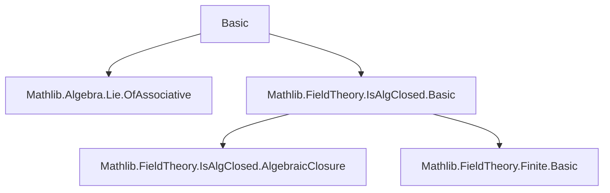
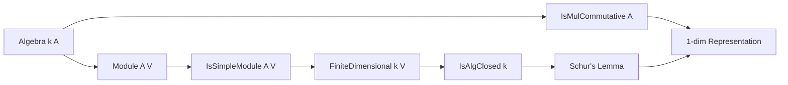

**Technical Brief: `Basic.lean` — Basic Facts about Algebra Representations**

---

### 1. **Key Definitions & Theorems**

| Name | Type / Signature | Purpose |
|------|------------------|---------|
| `algebraMap_end_bijective_of_isAlgClosed` | `Function.Bijective (algebraMap k (Module.End A V))` | Schur’s Lemma for algebra representations over an algebraically closed field: every $A$-linear endomorphism of an irreducible finite-dimensional representation $V$ is scalar (i.e., lies in the image of the algebra map $k \to \mathrm{End}_A(V)$). |
| `finrank_eq_one_of_isMulCommutative` | `Module.finrank k V = 1` | Corollary: If $A$ is commutative, then any finite-dimensional irreducible $A$-module $V$ over an algebraically closed field $k$ is 1-dimensional. |

**Auxiliary definitions used (implicit):**
- `Module.End A V`: Endomorphism ring of $V$ as an $A$-module.
- `algebraMap k (Module.End A V)`: The canonical $k$-algebra map from scalars to $A$-linear endomorphisms.
- `IsSimpleModule A V`: $V$ is a simple (i.e., irreducible) $A$-module.
- `IsMulCommutative A`: Multiplication in $A$ is commutative.
- `Module.toModuleEnd A V a`: The $A$-action on $V$ as an element of $\mathrm{End}_k(V)$, viewed as an $A$-linear endomorphism.

---

### 2. **Naming Conventions**

- **Prefixes:**
  - `algebraMap_...`: Relates to the canonical map from the base field $k$ into endomorphism rings.
  - `finrank_...`: Concerning finite-dimensional rank over $k$.
  - `is_...`: Properties (e.g., `IsSimpleModule`, `IsAlgClosed`, `IsMulCommutative`).
- **Suffixes:**
  - `_of_...`: Conditions or assumptions (e.g., `of_isAlgClosed`, `of_isMulCommutative`).
  - `_bijective`, `_eq_one`: Describes the conclusion (bijectivity, equality to 1).

---

### 3. **Tactic Stack**

- `have`: Introduces intermediate facts (e.g., finiteness of $\mathrm{End}_A(V)$ over $k$).
- `of_injective ... LinearMap.restrictScalars_injective _`: Uses injectivity of restriction of scalars to deduce finiteness.
- `classical`: Enables classical logic (used for algebraically closed field properties).
- `IsAlgClosed.algebraMap_bijective_of_isIntegral`: Key lemma from `Mathlib.FieldTheory.IsAlgClosed.Basic`.
- `obtain ⟨v, v_nz⟩`: Extracts a nonzero vector from nontriviality.
- `set U : Submodule A V := ...`: Constructs a submodule (here, the span of a vector).
- `eq_bot_or_eq_top U`: Uses simplicity of $V$ to split into two cases: $U = 0$ or $U = V$.
- `rw [finrank_eq_one_iff_of_nonzero ...]`, `rwa [...]`: Rewrites using characterizations of 1-dimensionality.
- `simpa [...] using ...`: Simplifies using a hypothesis and a target equality.

---

### 4. **Proof Logic**

- **First theorem (`algebraMap_end_bijective_of_isAlgClosed`)**:
  1. Show $\mathrm{End}_A(V)$ is finite-dimensional over $k$ via restriction of scalars and injectivity.
  2. Use that every element of a finite-dimensional algebra over an algebraically closed field is integral over $k$.
  3. Apply `IsAlgClosed.algebraMap_bijective_of_isIntegral`, which states that the algebra map $k \to \mathrm{End}_A(V)$ is bijective if every element is integral and $k$ is algebraically closed.

- **Second theorem (`finrank_eq_one_of_isMulCommutative`)**:
  1. Pick a nonzero vector $v \in V$ (possible since $V$ is nonzero).
  2. Consider the $A$-submodule $U = \mathrm{span}_k\{v\}$; show it is $A$-stable using commutativity of $A$ and bijectivity of the algebra map.
  3. Simplicity of $V$ implies $U = 0$ or $U = V$; $U = 0$ contradicts $v \ne 0$, so $U = V$.
  4. Conclude $\dim_k V = 1$ via `finrank_eq_one_iff_of_nonzero`.

---

### 5. **Imports**

| Import | Purpose |
|--------|---------|
| `Mathlib.Algebra.Lie.OfAssociative` | Provides conversion from associative algebras to Lie algebras (likely for future generalizations to Lie representations). |
| `Mathlib.FieldTheory.IsAlgClosed.Basic` | Supplies foundational facts about algebraically closed fields, especially `algebraMap_bijective_of_isIntegral`. |

---

### 6. **Mermaid Diagrams**

#### **Dependency Graph (Module-Level)**



#### **Theoretical Overview (File Scope)**



#### **Proof Structure (First Theorem)**

```mermaid
flowchart LR
  A[IsSimpleModule A V] --> B[Module.Finite k (Module.End A V)]
  B --> C[algebraMap k (Module.End A V) integral]
  C --> D[IsAlgClosed k]
  D --> E[algebraMap is bijective]
```

#### **Proof Structure (Second Theorem)**

```mermaid
flowchart LR
  A[IsSimpleModule A V] --> B[Pick nonzero v]
  B --> C[Define U = span{k}{v}]
  C --> D[U is A-submodule]
  D --> E[IsMulCommutative A]
  E --> D
  D --> F[Use Schur’s Lemma]
  F --> G[U = V or 0]
  G --> H[U ≠ 0 ⇒ U = V]
  H --> I[dim V = 1]
```

---

### 7. **Summary**

This file establishes foundational representation-theoretic facts for algebras over algebraically closed fields, with an emphasis on irreducibility and finite-dimensionality. It serves as a *unifying abstraction layer*—results here specialize to group representations, Lie algebra representations, etc., via the `OfAssociative` bridge. The proofs rely critically on:
- Schur’s Lemma (via integrality and algebraic closedness),
- Simplicity of modules (to reduce to 1-dimension in the commutative case),
- Linear algebra over finite-dimensional spaces.

The style is Lean-idiomatic: concise, tactic-driven, and heavily reliant on library lemmas (`IsAlgClosed.algebraMap_bijective_of_isIntegral`, `finrank_eq_one_iff_of_nonzero`, etc.).
