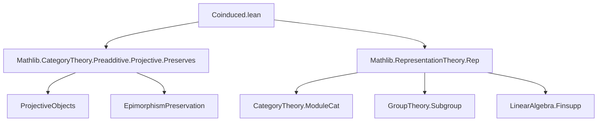

### Technical Brief: `Coinduced.lean`

---

#### **1. Key Definitions & Theorems**

| Name | Type / Signature | Purpose |
|------|------------------|---------|
| `coindV φ ρ` | `Submodule k (H → A)` | Underlying submodule of *$G$-equivariant* functions $f : H \to A$, i.e., satisfying $f(\varphi(g) \cdot h) = \rho(g)(f(h))$. |
| `coind φ ρ` | `Representation k H (coindV φ ρ)` | Induces an $H$-action on `coindV φ ρ` via $(h \cdot f)(h_1) := f(h_1 \cdot h)$. |
| `coind' φ A` | `Rep k H` | Alternative definition: $H$-representation on $\mathrm{Hom}_{k[G]}(k[H], A)$, with $(h \cdot f)(r \cdot h_1) := r \cdot f(h_1 \cdot h)$. |
| `coindMap φ f` | `coind φ A ⟶ coind φ B` | Post-composition by $f : A \to B$ gives an $H$-map between coinduced reps. |
| `coindFunctor k φ` | `Rep k G ⥤ Rep k H` | Functor sending $A \mapsto \mathrm{coind}_G^H(A)$, $f \mapsto \mathrm{coindMap}_G^H(f)$. |
| `coindMap' φ f`, `coindFunctor' k φ` | Analogous to above, for `coind'`. |
| `coindVEquiv φ A` | `A.ρ.coindV φ ≃ₗ[k] ((Action.res _ φ).obj (leftRegular k H) ⟶ A)` | Linear equivalence between the two underlying modules of the two coinduction constructions. |
| `coindIso φ A` | `coind φ A ≅ coind' φ A` | Isomorphism of $H$-representations between the two coinduction definitions. |
| `coindFunctorIso k φ` | `coindFunctor k φ ≅ coindFunctor' k φ` | Natural isomorphism of functors. |
| `resCoindHomEquiv φ B A` | `((Action.res _ φ).obj B ⟶ A) ≃ₗ[k] (B ⟶ coind φ A)` | Linear equivalence underlying the adjunction. |
| `resCoindAdjunction k φ` | `Action.res _ φ ⊣ coindFunctor k φ` | Adjointness: restriction along $\varphi$ is left adjoint to coinduction. |
| `Instance preservesEpimorphisms` | `(coindFunctor k S.subtype).PreservesEpimorphisms` | Proves coinduction along subgroup embedding preserves epimorphisms (surjections). |
| `Instance preservesProjectiveObjects` | `(Action.res _ S.subtype).PreservesProjectiveObjects` | Follows from adjunction + epimorphism preservation. |

---

#### **2. Naming Conventions**

- **Prefixes**:
  - `coindV`, `coind`, `coind'`: core coinduction constructions.
  - `coindMap`, `coindMap'`: map-level actions.
  - `coindFunctor`, `coindFunctor'`: functor-level.
  - `resCoind`: restriction-coinduction adjunction.
- **Suffixes**:
  - `V`: underlying *module* (submodule of functions).
  - `'`: alternative definition (via internal hom).
  - `Iso`: isomorphism between constructions.
  - `Equiv`: linear equivalence (often underlying isomorphism).
- **General**:
  - `hom`, `comm`, `obj`, `map`: standard category-theoretic fields.
  - `ext`, `simps`: for extensionality and automatic simp lemmas.

---

#### **3. Tactic Stack**

Frequently used tactics in proofs:

| Tactic | Role |
|--------|------|
| `simp` / `simp_all` | Simplify goals using definitions and `@[simps]` lemmas. |
| `ext` | Extensionality for functions, modules, homs. |
| `rfl` | Reflexivity for definitional equalities. |
| `have`, `have :=`, `have h :=` | Introduce intermediate facts. |
| `simpa using` / `simpa [mul_assoc] using` | Simplify using a hypothesis. |
| `exact`, `refine`, `apply` | Direct proof steps. |
| `linear_combination`, `codRestrict`, `proj`, `compLeft` | Module/hom construction helpers. |
| `ModuleCat.ofHom`, `ModuleCat.hom_ext`, `lhom_ext'`, `Action.Hom.ext` | Category-theoretic hom reasoning. |
| `Quotient.mk'_surjective`, `choose!`, `Quotient.eq'` | Quotient/group-theoretic constructions. |
| `aesop` (not present here) | Not used — proofs are mostly manual and structured. |

---

#### **4. Proof Logic**

- **Structure**:
  - **Step 1**: Define underlying module (`coindV`) and verify it's a submodule.
  - **Step 2**: Define $H$-action on `coindV`, check equivariance and unit/multiplication laws.
  - **Step 3**: Define alternative definition (`coind'`) via internal hom, verify $H$-action.
  - **Step 4**: Construct linear equivalence `coindVEquiv`, then upgrade to iso `coindIso`.
  - **Step 5**: Show functors `coindFunctor` and `coindFunctor'` are naturally isomorphic.
  - **Step 6**: Prove adjunction `res ⊣ coind` via explicit hom equivalence `resCoindHomEquiv`.
  - **Step 7**: Derive categorical consequences: right adjoint preserves limits, epimorphisms, projectives.

- **Common proof patterns**:
  - *Induction on structure* is rare — mostly *extensionality* + *simp*.
  - *Hom-commutativity* is verified by unfolding definitions and simplifying.
  - *Quotient/group actions* handled via `Quotient.mk'` and subgroup properties.

---

#### **5. Imports & Dependencies**

| Import | Purpose |
|--------|---------|
| `Mathlib.CategoryTheory.Preadditive.Projective.Preserves` | For `PreservesEpimorphisms`, `PreservesProjectiveObjects`. |
| `Mathlib.RepresentationTheory.Rep` | Core representation theory: `Rep k G`, `Action`, `leftRegular`, `Hom`, etc. |

**Key underlying theories**:
- Category theory (`CategoryTheory`, `ModuleCat`, `Functor`, `Adjunction`).
- Representation theory (`Rep`, `Action`, `leftRegular`, `Hom`).
- Group actions, subgroups, quotients (`Subgroup`, `QuotientGroup`).
- Linear algebra over commutative semirings/rings (`Module`, `Finsupp`, `LinearMap`).

---

#### **6. Mermaid Diagrams**

##### **Dependency Graph (Module-Level)**



##### **Overview of Theory Flow**

```mermaid
graph LR
  A[Monoid hom φ : G →* H] --> B[Restriction functor Res_φ : Rep k H → Rep k G]
  A --> C[Coinduction functors Coind_φ, Coind'_φ]
  B --> D[Left adjoint?]
  C --> E[Right adjoint to Res_φ]
  E --> F[Preserves limits]
  E --> G[Preserves epimorphisms (for groups)]
  G --> H[Preserves projective objects]
```

##### **Construction Equivalences**

```mermaid
graph TD
  A[coindV φ ρ] -- linear equiv --> B[Hom_{k[G]}(k[H], A)]
  A -- rep iso --> C[coind φ A]
  B -- rep iso --> C
  C -- nat iso --> D[coindFunctor k φ]
  B -- rep iso --> E[coind' φ A]
  D -- nat iso --> E
```

---

#### **7. Summary**

This file formalizes *coinduced representations* in Lean 4, providing two equivalent constructions (functions and internal hom), proving their equivalence, and establishing the fundamental adjunction:

$$
\mathrm{Res}_\varphi \dashv \mathrm{Coind}_G^H
$$

It further derives categorical properties (limit preservation, epimorphism/projective object preservation in the group case), aligning with classical homological algebra results. The formalization is clean, modular, and leverages Lean’s `Rep` and `ModuleCat` infrastructure effectively.
