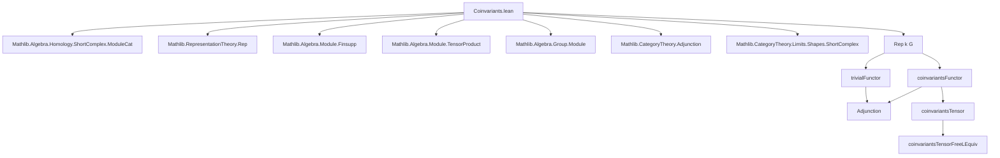

### Technical Brief: Coinvariants in Lean 4 (Coinvariants.lean)

---

#### **1. Key Definitions & Theorems**

| Name | Type / Signature | Purpose |
|------|------------------|---------|
| `Coinvariants.ker ρ` | `Submodule k V` | Submodule generated by elements `ρ g x - x` for $g \in G, x \in V$. |
| `Coinvariants ρ` | `Type*` (quotient module) | Coinvariants of representation $\rho$: $V / \langle \rho g x - x \rangle$. |
| `mk ρ` | `V →ₗ[k] Coinvariants ρ` | Quotient map; linear projection to coinvariants. |
| `lift ρ f h` | `Coinvariants ρ →ₗ[k] W` | Universal property: $G$-invariant maps factor through coinvariants. |
| `map ρ τ f hf` | `Coinvariants ρ →ₗ[k] Coinvariants τ` | Functoriality: $G$-equivariant maps induce maps on coinvariants. |
| `coinvariantsFinsuppLEquiv ρ α` | `Coinvariants (ρ.finsupp α) ≃ₗ[k] α →₀ Coinvariants ρ` | Linear equivalence between coinvariants of finitely supported functions and finitely supported functions into coinvariants. |
| `coinvariantsTprodLeftRegularLEquiv ρ` | `Coinvariants (ρ ⊗ leftRegular k G) ≃ₗ[k] V` | Key equivalence: $(V \otimes k[G])_G \cong V$, sending $[v \otimes \delta_g] \mapsto \rho(g^{-1})v$. |
| `coinvariantsAdjunction k G` | `coinvariantsFunctor k G ⊣ trivialFunctor k G` | Adjointness: coinvariants is left adjoint to trivial representation functor. |
| `coinvariantsTensor k G` | `Rep k G ⥤ Rep k G ⥤ ModuleCat k` | Bifunctor: $(A, B) \mapsto (A \otimes_k B)_G$. |
| `coinvariantsTensorFreeLEquiv A α` | `Coinvariants (A ⊗ free k G α) ≃ₗ[k] α →₀ A` | Generalizes previous equivalence; crucial for group homology computations. |
| `toCoinvariantsKer ρ S` | `Subrepresentation ρ (ker (ρ ∘ S.subtype))` | Restriction of $G$-rep to kernel of $S$-coinvariant quotient. |
| `toCoinvariants ρ S` | `Representation k G (Coinvariants (ρ ∘ S.subtype))` | Induced $G$-action on $S$-coinvariants. |
| `quotientToCoinvariants ρ S` | `Representation k (G/S) (Coinvariants (ρ ∘ S.subtype))` | Descends to $G/S$-action when $S \trianglelefteq G$. |
| `coinvariantsShortComplex A S` | `ShortComplex (Rep k G)` | Short exact sequence $0 \to \ker \to A \to A_S \to 0$ in $\mathsf{Rep}(k,G)$. |

**Theorems (selected):**
- `mk_self_apply`: $[\rho g \cdot x] = [x]$ in coinvariants.
- `induction_on`: Induction principle for coinvariants via representatives.
- `hom_ext`: Extensionality for maps out of coinvariants.
- `coinvariantsAdjunction.homEquiv_apply_hom` / `homEquiv_symm_apply_hom`: Explicit description of adjunction unit/counit.
- `coinvariantsTensorFreeLEquiv`: Explicit inverse pair for free module case.

---

#### **2. Naming Conventions**

| Pattern | Meaning | Examples |
|--------|---------|----------|
| `Coinvariants.*` | Core definitions about coinvariants | `ker`, `mk`, `lift`, `map`, `induction_on` |
| `coinvariants*LEquiv` | Linear equivalences involving coinvariants | `coinvariantsFinsuppLEquiv`, `coinvariantsTprodLeftRegularLEquiv`, `coinvariantsTensorFreeLEquiv` |
| `coinvariants*` | Functors / natural transformations | `coinvariantsFunctor`, `coinvariantsMk`, `coinvariantsTensor` |
| `toCoinvariants*` | Induced structures on coinvariants (often w.r.t. normal subgroup $S$) | `toCoinvariants`, `toCoinvariantsKer`, `quotientToCoinvariants` |
| `coinvariantsShortComplex` | Exact sequences involving coinvariants | `coinvariantsShortComplex`, `coinvariantsShortComplex_shortExact` |
| `ofCoinvariants*` | Maps *into* coinvariants or *from* coinvariants | `ofCoinvariantsTprodLeftRegular` |
| `finsuppToCoinvariants*`, `coinvariantsToFinsupp*` | Directional maps in equivalences | `coinvariantsToFinsupp`, `finsuppToCoinvariants` |

---

#### **3. Tactic Stack**

| Tactic | Frequency | Role |
|--------|-----------|------|
| `simp` | Very high | Simplification using `@[simp]` lemmas (e.g., `mk_self_apply`, `lift_mk`, `map_mk`). |
| `ext` | High | Extensionality for linear maps, functions, finsupp, tensor product. |
| `rw`, `simp_rw` | Medium | Rewriting using `mk_eq_iff`, `mem_ker_of_eq`, etc. |
| `exact`, `assumption` | Medium | Used in short proofs after `simp` or `rw`. |
| `cases` | Low | Rarely needed due to quotient/induction principles. |
| `have : ...` + `simpa` | Medium | Intermediate steps, especially in `mem_ker_of_eq`, `le_comap_ker`. |
| `ring` | Low | For commutative ring arithmetic (e.g., $r \cdot s = s \cdot r$). |
| `aesop` | Not present | No high-level automation used. |
| `linear_combination` | Medium | In `ofCoinvariantsTprodLeftRegular_mk_tmul_single`. |

---

#### **4. Proof Logic**

- **Quotient-based reasoning**: Most proofs rely on the universal property of quotients (`Submodule.liftQ`, `Submodule.linearMap_qext`, `Submodule.Quotient.induction_on`).
- **Induction on coinvariants**: `induction_on` reduces goals to statements about representatives $x \in V$.
- **Equational reasoning**: Proofs often proceed by:
  1. Reducing to linear map equality via `hom_ext` or `LinearMap.ext`.
  2. Evaluating on generators (e.g., `single x a`, $x \otimes \delta_g$).
  3. Applying `mk_eq_iff` or `mem_ker_of_eq` to verify membership in the kernel.
- **Functoriality**: `map_id`, `map_comp` verified via extensionality and `hom_ext`.
- **Adjointness**: Unit/counit verified via `desc` and `lift`; triangle identities follow from definitions.
- **Normal subgroup descent**: Uses `le_comap_ker` to show stability under $G$-action, enabling induced representations on coinvariants.

---

#### **5. Imports & Dependencies**

| Module | Purpose |
|--------|---------|
| `Mathlib.Algebra.Homology.ShortComplex.ModuleCat` | For `ShortComplex`, exactness, morphism properties. |
| `Mathlib.RepresentationTheory.Rep` | Core representation theory: `Rep`, `Representation`, `trivialFunctor`, `leftRegular`, `free`, tensor products, group algebras. |
| `Finsupp`, `TensorProduct`, `ModuleCat` | Finsupp-based free modules, tensor products over $k$, module category structure. |

---

#### **6. Theory Overview & Dependency Diagram**

##### **High-Level Theory Flow**
```
Representation Theory (Rep k G)
│
├── Coinvariants: quotient by G-action differences
│   ├── Definition via kernel submodule
│   ├── Universal property (lift)
│   ├── Functoriality (map)
│   └── Adjunction with trivial representations
│
├── Structural results
│   ├── Normal subgroup descent (toCoinvariants, quotientToCoinvariants)
│   └── Short exact sequences (coinvariantsShortComplex)
│
├── Computational tools
│   ├── Finsupp case: coinvariantsFinsuppLEquiv
│   ├── Free module case: coinvariantsTensorFreeLEquiv
│   └── Regular representation case: coinvariantsTprodLeftRegularLEquiv
│
└── Applications
    ├── Group homology (via coinvariantsTensorFreeLEquiv)
    └── Derived functors (via short exact sequences)
```

##### **Mermaid Diagrams**

**Dependency Graph (Module-Level)**



**Overview of Core Construction**

```mermaid
graph LR
  V[V] -->|ρ g - id| K["ker ρ = span{ρg x - x}"]
  V -->|quotient| C["Coinvariants ρ = V / K"]
  C -->|lift| W[W]
  V -->|f: G-equivariant| W
  C -.->|map f| C'
  C -->|mk| V
  C -->|adjunction| trivial V
```

---

#### **7. Summary**

This file formalizes the foundational theory of **group coinvariants** in the context of $k$-linear representations of monoids/groups. It establishes:
- The universal property of coinvariants,
- Functoriality and adjointness (`coinvariants ⊣ trivial`),
- Structural results for normal subgroups and short exact sequences,
- Explicit linear equivalences for computational use (especially in group homology),
- A clean interface for reasoning about $G$-invariant structures modulo the diagonal action.

The formalization is highly structured, leveraging Lean’s quotient machinery, module category, and representation theory libraries to provide both theoretical depth and practical utility.

--- 

*Prepared for Domain-Specific AI Agent Training*
