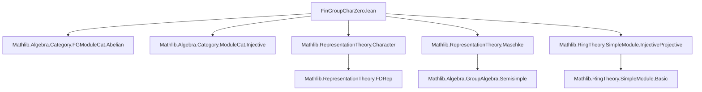
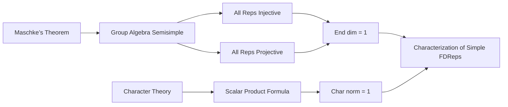

**Technical Metadata Brief: `FinGroupCharZero.lean`**

---

### 1. **Key Definitions & Theorems**

| Name | Type / Signature | Purpose |
|------|------------------|---------|
| `Rep.Injective` | `instance (V : Rep k G) : Injective V` | Shows every object in `Rep k G` is injective when `|G|` is invertible in `k`. |
| `Rep.Projective` | `instance (V : Rep k G) : Projective V` | Shows every object in `Rep k G` is projective under same condition. |
| `FDRep.Injective` | `instance (V : FDRep k G) : Injective V` | Extends injectivity to finite-dimensional representations. |
| `FDRep.Projective` | `instance (V : FDRep k G) : Projective V` | Extends projectivity to finite-dimensional representations. |
| `FDRep.simple_iff_end_is_rank_one` | `Simple V ↔ Module.finrank k (V ⟶ V) = 1` | Simplicity criterion via endomorphism space dimension (requires `k` algebraically closed, `|G| ≠ 0` in `k`). |
| `FDRep.simple_iff_char_is_norm_one` | `Simple V ↔ ∑ g : G, V.character g * V.character g⁻¹ = Fintype.card G` | Simplicity criterion via character norm (requires `CharZero k`, `|G| ≠ 0` in `k`). |

---

### 2. **Naming Conventions**

- **Prefixes**:
  - `is_`: e.g., `isSemisimpleRing`, `isIsoZero_iff_source_target_isZero` — indicates a property or equivalence.
  - `simple_`, `char_`, `end_`: used in lemmas describing structural properties (`simple_iff_*`, `char_is_norm_one`, `end_is_rank_one`).
- **Suffixes**:
  - `_iff_`: indicates biconditional lemmas.
  - `_of_`: e.g., `injective_of_map_injective`, `projective_of_map_projective` — shows how properties transfer via functors.
- **Category-theoretic terms**:
  - `forget₂`, `ι`, `φ`, `factorThru`, `image`, `mono_isIso_iff_nonzero`: standard categorical constructions.

---

### 3. **Tactic Stack**

Frequently used tactics in this file:

| Tactic | Usage |
|--------|-------|
| `rw` | Rewriting using equivalences, definitions, and lemmas (e.g., `← Rep.equivalenceModuleMonoidAlgebra.map_injective_iff`). |
| `exact` / `exact?` | Supplying known instances or proofs. |
| `simp` / `simp_all` | Simplifying goals using `simp` lemmas (e.g., `simp only [invOf_eq_inv, smul_eq_mul]`). |
| `have`, `suffices`, `obtain` | Intermediate proof steps and existential elimination. |
| `apply_fun` | Applying a morphism to both sides of an equation. |
| `grind` | Custom tactic (likely from `Mathlib.Tactic`) for solving linear arithmetic or module-theoretic goals. |
| `congr'`, `ext`, `funext` | Extensionality reasoning (used implicitly via `simp`). |
| `cases` | Case analysis on hypotheses (e.g., `cases hf`). |
| `ring` / `abel` | Not explicitly used, but `grind` likely subsumes ring reasoning. |

---

### 4. **Proof Logic**

- **Structure**:
  - **Injectivity/Projectivity**: Reduce to module-theoretic facts using equivalences (`Rep.equivalenceModuleMonoidAlgebra.map_*`) and apply `Module.injective_of_isSemisimpleRing` / `Module.projective_of_isSemisimpleRing`, relying on Maschke’s theorem (via `NeZero (Fintype.card G : k)` ⇒ group algebra is semisimple).
  - **Simplicity criteria**:
    - *Endomorphism dimension*: Use `finrank_endomorphism_simple_eq_one` for `mp`. For `mpr`, assume `End(V)` is 1-dim, then use properties of monomorphisms/epimorphisms in abelian categories, factorization through image, and scalar multiplication to deduce simplicity.
    - *Character norm*: Use orthonormality of characters (`char_orthonormal`) and scalar product formula (`FDRep.scalar_product_char_eq_finrank_equivariant`) to relate norm to dimension of endomorphism ring.

- **Logical Flow**:
  - **Forward direction (`mp`)**: Use known identities (e.g., orthonormality) to derive scalar equation.
  - **Reverse direction (`mpr`)**: Use scalar equation to deduce `End(V)` has dimension 1, then apply previous criterion.

---

### 5. **Imports**

| Import | Role |
|--------|------|
| `Mathlib.Algebra.Category.FGModuleCat.Abelian` | Provides abelian structure on finitely generated modules. |
| `Mathlib.Algebra.Category.ModuleCat.Injective` | Injective objects in module categories. |
| `Mathlib.RepresentationTheory.Character` | Character theory for representations. |
| `Mathlib.RepresentationTheory.Maschke` | Maschke’s theorem (semisimplicity of group algebra when `|G|` invertible). |
| `Mathlib.RingTheory.SimpleModule.InjectiveProjective` | Links simplicity with injectivity/projectivity in module categories. |

---

### 6. **Mermaid Diagrams**

#### **Dependency Graph (Module-Level)**

#### **Overview of Theoretical Flow**

---

### 7. **Key Assumptions & Hypotheses**

- `G` finite (`[Fintype G]`)
- `k` a field (`[Field k]`)
- `|G|` invertible in `k` (`[NeZero (Fintype.card G : k)]`)
- For simplicity criteria:
  - `k` algebraically closed (`[IsAlgClosed k]`) for `simple_iff_end_is_rank_one`
  - `k` characteristic zero (`[CharZero k]`) for `simple_iff_char_is_norm_one`

---

### 8. **Notable Idioms & Patterns**

- **Transfer via forgetful functors**: `forget₂` used to lift properties from `Rep k G` to `FDRep k G`.
- **Equivalence with module category**: `Rep.equivalenceModuleMonoidAlgebra` bridges representation-theoretic and module-theoretic notions.
- **Scalar multiplication manipulation**: Heavy use of `smul_eq_mul`, `invOf_self`, and `mul_inv_cancel` to convert between scalar actions and field multiplication.
- **Abelian category reasoning**: Image factorization, mono/epi criteria, and `ι`, `φ` notation for canonical maps.

--- 

Let me know if you'd like a formalized dependency graph (e.g., `.lean`-level imports) or a proof-term extraction.
