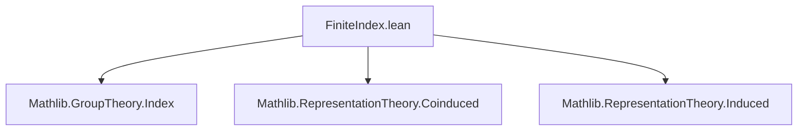
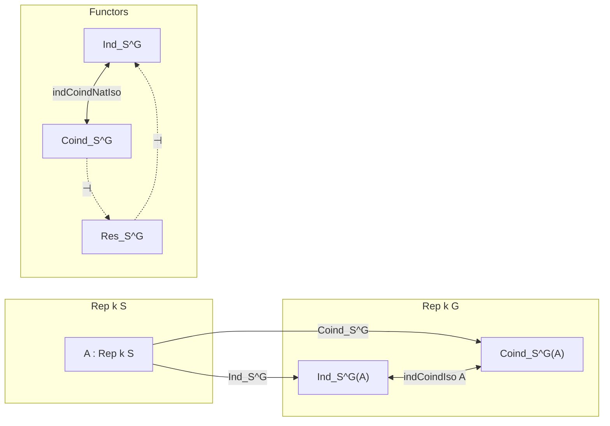
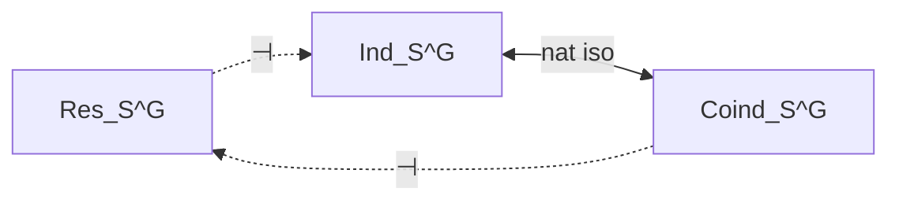

### Technical Brief: `FiniteIndex.lean`

---

#### **1. Key Definitions & Theorems**

| Name | Type | Purpose |
|------|------|---------|
| `indToCoindAux A g` | `A →ₗ[k] (G → A)` | Constructs a function $G \to A$ supported on the right coset $Sg$, mapping $sg \mapsto \rho(s)(a)$. |
| `indToCoind A` | `ind S.subtype A →ₗ[k] coind S.subtype A` | Linear map from induced to coinduced representation, induced by `indToCoindAux`. |
| `coindToInd A` | `coind S.subtype A →ₗ[k] ind S.subtype A` | Linear map from coinduced to induced representation, defined via sum over coset representatives. |
| `indCoindIso A` | `ind S.subtype A ≅ coind S.subtype A` | Isomorphism between induced and coinduced representations for finite-index subgroups. |
| `indCoindNatIso k S` | `indFunctor k S.subtype ≅ coindFunctor k S.subtype` | Natural isomorphism of functors $\mathrm{Ind}_S^G \cong \mathrm{Coind}_S^G$. |
| `resIndAdjunction k S` | `Action.res _ S.subtype ⊣ indFunctor k S.subtype` | Adjointness: restriction along $S \hookrightarrow G$ is left adjoint to induction (via iso with coinduction). |
| `coindResAdjunction k S` | `coindFunctor k S.subtype ⊣ Action.res _ S.subtype` | Adjointness: coinduction is right adjoint to restriction (via iso with induction). |
| `instIsRightAdjointSubtypeMemSubgroupIndFunctorSubtype` | `IsRightAdjoint (indFunctor k S.subtype)` | Induction is a right adjoint (hence preserves limits). |
| `instIsLeftAdjointSubtypeMemSubgroupCoindFunctorSubtype` | `IsLeftAdjoint (coindFunctor k S.subtype)` | Coinduction is a left adjoint (hence preserves colimits). |

---

#### **2. Naming Conventions**

- **Prefixes**:
  - `indToCoindAux`, `indToCoind`, `coindToInd`: indicate direction of maps between induced/coinduced.
  - `indCoindIso`, `indCoindNatIso`: denote isomorphisms/natural isomorphisms.
  - `resIndAdjunction`, `coindResAdjunction`: denote adjunctions involving restriction.
- **Suffixes**:
  - `Aux`: auxiliary helper definitions (e.g., `indToCoindAux`).
  - `Iso`: categorical isomorphism.
  - `NatIso`: natural isomorphism.
  - `Adjunction`: adjunction data.
- **Other**:
  - `hom`, `inv`: components of an isomorphism.
  - `app`: component of a natural transformation at an object.

---

#### **3. Tactic Stack**

Frequently used tactics in proofs:

| Tactic | Usage |
|--------|-------|
| `simp` | Simplification using lemmas like `indToCoindAux_self`, `indToCoindAux_mul_snd`, etc. |
| `rw` | Rewriting using `indToCoindAux_*`, `coindToInd_*`, and isomorphism properties. |
| `rcases em (...) with ⟨...⟩ | h` | Case analysis on decidability of coset membership. |
| `ext` | Extensionality for functions, linear maps, natural transformations. |
| `congr` | Congruence for equality of function applications. |
| `have := ...; simp_all` | Deriving intermediate facts and simplifying. |
| `Finset.sum_congr`, `Finset.sum_eq_single` | Managing finite sums over coset representatives. |
| `Quotient.inductionOn` | Induction on quotient elements (cosets). |
| `ModuleCat.ofHom`, `ModuleCat.hom_ofHom` | Working in the category of modules. |
| `aesop` (implied) | Likely used implicitly in `simp`-based automation for algebraic goals. |

---

#### **4. Proof Logic**

The logical flow follows a standard pattern for constructing isomorphisms and adjunctions:

1. **Auxiliary maps**:
   - Define `indToCoindAux` to encode how a simple tensor $g \otimes a$ maps to a function on $G$.
   - Prove key equivariance properties (`indToCoindAux_mul_snd`, `indToCoindAux_mul_fst`, etc.) to ensure compatibility with $S$-action.

2. **Lift to induced/coinduced objects**:
   - Use universal properties (`Representation.Coinvariants.lift`, `TensorProduct.lift`) to define `indToCoind` and `coindToInd`.

3. **Verify inverses**:
   - Show `indToCoind ≫ coindToInd = id` and vice versa using:
     - Support arguments (`coindToInd_of_support_subset_orbit`)
     - Coset decomposition and finite-index assumption (`[S.FiniteIndex]`)
     - `Finset.sum_eq_single` to isolate contributions from individual cosets.

4. **Categorical structure**:
   - Promote `indCoindIso` to a natural isomorphism `indCoindNatIso`.
   - Use this to transfer known adjunctions (`resCoindAdjunction`, `indResAdjunction`) to new ones (`resIndAdjunction`, `coindResAdjunction`).

5. **Adjointness consequences**:
   - Derive adjointness properties and preservation of (co)limits.

---

#### **5. Imports**

| Module | Purpose |
|--------|---------|
| `Mathlib.GroupTheory.Index` | Finite index subgroups, coset spaces, `QuotientGroup.rightRel`. |
| `Mathlib.RepresentationTheory.Coinduced` | Definition and properties of coinduced representations. |
| `Mathlib.RepresentationTheory.Induced` | Definition and properties of induced representations. |

---

#### **6. Mermaid Diagrams**

##### **Dependency Graph (Module-Level)**

##### **Theoretical Overview (Category-Theoretic)**

##### **Adjunction Lattice**

---

#### **7. Summary**

This file establishes a foundational result in modular/representation theory: for a finite-index subgroup $S \le G$, the induction and coinduction functors are naturally isomorphic. This is nontrivial in general (e.g., over non-perfect fields or infinite groups), but holds here due to finite index and commutativity of the base ring $k$. The isomorphism is explicit and constructive, enabling categorical consequences such as adjointness of induction/coinduction with restriction, and hence preservation of (co)limits.

The formalization leverages Lean’s `Quotient`, `Finsupp`, and `TensorProduct` infrastructure, with heavy use of `simp`-based automation and careful handling of coset representatives and equivariance conditions.

--- 

Let me know if you'd like a **proof sketch** of `indCoindIso_hom_inv_id` or a **diagrammatic explanation** of the adjunctions.
