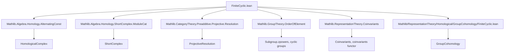

### Technical Brief: `FiniteCyclic.lean`

---

#### **1. Key Definitions & Theorems**

| Name | Type / Signature | Purpose |
|------|------------------|---------|
| `coinvariantsKer_eq_range` | `Coinvariants.ker ρ = LinearMap.range (ρ g - id)` | Identifies the coinvariants kernel with the image of the “augmentation difference” map when $G = \langle g \rangle$. |
| `coinvariantsEquiv` | `ρ.Coinvariants ≃ₗ[𝕜] (V ⧸ Im(ρ(g) - id))` | Constructs an explicit linear isomorphism between coinvariants and the quotient by the image of $g - 1$. |
| `coinvariantsKer_leftRegular_eq_ker` | `Coinvariants.ker (leftRegular k G) = ker(linearCombination k (λ _ => 1))` | Relates coinvariants kernel of the left regular representation to the kernel of the augmentation map (sum of coefficients). |
| `leftRegular.range_norm_eq_ker_applyAsHom_sub` | `range(N) = ker(ρ(g) - id)` | Key algebraic identity in the left regular representation: norm map kernel = difference map image. |
| `leftRegular.range_applyAsHom_sub_eq_ker_linearCombination` | `range(ρ(g) - id) = ker(ε)` | Shows the difference map’s image equals the augmentation ideal (kernel of sum-of-coefficients). |
| `leftRegular.range_applyAsHom_sub_eq_ker_norm` | `range(ρ(g) - id) = ker(N)` | Symmetric version: difference map image = norm map kernel. |
| `chainComplexFunctor` | `Rep k G ⥤ ChainComplex (Rep k G) ℕ` | Constructs a periodic chain complex in representations: alternating between norm and $g - 1$ maps. |
| `normHomCompSub`, `subCompNormHom` | `ShortComplex (ModuleCat k)` | Short complexes encoding two consecutive maps in the periodic resolution. |
| `moduleCatChainComplex`, `moduleCatCochainComplex` | `ChainComplex (ModuleCat k) ℕ`, `CochainComplex (ModuleCat k) ℕ` | Underlying module-level complexes; homology = group homology, cohomology = group cohomology. |
| `resolution.π` | `P• → k` (trivial rep concentrated at 0) | Augmentation map from the periodic resolution to the trivial representation. |
| `resolution_quasiIso` | `QuasiIso (resolution.π)` | Proves the resolution is acyclic (i.e., exact except at degree 0). |
| `resolution` | `ProjectiveResolution (trivial k G k)` | Final object: the projective resolution of the trivial representation for finite cyclic $G$. |

---

#### **2. Naming Conventions**

- **Prefixes:**
  - `coinvariants_`: relates to coinvariants functor $V \mapsto V_G = V / \langle gv - v \rangle$.
  - `leftRegular_`: pertains to the left regular representation $k[G]$.
  - `range_`, `ker_`, `norm_`, `applyAsHom_`: denote maps involved in the resolution (norm, $g-1$, etc.).
  - `resolution_`: specific to the projective resolution construction.

- **Suffixes:**
  - `_eq_range`, `_eq_ker`: equality lemmas between image/kernel and other submodules.
  - `_hom`, `_hom.hom`: accessing underlying linear maps in `Rep k G` or `ModuleCat k`.
  - `_comp`: short complex built from composition of two maps.

- **Other patterns:**
  - `alternatingConst`: used to build periodic chain complexes with alternating maps.
  - `quasiIso`: indicates quasi-isomorphism (acyclic except at degree 0).
  - `π`: standard notation for augmentation/resolution map.

---

#### **3. Tactic Stack**

Frequent tactics used in proofs:

| Tactic | Usage |
|--------|-------|
| `simp` / `simp_all` | Simplifying definitions (e.g., `norm`, `applyAsHom`, `leftRegular`, `coinvariants`) |
| `ext` | Extensionality for functions/modules (proving equality of linear maps or elements) |
| `rw` / `rfl` | Rewriting using equalities or reflexivity |
| `induction` | Structural induction on natural numbers (degrees in chain complex) |
| `by_cases` / `if_pos` / `if_neg` | Handling parity (even/odd) of degrees |
| `exact` / `apply` | Completing goals using known lemmas |
| `aesop` | Automated reasoning for simple algebraic facts (e.g., bijectivity of multiplication) |
| `have` / `set` | Introducing intermediate lemmas (e.g., decomposition of group algebra elements) |
| `simpa using` | Simplifying with a hypothesis or lemma |
| `reflects_exact_of_faithful` | Lifting exactness from `ModuleCat k` to `Rep k G` via forgetful functor |

---

#### **4. Proof Logic**

The logical flow follows a standard homological pattern:

1. **Algebraic identities in group algebras**  
   Prove key submodule equalities:
   - $ \ker(N) = \operatorname{im}(g - 1) $
   - $ \operatorname{im}(g - 1) = \ker(\varepsilon) $ (augmentation)
   - $ \ker(N) = \operatorname{im}(g - 1) $ again (symmetry)

2. **Coinvariants identification**  
   Show $V_G \cong V / \operatorname{im}(g - 1)$ using kernel-image equality.

3. **Chain complex construction**  
   Use `HomologicalComplex.alternatingConst` to build periodic complexes in `Rep k G` and `ModuleCat k`.

4. **Projectivity check**  
   Use `Projective (leftRegular k G)` (instance from `Rep.kG_Module_projective` or similar).

5. **Quasi-isomorphism proof**  
   - For degree 0: show surjectivity of augmentation and exactness at 0 via augmentation ideal = image of $g - 1$.
   - For higher degrees: use parity induction and the kernel-image equalities to show exactness at each degree.

6. **Conclusion**  
   Assemble into `ProjectiveResolution` using `resolution_quasiIso`.

---

#### **5. Imports & Dependencies**

| Module | Role |
|--------|------|
| `Mathlib.Algebra.Homology.AlternatingConst` | Constructs alternating (periodic) chain complexes. |
| `Mathlib.Algebra.Homology.ShortComplex.ModuleCat` | Tools for short complexes in module categories. |
| `Mathlib.CategoryTheory.Preadditive.Projective.Resolution` | General projective resolution machinery. |
| `Mathlib.GroupTheory.OrderOfElement` | Used implicitly via `Subgroup.zpowers`, generator properties. |
| `Mathlib.RepresentationTheory.Coinvariants` | Coinvariants construction and basic properties. |

---

#### **6. Mermaid Diagrams**

##### **Dependency Graph (High-Level)**



##### **Overview of `FiniteCyclic.lean`**

```mermaid
flowchart LR
  Start[Start: finite cyclic G = ⟨g⟩] --> AlgebraIdentities[Algebraic Identities in k[G]]
  AlgebraIdentities --> CoinvariantsIso[Coinvariants ≅ V / im(g−1)]
  CoinvariantsIso --> ChainComplex[Periodic Chain Complex in Rep k G]
  ChainComplex --> ProjectiveCheck[Projectivity of k[G]]
  ProjectiveCheck --> AugmentationMap[Augmentation π: P• → k]
  AugmentationMap --> QuasiIso[Quasi-isomorphism proof]
  QuasiIso --> Resolution[ProjectiveResolution of trivial k]
  Resolution --> GroupCohomology[Used in FiniteCyclic.GroupCohomology.lean]
```

---

#### **7. Theory Scope**

This file constructs the **standard periodic projective resolution** of the trivial module $k$ over the group ring $k[G]$ when $G$ is finite cyclic. It serves as the foundational input for computing:

- **Group cohomology** $H^n(G, A) = \operatorname{Ext}^n_{kG}(k, A)$
- **Group homology** $H_n(G, A) = \operatorname{Tor}^n_{kG}(k, A)$

via derived functors applied to this resolution.

The resolution is *explicit*, *constructive*, and *periodic* (period 2), reflecting the well-known cohomological periodicity of cyclic groups.

---

#### **8. Summary**

This file formalizes the classical homological algebra of finite cyclic groups in Lean 4. It provides:

- Explicit algebraic identities in group algebras,
- A concrete projective resolution of the trivial representation,
- A foundation for group (co)homology computations.

It exemplifies Lean’s strength in organizing homological algebra with categorical and representation-theoretic precision.
