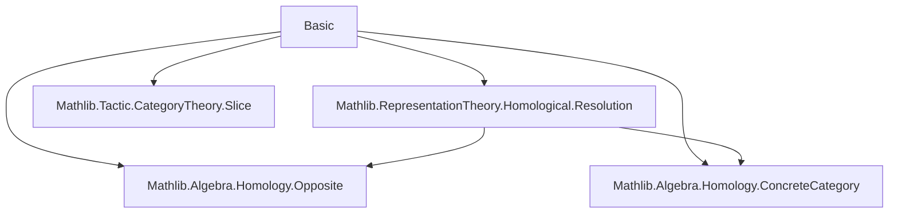

### Technical Brief: `Basic.lean` — Group Cohomology via Inhomogeneous Cochains

---

#### **1. Key Definitions & Theorems**

| Name | Type / Signature | Purpose |
|------|------------------|---------|
| `inhomogeneousCochains.d A n` | `d : ModuleCat.of k ((Fin n → G) → A) ⟶ ModuleCat.of k ((Fin (n + 1) → G) → A)` | Differential in the inhomogeneous cochain complex; encodes the standard group cohomology differential $d^n$ |
| `inhomogeneousCochains A` | `CochainComplex (ModuleCat k) ℕ` | The full cochain complex of inhomogeneous cochains, with $C^n = \mathrm{Fun}(G^n, A)$ |
| `inhomogeneousCochainsIso A` | `inhomogeneousCochains A ≅ (barComplex k G).linearYonedaObj k A` | Isomorphism of cochain complexes between inhomogeneous cochains and $\mathrm{Hom}(P, A)$, where $P$ is the bar resolution |
| `groupCohomology A n` | `ModuleCat k` | $n$th group cohomology: $\mathrm{H}^n(G, A) = \mathrm{H}^n(\mathrm{Hom}(P, A))$ |
| `groupCohomologyIsoExt A n` | `groupCohomology A n ≅ Extⁿ(k, A)` | Isomorphism identifying group cohomology with $\mathrm{Ext}^n$ in $\mathbf{Rep}_k G$ |
| `cocycles A n` | `ModuleCat k` | $n$-cocycles $Z^n(G, A) = \ker(d^n)$ |
| `groupCohomology.π A n` | `cocycles A n ⟶ groupCohomology A n` | Canonical projection from cocycles to cohomology classes |
| `d_eq` | `d A n = ...` | Identifies $d^n$ with conjugation of bar complex differential via `freeLiftLEquiv` |
| `d_comp_d` | `d A n ≫ d A (n + 1) = 0` | Proof that $d^2 = 0$, derived from complex structure |

---

#### **2. Naming Conventions**

- **Prefixes**:
  - `inhomogeneousCochains.*`: for the concrete cochain complex and its components.
  - `groupCohomology.*`: for cohomology groups, projections, and isomorphisms.
  - `cocycles`, `iCocycles`, `toCocycles`: standard homological algebra terminology.
- **Suffixes**:
  - `Iso`: for isomorphisms (e.g., `inhomogeneousCochainsIso`, `groupCohomologyIsoExt`).
  - `Mk`: for constructors of structured objects (e.g., `cocyclesMk`).
  - `π`: for canonical quotient maps (e.g., `groupCohomology.π`).
- **Function names**:
  - `d`, `d_def`, `d_eq`, `d_comp_d`: standard differential notation.
  - `freeLiftLEquiv`: leverages universal property of free objects in `Rep k G`.

---

#### **3. Tactic Stack**

- **Core tactics**:
  - `ext`: extensionality for functions/modules.
  - `simp` / `simp only`: simplification using `@[simps!]`, `@[ext]`, and definitional equalities.
  - `rw`: rewriting using `d_eq`, `d_comp_d`, `barComplex.d_single`, etc.
  - `slice_lhs`: localized rewriting in subterms (e.g., `slice_lhs 3 4 => {rw [Iso.hom_inv_id]}`).
  - `exact`, `refine`, `intro`, `rcases`: standard proof construction.
  - `cases` / `subst`: for handling equality hypotheses (e.g., `h : i + 1 = j`).
  - `isoOfQuasiIsoAt`, `HomotopyEquiv.ofIso`: category-theoretic isomorphism construction.

- **Category theory & homological algebra**:
  - `HomologicalComplex.Hom.isoOfComponents`: constructing complex isomorphisms componentwise.
  - `CochainComplex.of`: building cochain complexes from data + proof of $d^2 = 0$.
  - `Ext`, `ProjectiveResolution`, `barComplex`: from `Mathlib.Algebra.Homology` and `RepresentationTheory`.

---

#### **4. Proof Logic**

- **Structure of proofs**:
  1. **Define data** (e.g., `d`, `inhomogeneousCochains`) using `ModuleCat.ofHom` or `CochainComplex.of`.
  2. **Verify $d^2 = 0$** by reducing to known complex (e.g., bar complex) via `d_eq` and `d_comp_d`.
  3. **Construct isomorphisms** using `isoOfQuasiIsoAt` or `HomologicalComplex.Hom.isoOfComponents`, often via:
     - Universal properties (`freeLiftLEquiv`)
     - Known resolutions (`barComplex`, `barResolution.extIso`)
  4. **Lift properties** (e.g., projectivity, isomorphism of Ext) using `isoOfQuasiIsoAt` and `of_iso`.

- **Typical flow**:
  - *Induction not needed* — proofs rely on *structural equivalence* of complexes.
  - *Conjugation by isomorphisms* is central: e.g., `d = iso⁻¹ ∘ d_bar ∘ iso`.
  - *Universal properties* (free objects in `Rep k G`) simplify verification of equivariance and $k$-linearity.

---

#### **5. Imports & Dependencies**

| Module | Role |
|--------|------|
| `Mathlib.Algebra.Homology.Opposite` | Opposite category machinery for derived functors |
| `Mathlib.Algebra.Homology.ConcreteCategory` | Embedding of module categories into concrete categories |
| `Mathlib.RepresentationTheory.Homological.Resolution` | Bar resolution, projective resolutions in `Rep k G` |
| `Mathlib.Tactic.CategoryTheory.Slice` | Tactics for slice categories (used in `barComplex`) |

**Core algebraic infrastructure**:
- `CommRing k`, `Group G`, `Rep k G`: $k$-linear representations of $G$.
- `ModuleCat k`: category of $k$-modules.
- `barComplex k G`: bar resolution of the trivial representation $k$.
- `Ext`: derived functors in `Rep k G`.

---

#### **6. Mermaid Diagrams**

##### **Dependency Graph (Module-Level)**



##### **Theoretical Overview (Conceptual Flow)**

```mermaid
flowchart LR
  A[Rep k G: k-linear G-reps] --> B[Bar Complex P → k]
  B --> C[Hom(P, A) complex]
  C --> D[Cohomology Hⁿ(G, A)]
  A --> E[Inhomogeneous Cochains Cⁿ = Fun(Gⁿ, A)]
  E -->|iso| C
  D --> F[Extⁿ(k, A) in Rep k G]
  C -->|cohomology| F
```

##### **Complex Isomorphism Diagram**

```mermaid
flowchart LR
  Cⁿ(G, A) = Fun(Gⁿ, A) -- "freeLiftLEquiv" --> Hom(Pⁿ, A)
  d_C -- "d_eq" --> d_Hom
  Hom(Pⁿ, A) -- "(barComplex.linearYonedaObj).d" --> Hom(Pⁿ⁺¹, A)
  Cⁿ⁺¹(G, A) <-- "freeLiftLEquiv" -- 
  style Cⁿ(G, A) fill:#f9f,stroke:#333
  style Hom(Pⁿ, A) fill:#9ff,stroke:#333
```

---

#### **7. Summary**

This file formalizes **group cohomology** in Lean using the **inhomogeneous cochain complex**, and proves its equivalence to the derived-functor definition via the **bar resolution**. Key innovations:
- Avoids `Module ℤ[G]` to prevent scalar-action diamonds.
- Uses `Rep k G` uniformly for representation structure.
- Leverages `freeLiftLEquiv` to identify cochains with $\mathrm{Hom}(k[G]^{\oplus G^n}, A)$.
- Proves $d^2 = 0$ *for free* via isomorphism with a known complex.

The API is designed for low-degree cohomology (see `LowDegree.lean`) and sets up the foundation for spectral sequences (e.g., Hochschild–Serre) and profinite cohomology.

--- 

Let me know if you'd like a formalized dependency graph (e.g., `leanpkg.tree`), or a tactic-level trace of `d_comp_d`.
