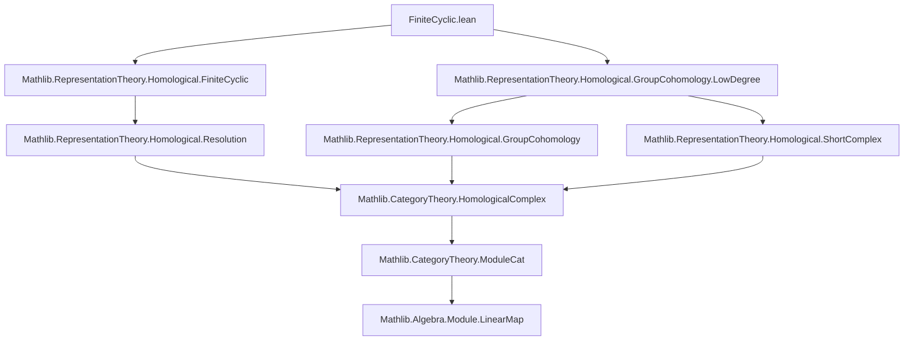

Here is a structured technical brief extracted from `FiniteCyclic.lean`, focusing on formalization metadata for domain-specific AI agent training.

---

### **1. Key Definitions & Theorems**

| Name | Type / Signature | Purpose |
|------|------------------|---------|
| `homResolutionIso` | `homResolutionIso A g hg : (resolution k g hg).complex.linearYonedaObj k A ≅ moduleCatCochainComplex A g` | Establishes a complex isomorphism between `Hom(P, A)` (where `P` is the periodic projective resolution of `k`) and the explicit cochain complex built from `ρ_A(g) - id` and the norm map `N`. |
| `groupCohomologyIso₀` | `groupCohomology A 0 ≅ ModuleCat.of k (LinearMap.ker (ρ(g) - id))` | Identifies $H^0(G, A)$ with the invariants $A^G = \ker(\rho(g) - \mathrm{id})$ for finite cyclic $G = \langle g \rangle$. |
| `groupCohomologyIsoEven` | `groupCohomology A i ≅ (normHomCompSub A g).homology` for nonzero even $i$ | Computes $H^i(G, A)$ for even $i > 0$ as homology of $A \xrightarrow{N} A \xrightarrow{\rho(g)-\mathrm{id}} A$. |
| `groupCohomologyIsoOdd` | `groupCohomology A i ≅ (subCompNormHom A g).homology` for odd $i$ | Computes $H^i(G, A)$ for odd $i$ as homology of $A \xrightarrow{\rho(g)-\mathrm{id}} A \xrightarrow{N} A$. |
| `groupCohomologyπEven` | `ModuleCat.of k (Ker(ρ(g)−id)) ⟶ H^i(G, A)` | The canonical quotient map $A^G \twoheadrightarrow H^i(G, A)$ for even $i > 0$, factoring through $\mathrm{coker}(N)$. |
| `groupCohomologyπOdd` | `ModuleCat.of k (Ker(N)) ⟶ H^i(G, A)` | The canonical quotient map $\ker(N) \twoheadrightarrow H^i(G, A)$ for odd $i$, factoring through $\ker(N)/\mathrm{im}(\rho(g)-\mathrm{id})$. |
| `groupCohomologyπEven_eq_zero_iff`, `groupCohomologyπEven_eq_iff` | Logical characterizations of kernel/image under the even quotient map | Formalize when a class maps to zero or when two elements map to the same cohomology class. |
| `groupCohomologyπOdd_eq_zero_iff`, `groupCohomologyπOdd_eq_iff` | Analogous for odd degree | Same as above, but for odd degrees. |

---

### **2. Naming Conventions**

- **Prefixes**:
  - `groupCohomology*`: for cohomology isomorphisms and quotient maps.
  - `homResolution*`: for resolution-related constructions.
  - `normHomCompSub`, `subCompNormHom`: denote compositions involving the norm map $N = \sum_{h \in G} h$ and $\rho(g) - \mathrm{id}$.
- **Suffixes**:
  - `Iso`: for isomorphisms (e.g., `groupCohomologyIso₀`, `groupCohomologyIsoEven`).
  - `π`: for canonical quotient maps (e.g., `groupCohomologyπEven`, `groupCohomologyπOdd`).
  - `eq_zero_iff`, `eq_iff`: for equivalence lemmas about equality/zero in quotient constructions.
- **Other patterns**:
  - `moduleCatCochainComplex`, `moduleCatCyclesIso`: indicate constructions in `ModuleCat k`.
  - `applyAsHom`: used to evaluate representation $\rho(g)$ as a linear map.

---

### **3. Tactic Stack**

Frequent tactics used in proofs and definitions:

| Tactic | Usage |
|--------|-------|
| `ext` | To extend by extensionality (e.g., for functions, linear maps, modules). |
| `simp` / `simp_rw` | Simplification using definitional equalities and lemmas (e.g., `Representation.mem_invariants_iff_of_forall_mem_zpowers`). |
| `induction` | Structural induction on natural numbers (e.g., in `groupCohomologyIsoEven`). |
| `intro` / `rintro` | Introducing hypotheses and destructuring existentials. |
| `exact`, `assumption` | Closing goals directly. |
| `rw` | Rewriting using equalities (e.g., `sub_eq_zero`, `AddSubgroupClass.coe_sub`). |
| `by_cases` | Case analysis on boolean predicates (e.g., `Even i`). |
| `have`, `suffices` | Introducing intermediate claims. |
| `convert` / `congr'` | For congruence-based equality proofs. |
| `ModuleCat.mono_iff_injective` | Reasoning about monomorphisms in `ModuleCat k`. |

---

### **4. Proof Logic**

The logical flow across the file follows a standard homological algebra pattern:

1. **Construct a projective resolution** `resolution k g hg` of the trivial module $k$ for finite cyclic $G = \langle g \rangle$.
2. **Show that `Hom(P, A)` is isomorphic to an explicit cochain complex** via `homResolutionIso`, using the left regular representation and the isomorphism `leftRegularHomEquiv`.
3. **Compute cohomology via homology of the explicit complex**:
   - For $i = 0$: use `groupCohomology.H0Iso` and invariants characterization.
   - For $i > 0$: use `groupCohomologyIso` (comparison isomorphism), `homologyMapIso` (induced by `homResolutionIso`), and `alternatingConstHomologyIsoEven/Odd` (to identify homology of alternating complexes).
4. **Define quotient maps** (`groupCohomologyπEven`, `groupCohomologyπOdd`) and prove their universal properties (kernel/image characterizations).

Induction is used to handle parity of degrees, especially in `groupCohomologyIsoEven`, where `i` is split into base case (`i = 0`, impossible due to `NeZero`) and inductive step.

---

### **5. Imports**

| Import | Purpose |
|--------|---------|
| `Mathlib.RepresentationTheory.Homological.FiniteCyclic` | Core definitions of finite cyclic group representations and resolutions. |
| `Mathlib.RepresentationTheory.Homological.GroupCohomology.LowDegree` | General low-degree group cohomology tools (e.g., `groupCohomology.H0Iso`). |

These imports indicate the module sits at the intersection of:
- Representation theory of finite groups,
- Homological algebra (projective resolutions, cochain complexes, homology),
- Module theory over commutative rings.

---

### **6. Mermaid Diagrams**

#### **Dependency Graph (Top-Level)**



#### **Overview of File Structure**

```mermaid
flowchart LR
  subgraph Definitions
    A[resolution k g hg] --> B[homResolutionIso]
    B --> C[Hom(P, A) ≅ Cochains(A, ρ(g)−id, N)]
  end

  subgraph Cohomology Computations
    C --> D[groupCohomologyIso₀]
    C --> E[groupCohomologyIsoEven]
    C --> F[groupCohomologyIsoOdd]
  end

  subgraph Quotient Maps
    D --> G[groupCohomologyπEven]
    F --> H[groupCohomologyπOdd]
  end

  subgraph Lemmas
    G --> I[groupCohomologyπEven_eq_zero_iff]
    G --> J[groupCohomologyπEven_eq_iff]
    H --> K[groupCohomologyπOdd_eq_zero_iff]
    H --> L[groupCohomologyπOdd_eq_iff]
  end
```

---

Let me know if you'd like a formalized dependency graph in `leanpkg` format or a visualization of the chain/cochain complexes involved.
