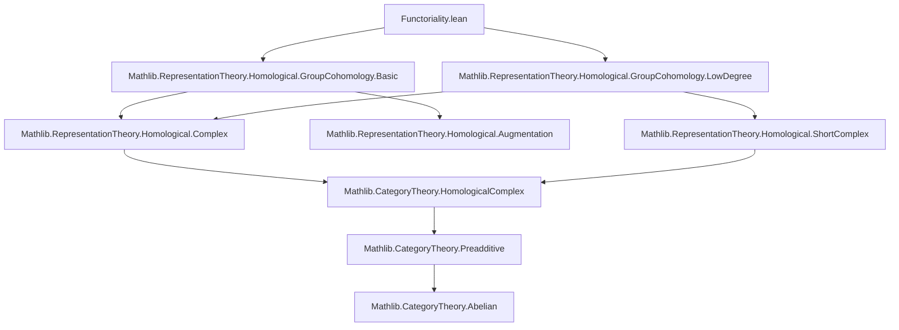

### Technical Brief: Functoriality of Group Cohomology (`Functoriality.lean`)

---

#### **1. Key Definitions & Theorems**

| Name | Type / Signature | Purpose |
|------|------------------|---------|
| `cochainsMap f φ` | `inhomogeneousCochains A ⟶ inhomogeneousCochains B` | Induced cochain map on inhomogeneous cochains via pullback along `f : G →* H` and `φ : Res(f)(A) → B`. |
| `map f φ n` | `groupCohomology A n ⟶ groupCohomology B n` | Induced map on cohomology groups in degree `n`. |
| `cocyclesMap f φ n` | `cocycles A n ⟶ cocycles B n` | Induced map on cocycles (cycles of degree `n`). |
| `mapShortComplexH1 f φ` | `shortComplexH1 A ⟶ shortComplexH1 B` | Lift of `cochainsMap` to degree-1 short complexes (used for $H^1$). |
| `mapShortComplexH2 f φ` | `shortComplexH2 A ⟶ shortComplexH2 B` | Lift of `cochainsMap` to degree-2 short complexes (used for $H^2$). |
| `mapCocycles₁ f φ` | `cocycles₁ A ⟶ cocycles₁ B` | Explicit description of $Z^1$-map via `mapShortComplexH1`. |
| `mapCocycles₂ f φ` | `cocycles₂ A ⟶ cocycles₂ B` | Explicit description of $Z^2$-map via `mapShortComplexH2`. |
| `H1InfRes A S` | `ShortComplex (ModuleCat k)` | Short complex $H^1(G/S, A^S) \xrightarrow{\mathrm{inf}} H^1(G, A) \xrightarrow{\mathrm{res}} H^1(S, A)$. |
| `cochainsFunctor k G` | `Rep k G ⥤ CochainComplex (ModuleCat k) ℕ` | Functor sending a representation to its cochain complex. |
| `functor k G n` | `Rep k G ⥤ ModuleCat k` | Functor sending $A \mapsto H^n(G, A)$. |
| `resNatTrans f n` | `functor k H n ⟶ Action.res f ⋙ functor k G n` | Natural transformation expressing functoriality of cohomology under restriction. |
| `infNatTrans S n` | `quotientToInvariantsFunctor k S ⋙ functor k (G/S) n ⟶ functor k G n` | Natural transformation expressing inflation map as a natural transformation. |

**Theorems (selected):**
- `cochainsMap_comp`: Compatibility with composition of group homomorphisms and intertwiners.
- `map_comp`: Compatibility of cohomology maps with composition.
- `map_id`: Identity preservation.
- `map_H0Iso_hom_f`, `map_id_comp_H0Iso_hom`: Description of $H^0$-maps in terms of invariants.
- `H1InfRes_exact`: Exactness of the inflation-restriction sequence in degree 1.
- `Mono (H1InfRes A S).f`: Inflation map is monic.
- `mapCocycles₁_comp_i`, `mapCocycles₂_comp_i`: Compatibility of cocycle maps with inclusion into cochains.

---

#### **2. Naming Conventions**

| Pattern | Meaning | Examples |
|--------|---------|----------|
| `cochainsMap*` | Cochain-level constructions | `cochainsMap`, `cochainsMap₁`, `cochainsMap₂`, `cochainsMap₃` |
| `map*` | Cohomology-level constructions | `map`, `mapCocycles₁`, `mapCocycles₂` |
| `mapShortComplexH*` | Lifts to short complexes for low degrees | `mapShortComplexH1`, `mapShortComplexH2` |
| `*NatTrans` | Natural transformations between functors | `resNatTrans`, `infNatTrans` |
| `*Iso` | Isomorphisms identifying cochains/cocycles with function spaces | `cochainsIso₀`, `isoCocycles₁`, `isoCocycles₂`, `H0Iso` |
| `ShortComplex.*` | Short complex constructions | `shortComplexH1`, `shortComplexH2`, `H1InfRes` |
| `H*π` | Projection from cocycles to cohomology | `H1π`, `H2π` |
| `*Hom` / `*Map` | Hom-level or map-level operations | `cochainsMap`, `cocyclesMap`, `mapCocycles₁` |

---

#### **3. Tactic Stack**

| Tactic | Usage Frequency | Purpose |
|--------|-----------------|---------|
| `rfl` | Very High | Proving definitional equalities (e.g., `map_id`, `cochainsMap_id`). |
| `simp` / `simp only` | Very High | Simplifying using `@[simp]` lemmas, especially for naturality and compatibility. |
| `ext` | High | Extensionality for functions/modules (e.g., proving equality of linear maps). |
| `funext` | High | Proving equality of functions (especially in cochain spaces like $H → A$). |
| `congr` | Medium | Congruence reasoning for function composition and equality of arguments. |
| `subst` | Medium | Substituting equalities (e.g., in `congr` theorem). |
| `rcases` / `induction ... using ..._on` | Medium | Inductive arguments on cochains (e.g., `H1_induction_on`). |
| `abel` | Low | Abelian group simplifications (e.g., in exactness proofs). |
| `rcongr` | Low | Rewriting under binders (e.g., `rcongr x` in `cochainsMap_f_2_comp_cochainsIso₂`). |
| `fin_cases` | Low | Case analysis on finite types (e.g., `Fin 3`). |
| `apply Subtype.ext` | Medium | Proving equality in subtype (e.g., cocycles as subtypes of functions). |

---

#### **4. Proof Logic**

- **Structure**: Proofs follow a *functoriality-first* pattern:
  1. Define cochain-level maps (`cochainsMap`).
  2. Prove they commute with differentials → cochain maps.
  3. Induce maps on cycles (`cocyclesMap`) and homology (`map`).
  4. Prove naturality, composition, identity laws.
  5. For low degrees (1, 2), lift to short complexes for explicit calculations.
  6. Use short complex machinery to prove exactness (e.g., inflation-restriction).

- **Common Flow**:
  - **Definitional lemmas** (`rfl`, `simp`) for basic properties (`map_id`, `map_comp`).
  - **Naturality**: Use `simp` + `← HomologicalComplex.*_comp` + `cochainsMap_comp`.
  - **Low-degree API**: Use `cochainsMap_f_*_comp_cochainsIso*` to relate to explicit function-space maps.
  - **Exactness**: Use `H1π_eq_zero_iff`, `mem_cocycles₁_iff`, `H1_induction_on`, and subgroup properties.

- **Induction**: Used in exactness proofs (e.g., `H1_induction_on` for cocycles modulo coboundaries).

---

#### **5. Imports & Dependencies**

| Module | Role |
|--------|------|
| `Mathlib.RepresentationTheory.Homological.GroupCohomology.Basic` | Core definitions: cochains, cohomology, differential, invariants, restriction. |
| `Mathlib.RepresentationTheory.Homological.GroupCohomology.LowDegree` | Explicit descriptions of $H^0$, $H^1$, $H^2$, cocycles, coboundaries, and short complexes. |

**Key underlying libraries**:
- `CategoryTheory` (functors, natural transformations, homology)
- `ModuleCat` (module morphisms, mono/epi)
- `GroupTheory.Subgroup` (normal subgroups, quotients)
- `RepresentationTheory.Action` (group actions, restriction of scalars)

---

#### **6. Mermaid Diagrams**

##### **Dependency Graph (Module-Level)**



##### **Overview of Theory Flow**

```mermaid
graph LR
  Rep[k][G] -->|cochainsFunctor| CochainComplex
  CochainComplex -->|homology| ModuleCat[k]
  Rep[k][G] -->|functor n| ModuleCat[k]
  Rep[k][H] -->|Action.res f| Rep[k][G]
  Rep[k][H] -->|map f φ n| Rep[k][G]
  Rep[k][G] -->|quotientToInvariants S| Rep[k][G/S]
  Rep[k][G/S] -->|infNatTrans| Rep[k][G]
  Rep[k][G] -->|H1InfRes| ShortComplex
  ShortComplex -->|exact| ExactSequence
```

##### **Functoriality Ladder**

```mermaid
graph TD
  A[Rep k H] -->|cochainsFunctor H| CochainComplex k
  B[Rep k G] -->|cochainsFunctor G| CochainComplex k
  A -- Action.res f --> B
  CochainComplex k -- HomologicalComplex.homologyMap (cochainsMap f φ) --> CochainComplex k
  A -- map f φ n --> B
  A -- functor n H --> ModuleCat k
  B -- functor n G --> ModuleCat k
  A -- resNatTrans n --> B
```

---

This file formalizes the *contravariant functoriality* of group cohomology in both the group and representation arguments, with explicit low-degree constructions and naturality for inflation/restriction. It serves as a foundational module for further homological algebra in representation theory (e.g., Lyndon–Hochschild–Serre spectral sequences).
