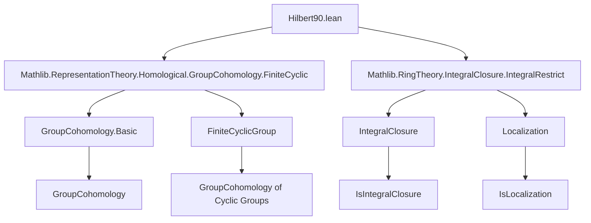
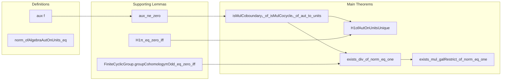

**Technical Brief: Hilbert90.lean (Lean 4)**  
*Domain: Galois Theory & Group Cohomology*  
*Author(s): Riccardo Brasca, Amelia Livingston*  
*License: Apache 2.0*

---

### 1. KEY DEFINITIONS & THEOREMS

| Name | Type / Signature | Purpose |
|------|------------------|---------|
| `aux f` | `Gal(L/K) → Lˣ → L → L` | Constructs the $L$-linear operator $\sum_{\varphi} f(\varphi) \cdot \varphi$ on $L$, used to find a non-zero vector for the proof. |
| `aux_ne_zero f` | `aux f ≠ 0` | Proves the operator is non-zero using **Dedekind’s linear independence of characters**. |
| `isMulCoboundary₁_of_isMulCocycle₁_of_aut_to_units f hf` | `IsMulCocycle₁ f → IsMulCoboundary₁ f` | **Noether’s generalization of Hilbert 90**: every 1-cocycle $f: \mathrm{Gal}(L/K) \to L^\times$ is a coboundary. |
| `H1ofAutOnUnitsUnique` | `Unique (H¹(Rep.ofAlgebraAutOnUnits K L))` | Formalizes triviality of $H^1(\mathrm{Gal}(L/K), L^\times)$ in cohomological terms. |
| `exists_div_of_norm_eq_one hg hx` | `N_{L/K}(x) = 1 → ∃ y : Lˣ, y / g y = x` | **Classical Hilbert 90** for finite *cyclic* Galois extensions. |
| `norm_ofAlgebraAutOnUnits_eq x` | `N_{L/K}(x) = \prod_{\sigma \in \mathrm{Gal}(L/K)} \sigma(x)` | Relates the representation-theoretic norm to the field-theoretic norm. |
| `exists_mul_galRestrict_of_norm_eq_one hg hη` | `N_{L/K}(\eta) = 1 → ∃ ε ∈ B, ε ≠ 0 ∧ η \cdot g(\varepsilon) = \varepsilon` | **Integral version** of Hilbert 90 in the $ABKL$ setting (integral closure / localization context). |

---

### 2. NAMING CONVENTIONS

- **Prefixes**:
  - `isMulCocycle₁`, `isMulCoboundary₁`: indicate 1-cocycle / coboundary conditions for multiplicative actions.
  - `aux`: auxiliary construction.
  - `norm_ofAlgebraAutOnUnits_eq`: norm computed via algebra automorphisms.
  - `exists_*`: existential statements (e.g., `exists_div_of_norm_eq_one`).
- **Suffixes**:
  - `_of_*`: conditions or contexts (e.g., `of_aut_to_units`, `of_norm_eq_one`).
  - `_eq_zero_iff`: equivalence with zero condition (e.g., `H1π_eq_zero_iff`).
- **Type variables**:
  - `K`, `L`: base and extension fields.
  - `A`, `B`: base rings in integral version.
  - `g`, `η`, `ε`, `β`, `y`: standard notation for Galois automorphism, elements, and coboundary witnesses.

---

### 3. TACTIC STACK

| Tactic | Usage Frequency | Purpose |
|--------|-----------------|---------|
| `simp` / `simp_rw` | Very High | Simplify sums, maps, units, norms, and group actions. |
| `rw` | High | Rewrite using cocycle condition, norm definitions, and algebra maps. |
| `exact` / `apply` | High | Apply lemmas like `coboundariesOfIsMulCoboundary₁`, `FiniteCyclicGroup.groupCohomologyπOdd_eq_zero_iff`. |
| `obtain` / `rcases` | High | Extract witnesses from existential hypotheses (e.g., `⟨z, hz⟩`, `⟨y, hy⟩`). |
| `field_simp`, `ring` | Medium | Simplify field expressions and algebraic identities. |
| `ext`, `funext` | Medium | Prove extensionality of functions/morphisms. |
| `aesop` | Low | Not used in this file (proofs are highly structured, not automated). |
| `congr`, `congr_arg` | Medium | Propagate equalities through constructions (e.g., `congr (algebraMap K L)`). |

---

### 4. PROOF LOGIC

The proofs follow a **constructive, case-based strategy**, leveraging:

1. **Linear independence of characters** (Dedekind) to guarantee existence of $z$ with $\sum f(h) h(z) \ne 0$.
2. **Explicit coboundary construction**: set $\beta = (\sum f(h) h(z))^{-1}$.
3. **Cocycle condition** $f(gh) = g(f(h)) \cdot f(g)$ to verify $g(\beta)/\beta = f(g)$.
4. **Cohomological translation**: use `H1_induction_on` and `coboundariesOfIsMulCoboundary₁` to lift cocycle-level result to $H^1$ triviality.
5. **Finite cyclic case**: reduce to group cohomology of cyclic groups (`FiniteCyclicGroup.groupCohomologyπOdd_eq_zero_iff`) and use norm condition to get trivial cohomology class.
6. **Integral version**: lift from field case via localization and integral closure properties; use torsion-freeness and injectivity of algebra maps.

Induction is *not* used; instead, the proofs rely on:
- **Explicit construction** (witness-based),
- **Linear algebra over fields** (Dedekind),
- **Group cohomology machinery** (finite cyclic case),
- **Localization theory** (integral version).

---

### 5. IMPORTS & DEPENDENCIES

| Module | Role |
|--------|------|
| `Mathlib.RepresentationTheory.Homological.GroupCohomology.FiniteCyclic` | Provides cohomology of finite cyclic groups, norm maps, and key lemmas like `groupCohomologyπOdd_eq_zero_iff`. |
| `Mathlib.RingTheory.IntegralClosure.IntegralRestrict` | Supplies tools for the integral version (e.g., `galRestrict`, `IsIntegralClosure`, localization). |
| `Mathlib.Field.Basic`, `Mathlib.Algebra.Algebra`, `Mathlib.Algebra.Module` | Implicit via `Field`, `Algebra`, `FiniteDimensional`. |
| `Mathlib.GroupTheory.GroupAction.GroupCohomology` | Underlies `H1`, `coboundaries`, `cocycles`. |
| `Mathlib.RepresentationTheory.Representation` | For `Rep.ofAlgebraAutOnUnits`, norm, and action. |
| `Mathlib.RepresentationTheory.Homological.GroupCohomology.Basic` | General cohomology definitions (`H1`, `coboundaries`, etc.). |

---

### 6. MERMAID DIAGRAMS

#### Dependency Graph (Top-Level)

#### Overview of File Structure

---

### 7. CONTEXTUAL SUMMARY

This file formalizes **Hilbert’s Theorem 90** and its generalizations in the Lean 4 ecosystem. It bridges:
- **Classical field theory** (norms, Galois extensions),
- **Group cohomology** (1-cocycles, coboundaries, $H^1$ triviality),
- **Representation theory** (linear actions of automorphism groups),
- **Integral closure & localization** (arithmetic generalizations).

The formalization is **non-automated**, relying on explicit constructions and structural properties (e.g., Dedekind’s lemma), and is carefully organized to support both the cohomological and elementary formulations.

---

### 8. TODO & EXTENSIONS

- Extend to **infinite Galois extensions** (requires pro-finite topology & continuity).
- Prove **Additive Hilbert 90**: $H^n(G, L) = 0$ for $n \ge 1$ (currently open).
- Formalize **local class field theory** or **global class field theory** applications.
- Develop **Galois descent** machinery using Hilbert 90 as a base case.

--- 

*End of Technical Brief.*
