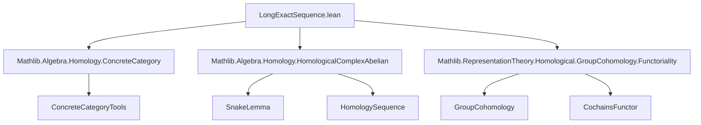
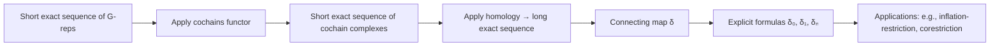

### Technical Brief: `LongExactSequence.lean`

---

#### **1. Key Definitions & Theorems**

| Name | Type / Signature | Purpose |
|------|------------------|---------|
| `map_cochainsFunctor_shortExact` | `ShortExact (X.map (cochainsFunctor k G))` | Shows that applying the inhomogeneous cochains functor to a short exact sequence of $G$-representations yields a short exact sequence of cochain complexes. |
| `mapShortComplex₁` | `ShortComplex (Hⁱ(G, X₃) → Hʲ(G, X₁) → Hʲ(G, X₂))` | The short complex induced on homology by the snake lemma, in degrees $i, j = i+1$. |
| `mapShortComplex₂` | `ShortComplex (Hⁱ(G, X₁) → Hⁱ(G, X₂) → Hⁱ(G, X₃))` | The degree-$i$ part of the long exact sequence in cohomology. |
| `mapShortComplex₃` | `ShortComplex (Hⁱ(G, X₂) → Hⁱ(G, X₃) → Hʲ(G, X₁))` | The connecting part of the long exact sequence, again in degrees $i, j = i+1$. |
| `δ` | `groupCohomology X.X₃ i → groupCohomology X.X₁ (i+1)` | The **connecting homomorphism** in group cohomology, constructed via the snake lemma. |
| `cocyclesMkOfCompEqD` | `(f ∘ x = d y) ⇒ x ∈ Zⁱ(G, X₁)` | Constructs a cocycle $x$ from a cochain $y$ whose differential lands in the image of $f$. |
| `mem_cocycles₁_of_comp_eq_d₀₁`, `mem_cocycles₂_of_comp_eq_d₁₂` | `(f ∘ x = d₀₁ y) ⇒ x ∈ Z¹`, `(f ∘ x = d₁₂ y) ⇒ x ∈ Z²` | Verify that certain cochains are cocycles, used in low-degree descriptions of $\delta$. |
| `δ_apply` | Explicit formula for $\delta$ on cochains | Describes $\delta$ in arbitrary degree via lifting and differential computation. |
| `δ₀_apply`, `δ₁_apply` | Explicit formulas for $\delta^0$, $\delta^1$ | Concrete descriptions of the connecting map in degrees 0 and 1, using invariants and 1-cocycles. |
| `epi_δ_of_isZero`, `mono_δ_of_isZero`, `isIso_δ_of_isZero` | Conditions for $\delta$ to be epi/mono/iso | Derived from general snake-lemma properties when intermediate cohomology vanishes. |

---

#### **2. Naming Conventions**

- **Prefixes**:
  - `map_`: Functors applied to morphisms or complexes (e.g., `map_cochainsFunctor`, `mapShortComplex`).
  - `δ`: Connecting homomorphism (e.g., `δ`, `δ_apply`, `δ₀_apply`).
  - `mem_cocycles_`: Membership lemmas for cocycles (e.g., `mem_cocycles₁`, `mem_cocycles₂`).
  - `cocyclesMk_`: Constructors for cocycles (e.g., `cocyclesMkOfCompEqD`).
- **Suffixes**:
  - `_exact`: Exactness lemmas (e.g., `mapShortComplex₁_exact`).
  - `_apply`: Element-wise descriptions (e.g., `δ_apply`, `δ₀_apply`).
  - `_of_`: Conditional constructions (e.g., `epi_δ_of_isZero`, `mono_δ_of_isZero`).
- **Arity indicators**:
  - `₀`, `₁`, `₂`: Degrees 0, 1, 2 (e.g., `d₀₁`, `d₁₂`, `H0Iso`, `H1π`, `H2π`).

---

#### **3. Tactic Stack**

- **Core tactics**:
  - `simp` / `simp_all`: Simplification using module/ring/representation-theoretic facts.
  - `exact`: For direct proof steps, especially after `have` or `letI`.
  - `ext`: Extensionality for functions/linear maps.
  - `congr`: Congruence for function equality (used in cochain-level computations).
  - `rw` / `subst`: Rewriting and substitution for equalities like $i+1=j$.
- **Domain-specific automation**:
  - `have : ... := ...; simp [this]`: Common pattern for intermediate equalities.
  - `letI := hX.mono_f; ...`: Use of instance inference for monomorphisms/epimorphisms.
  - `by simpa using ...`: Simplify using a hypothesis and a target equality.

---

#### **4. Proof Logic**

The logical flow follows a standard homological algebra pattern:

1. **Setup**: Start with a short exact sequence $0 \to X_1 \xrightarrow{f} X_2 \xrightarrow{g} X_3 \to 0$ of $k[G]$-modules.
2. **Functoriality**: Apply the inhomogeneous cochains functor $\operatorname{C}^\bullet(G, -)$ to get a short exact sequence of cochain complexes.
3. **Exactness verification**: Prove degreewise exactness using properties of $\operatorname{Hom}_k(-, -)$ and the fact that $\operatorname{forget}$ reflects exactness.
4. **Apply snake lemma**: Use `SnakeInput` to produce the long exact sequence in cohomology.
5. **Extract connecting map**: Define $\delta$ as the connecting morphism from the snake lemma.
6. **Element-wise descriptions**:
   - For general degree: lift a cocycle $z \in Z^i(G, X_3)$ to $y \in C^i(G, X_2)$, compute $d(y) = f(x)$, and show $x \in Z^{i+1}(G, X_1)$.
   - For low degrees (0, 1): specialize using invariants ($X^G$) and explicit differentials $d_0^1$, $d_1^2$.
7. **Vanishing criteria**: Use general homological algebra results (`SnakeInput.*`) to deduce when $\delta$ is mono/epi/iso.

---

#### **5. Imports**

| Import | Role |
|--------|------|
| `Mathlib.Algebra.Homology.ConcreteCategory` | Provides tools for working with homology in concrete categories (e.g., modules). |
| `Mathlib.Algebra.Homology.HomologicalComplexAbelian` | Enables use of homological complexes and their homology sequences. |
| `Mathlib.RepresentationTheory.Homological.GroupCohomology.Functoriality` | Supplies the cochains functor and its behavior under morphisms of representations. |

---

#### **6. Mermaid Diagrams**

##### **Dependency Graph**

##### **Overview of Theory Flow**

---

#### **7. Summary**

This file formalizes the foundational step in deriving the long exact sequence in group cohomology: starting from a short exact sequence of $G$-representations, it constructs a short exact sequence of cochain complexes via the inhomogeneous cochains functor, then applies the snake lemma to obtain the connecting homomorphism $\delta$. It provides both abstract categorical descriptions and concrete cochain-level formulas for $\delta$, especially in low degrees, enabling practical computations in group cohomology.

The structure is highly modular, leveraging existing homological algebra infrastructure in Mathlib while specializing it to the representation-theoretic context.
