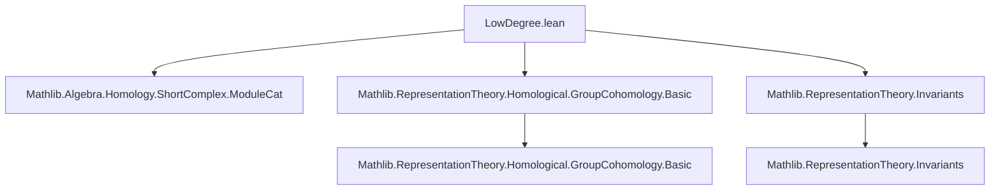
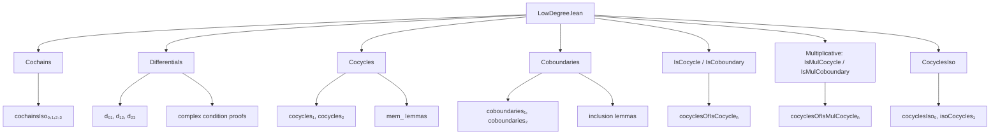

Here is the structured technical metadata extracted from `LowDegree.lean`:

---

### **1. Key Definitions & Theorems**

| Name | Type / Purpose |
|------|----------------|
| `cochainsIso₀`, `cochainsIso₁`, `cochainsIso₂`, `cochainsIso₃` | Isomorphisms between the $n$th cochain objects in `inhomogeneousCochains A` and function spaces: $A$, $G \to A$, $G \times G \to A$, $G^3 \to A$. |
| `d₀₁`, `d₁₂`, `d₂₃` | Explicit $k$-linear differentials in low degrees: $A \to G \to A$, $G \to A \to G \times G \to A$, $G \times G \to A \to G^3 \to A$. |
| `d₀₁_comp_d₁₂`, `d₁₂_comp_d₂₃` | Theorems asserting $d^1 \circ d^0 = 0$, $d^2 \circ d^1 = 0$, ensuring the complex property. |
| `cocycles₁`, `cocycles₂` | Submodules of 1- and 2-cocycles: $\ker(d^1)$, $\ker(d^2)$. |
| `coboundaries₁`, `coboundaries₂` | Submodules of 1- and 2-coboundaries: $\operatorname{im}(d^0)$, $\operatorname{im}(d^1)$. |
| `cocycles₁IsoOfIsTrivial` | Isomorphism $Z^1(G, A) \cong \operatorname{Hom}(G, A)$ when $A$ is trivial. |
| `H0Iso`, `H1π`, `H2π`, `H1IsoOfIsTrivial` | Isomorphisms/epimorphisms relating low-degree cohomology $H^n(G, A)$ to invariants, cocycles modulo coboundaries, and group homs. |
| `cocyclesOfIsCocycle₁`, `cocyclesOfIsCocycle₂`, `coboundariesOfIsCoboundary₁`, `coboundariesOfIsCoboundary₂` | Maps translating abstract cocycle/coboundary conditions (`IsCocycle₁`, `IsCoboundary₁`, etc.) into module-theoretic cocycles/coboundaries. |
| `cocyclesOfIsMulCocycle₁`, `cocyclesOfIsMulCocycle₂`, etc. | Multiplicative analogues for abelian groups with `MulDistribMulAction`. |
| `shortComplexH0`, `shortComplexH1`, `shortComplexH2` | Exact short complexes encoding $d^0$, $d^1$, $d^2$. |
| `cocyclesIso₀` | Isomorphism $Z^0(G, A) \cong A^G$, the invariants. |

---

### **2. Naming Conventions**

- **Prefixes**:
  - `cochainsIsoₙ`: Isomorphisms for cochain objects.
  - `dₙₘ`: Differentials $d^n : C^n \to C^{n+1}$.
  - `cocyclesₙ`, `coboundariesₙ`: Submodules of $n$-cocycles and $n$-coboundaries.
  - `cocyclesOfIsCocycleₙ`, `coboundariesOfIsCoboundaryₙ`: From concrete cocycle conditions to module-theoretic ones.
  - `cocyclesIsoₙ`: Isomorphisms identifying abstract cocycles with simpler types.

- **Suffixes**:
  - `_of_isTrivial`: When representation is trivial.
  - `_of_isMulCocycle`: Multiplicative version.
  - `_apply`: Applied to elements (e.g., `d₀₁_hom_apply`).
  - `_def`, `_iff`: Characterizations of membership.

- **Notable patterns**:
  - `mem_..._def`, `mem_..._iff`: Membership criteria.
  - `map_one`, `map_inv`, `map_mul`: Properties of cocycles under group operations.

---

### **3. Tactic Stack**

Frequently used tactics in proofs:

| Tactic | Usage |
|--------|-------|
| `simp` / `simp only` | Simplifying expressions involving `smul`, `sub`, `add`, `mul`, `one`, `inv`. |
| `ext` / `funext` | Extensionality for functions, especially in proving equality of maps. |
| `rw` / `simp_rw` | Rewriting using definitions or lemmas (e.g., `mem_cocycles₁_def`). |
| `abel` | Abelian group simplification (used in `d₁₂_comp_d₂₃`). |
| `exact`, `refine`, `intro` | Standard proof construction. |
| `fin_cases`, `rcongr` | For handling finite sums over `Fin n`. |
| `dsimp`, `change` | Simplifying definitions or changing goal form. |
| `convert`, `congr` | For congruence-based rewriting. |
| `ModuleCat.mono_iff_injective`, `Submodule.injective_subtype` | Module-categorical monomorphism reasoning. |

---

### **4. Proof Logic**

- **Structure**:
  - **Step 1**: Define explicit cochain objects and differentials (`cochainsIsoₙ`, `dₙₙ₊₁`).
  - **Step 2**: Prove complex condition ($d^{n+1} \circ d^n = 0$) via `dₙₙ₊₁_comp_dₙ₊₁ₙ₊₂`.
  - **Step 3**: Define cocycles/coboundaries as kernels/images.
  - **Step 4**: Prove inclusion $B^n \subseteq Z^n$ (`coboundaries₁_le_cocycles₁`, etc.).
  - **Step 5**: Relate to abstract cohomology via isomorphisms (`cocyclesIso₀`, `H0Iso`, etc.).
  - **Step 6**: For trivial action, derive explicit descriptions (e.g., $Z^1 \cong \operatorname{Hom}(G, A)$).
  - **Step 7**: Translate between concrete cocycle conditions (`IsCocycle₁`, `IsMulCocycle₁`) and module-theoretic ones.

- **Common pattern**:
  - Use `mem_..._def` to reduce membership to universal quantifiers.
  - Use `funext` + `simp` to verify cocycle identities.
  - Use `@[simps!]` to automatically generate `coe_mk`, `val_eq_coe`, etc.

---

### **5. Imports**

| Module | Role |
|--------|------|
| `Mathlib.Algebra.Homology.ShortComplex.ModuleCat` | Short complexes in module categories. |
| `Mathlib.RepresentationTheory.Homological.GroupCohomology.Basic` | General group cohomology via inhomogeneous cochains. |
| `Mathlib.RepresentationTheory.Invariants` | Invariants of group representations. |

---

### **6. Mermaid Diagrams**

#### **Dependency Graph (Top-Level)**

#### **Overview of File Structure**

---

Let me know if you'd like a formalized dependency graph or a summary of the `H¹(G, A) ≅ Hom(G, A)` isomorphism proof sketch.
