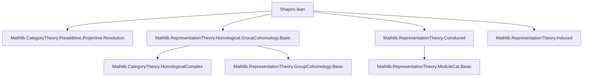

**Technical Brief: Shapiro’s Lemma in Lean 4 (`Shapiro.lean`)**  
*Formalized by Amelia Livingston (2025), under Apache 2.0 license*

---

### 1. **Key Definitions & Theorems**

| Name | Type / Signature | Purpose |
|------|------------------|---------|
| `linearYonedaObjResProjectiveResolutionIso` | `P : ProjectiveResolution (trivial k G k) → A : Rep k S → ... ≅ ...` | Constructs an isomorphism of cochain complexes: `Hom(Res(P), A) ≅ Hom(P, Coind(A))`, using the adjunction `Res ⊣ Coind` and the fact that `Res` preserves projectives. |
| `coindIso` | `A : Rep k S → n : ℕ → Hⁿ(G, Coind_S^G(A)) ≅ Hⁿ(S, A)` | **Shapiro’s Lemma**: the main theorem — an isomorphism between group cohomology groups of $G$ with coefficients in the coinduced representation and group cohomology of $S$ with coefficients in $A$. |
| `groupCohomology` | `Rep k G → ℕ → Module k` | Standard group cohomology functor: $H^n(G, M) = \mathrm{Ext}^n_{kG}(k, M)$, computed via injective/projective resolutions. |
| `coind` | `Rep k S → Rep k G` | Coinduction functor from $S$-representations to $G$-representations (right adjoint to restriction). |
| `Action.res` / `Res` | `Rep k G → Rep k S` | Restriction of scalars along subgroup inclusion $S \hookrightarrow G$. |
| `barResolution` | `k → Group G → ProjectiveResolution (trivial k G k)` | The standard bar resolution, used to compute group cohomology. |

---

### 2. **Naming Conventions**

- **Prefixes**:
  - `coind_`: related to coinduction (`coindIso`, `coind`).
  - `res_`: related to restriction (`resCoindHomEquiv`, `Action.res`).
  - `linearYonedaObj_`: for constructions involving the linear Yoneda embedding in homological complexes.
- **Suffixes**:
  - `_iso`: denotes an isomorphism (e.g., `coindIso`, `linearYonedaObjResProjectiveResolutionIso`).
  - `_homEquiv`: denotes a module/hom equivalence (e.g., `resCoindHomEquiv`).
- **Structure**:
  - `XObjY` or `XObjResY`: composite constructions involving objects (e.g., `linearYonedaObjResProjectiveResolutionIso`).
  - `inhomogeneousCochainsIso`: standard isomorphism between inhomogeneous cochains and $\mathrm{Hom}$-complexes.

---

### 3. **Tactic Stack**

| Tactic | Usage Frequency | Role |
|--------|-----------------|------|
| `simp_rw` / `simp` | High | Simplify homomorphism conditions and module structures. |
| `ext` + `simp [hom_comm_apply]` | High | Prove equality of morphisms in representation categories (extensionality + simplification). |
| `ModuleCat.hom_ext` | Medium | Extend equality of linear maps to equality of module homomorphisms. |
| `HomologicalComplex.Hom.isoOfComponents` | Medium | Construct isomorphisms of complexes componentwise. |
| `≫` (horizontal composition) | Medium | Compose isomorphisms of complexes/homology. |
| `mapIso` | Medium | Push isomorphisms through functors (e.g., homology). |
| `aesop` / `ring` | Low | Not explicitly used here; leaner proof style via explicit simplification. |

---

### 4. **Proof Logic**

The proof proceeds in three main logical steps:

1. **Projective Preservation & Resolution Restriction**  
   - Use that `Res(S)` is exact and left adjoint to `Coind_S^G`, and that `Coind_S^G` preserves epimorphisms (from `Coinduced.lean`).  
   - Conclude `Res(S)` preserves projectives ⇒ `Res(S)(P)` is a projective resolution of $k$ as an $S$-representation.

2. **Complex-Level Isomorphism**  
   - Construct `linearYonedaObjResProjectiveResolutionIso`:  
     - Use the natural isomorphism $\mathrm{Hom}_{kS}(\mathrm{Res}(P_\bullet), A) \cong \mathrm{Hom}_{kG}(P_\bullet, \mathrm{Coind}(A))$ (via `resCoindHomEquiv`).  
     - Show this commutes with differentials (via `hom_comm_apply`), yielding an isomorphism of cochain complexes.

3. **Homology-Level Isomorphism (Shapiro’s Lemma)**  
   - Apply homology functor to the complex-level iso:  
     $$
     H^n(\mathrm{Hom}_{kS}(\mathrm{Res}(P), A)) \cong H^n(\mathrm{Hom}_{kG}(P, \mathrm{Coind}(A)))
     $$
   - Identify both sides with group cohomology using `groupCohomologyIso` and `inhomogeneousCochainsIso`.  
   - Chain the isomorphisms to get `coindIso`.

---

### 5. **Imports & Dependencies**

| Module | Role |
|--------|------|
| `Mathlib.CategoryTheory.Preadditive.Projective.Resolution` | Projective resolutions and mapping properties. |
| `Mathlib.RepresentationTheory.Homological.GroupCohomology.Basic` | Definition of group cohomology via resolutions, bar resolution, inhomogeneous cochains. |
| `Mathlib.RepresentationTheory.Coinduced` | Coinduction functor, its adjunction with restriction, and preservation of epimorphisms. |
| `Mathlib.RepresentationTheory.Induced` | (Not directly used here, but related; coinduction = induction for finite index; may be relevant for generalizations.) |

---

### 6. **Mermaid Diagrams**

#### **Dependency Graph (Module-Level)**



#### **Overview of Proof Structure**

```mermaid
flowchart LR
  P[Projective Resolution P of k as G-rep] --> Res[Res(S)(P) is projective resolution as S-rep]
  A[Coinduction Adjunction: Res ⊣ Coind] --> HomIso[Hom(Res(P), A) ≅ Hom(P, Coind(A))]

  HomIso --> HomologyIso[Hⁿ(G, Coind(A)) ≅ Hⁿ(S, A)]

  Res --> HomIso
  HomIso -->|apply homology| HomologyIso
```

#### **Chain of Isomorphisms in `coindIso`**

```mermaid
flowchart LR
  Hⁿ(G, Coind(A)) 
    -->|inhomogeneousCochainsIso| 
    Hom(P, Coind(A))
    -->|linearYonedaObjResProjectiveResolutionIso.symm| 
    Hom(Res(P), A)
    -->|groupCohomologyIso.symm| 
    Hⁿ(S, A)
```

---

### 7. **Mathematical Summary**

Shapiro’s Lemma is formalized as an isomorphism of group cohomology groups:
$$
H^n(G, \mathrm{Coind}_S^G(A)) \cong H^n(S, A)
$$
for any subgroup $S \le G$, commutative ring $k$, and $k$-linear $S$-representation $A$.  
The proof leverages:
- Homological algebra (projective resolutions, homology functors),
- Representation theory (restriction/coinduction adjunction),
- Category theory (Yoneda, hom complexes, isomorphisms of complexes).

The formalization is concise and modular, reusing existing infrastructure for resolutions, cohomology, and adjunctions.

--- 

*End of Technical Brief.*
