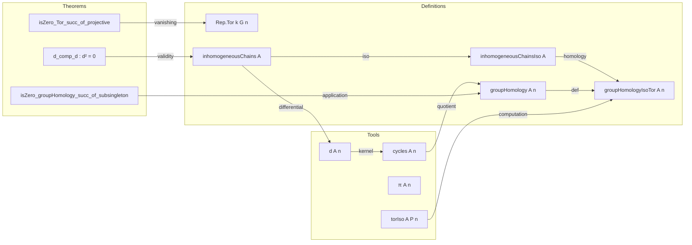

**Technical Brief: Group Homology in Lean 4 (Basic.lean)**  
*Based on `Basic.lean` from the Mathlib Representation Theory / Homological Algebra module*

---

### 1. KEY DEFINITIONS & THEOREMS

| Name | Type / Signature | Purpose |
|------|------------------|---------|
| `Rep.Tor k G n` | `Rep k G ⥤ Rep k G ⥤ ModuleCat k` | Left-derived functors of the bifunctor $(A, B) \mapsto (A \otimes_k B)_G$, i.e., $\mathrm{Tor}_n^G(A, B)$. |
| `groupHomology.inhomogeneousChains A` | `ChainComplex (ModuleCat k) ℕ` | The *inhomogeneous chain complex* computing group homology: $C_n(G, A) = \bigoplus_{G^n} A$. |
| `groupHomology.inhomogeneousChainsIso A` | `inhomogeneousChains A ≅ (barComplex k G).coinvariantsTensorObj A` | Isomorphism of chain complexes between inhomogeneous chains and $(A \otimes_k P)_G$, where $P$ is the bar resolution. |
| `groupHomology A n` | `ModuleCat k` | The $n$th group homology: $\mathrm{H}_n(G, A) := \mathrm{H}_n(C_\bullet(G, A))$. |
| `groupHomologyIsoTor A n` | `groupHomology A n ≅ (Rep.Tor k G n).obj A .obj (Rep.trivial k G k)` | Isomorphism $\mathrm{H}_n(G, A) \cong \mathrm{Tor}_n(A, k)$, induced by `inhomogeneousChainsIso`. |
| `groupHomology.d A n` | `ModuleCat.of k ((Fin (n+1) → G) →₀ A) ⟶ ModuleCat.of k ((Fin n → G) →₀ A)` | Differential $d_n$ in inhomogeneous complex: explicit formula involving group action and face maps. |
| `groupHomology.cycles A n` | `ModuleCat k` | $n$-cycles $Z_n(G, A) = \ker(d_n)$. |
| `groupHomology.π A n` | `cycles A n ⟶ groupHomology A n` | Canonical projection from cycles to homology. |
| `Rep.torIso A P n` | `((Rep.Tor k G n).obj A).obj B ≅ (P.complex.coinvariantsTensorObj A).homology n` | Computes $\mathrm{Tor}_n(A, B)$ via any projective resolution $P \to B$. |
| `Rep.isZero_Tor_succ_of_projective` | `[Projective Y] ⇒ IsZero (Tor_{n+1}(X, Y))` | Higher Tor vanishes when second argument is projective. |

---

### 2. NAMING CONVENTIONS

- **Prefixes**:
  - `Rep.`: Functions/objects in the category of $k$-linear $G$-representations.
  - `groupHomology.`: Group homology-specific constructions.
  - `coinvariantsTensor`: Bifunctor $(A, B) \mapsto (A \otimes_k B)_G$.
  - `barComplex`, `barResolution`: Standard bar resolution of the trivial representation.
  - `coinvariantsTensorFreeLEquiv`: Key isomorphism $\bigoplus_{G^n} A \cong (A \otimes_k k[G]^{\oplus G^n})_G$.

- **Suffixes**:
  - `Iso`: Isomorphism (e.g., `groupHomologyIsoTor`).
  - `d`: Differential in a chain complex.
  - `cycles`: Cycle module (kernel of differential).
  - `π`: Canonical projection to homology.
  - `homology`: Homology module (cokernel of previous differential modulo image).

- **Notable patterns**:
  - `Fin n → G` used for $G^n$-indexed sums.
  - `→₀` (finsupp) for finite support functions → direct sum.
  - `•` for scalar multiplication in modules.

---

### 3. TACTIC STACK

Frequently used tactics in proofs:

| Tactic | Usage |
|--------|-------|
| `simp` | Simplifying homology/differential definitions, especially using `d_single`, `d_eq`, `coinvariantsTensorFreeLEquiv`. |
| `ext` + `simp` | Proving equality of module homs (extensionality via `lsingle` generators). |
| `slice_lhs` | Local rewriting inside complex diagrams (e.g., inserting `Iso.hom_inv_id`). |
| `rw [Iso.hom_inv_id]`, `rw [Category.id_comp]` | Manipulating composite morphisms in categories. |
| `exact`, `apply`, `intro` | Standard intro/apply for simple goals. |
| `rcases` + `ModuleCat.epi_iff_surjective` | Elimination for homology elements (e.g., `groupHomology_induction_on`). |
| `simpa` | Simplify and solve using assumptions (e.g., `d_comp_d`). |
| `ring`, `abelian` | Implicitly used in module arithmetic (e.g., signs $(-1)^{i+1}$). |

---

### 4. PROOF LOGIC

**General proof strategy**:

1. **Define chain complexes**:
   - Construct `inhomogeneousChains A` using explicit differentials `d`.
   - Prove $d^2 = 0$ via `d_comp_d`, using `d_eq` to reduce to bar complex differential (which squares to zero by construction).

2. **Relate to bar resolution**:
   - Show `inhomogeneousChains A ≅ (barComplex k G).coinvariantsTensorObj A` via `inhomogeneousChainsIso`.
   - Key step: `d_eq` equates the explicit $d_n$ to conjugation of bar differential by `coinvariantsTensorFreeLEquiv`.

3. **Relate to Tor**:
   - Use `torIso A (barResolution k G) n` to identify homology of $(A \otimes P)_G$ with $\mathrm{Tor}_n(A, k)$.
   - Compose isomorphisms: `groupHomologyIsoTor = isoOfQuasiIsoAt ∘ torIso⁻¹`.

4. **Low-degree consequences**:
   - Vanishing results follow from projectivity (e.g., `isZero_groupHomology_succ_of_subsingleton` uses `isZero_Tor_succ_of_projective` + `groupHomologyIsoTor`).

**Inductive/structural reasoning**:
- Homology elements eliminated via `groupHomology_induction_on`, using surjectivity of $\pi$.
- Morphism extensionality via `inhomogeneousChains.ext`, reducing to generators `lsingle g`.

---

### 5. IMPORTS & DEPENDENCIES

| Module | Role |
|--------|------|
| `Mathlib.Algebra.Homology.ConcreteCategory` | Chain complexes in concrete categories (`ModuleCat k`). |
| `Mathlib.RepresentationTheory.Coinvariants` | Definition of coinvariants $(A)_G = A / \langle g \cdot a - a \rangle$. |
| `Mathlib.RepresentationTheory.Homological.Resolution` | Projective resolutions, bar resolution, left derived functors. |
| `Mathlib.Tactic.CategoryTheory.Slice` | Slice category tactics (used in `Rep`). |
| `Mathlib.CategoryTheory.Abelian.LeftDerived` | General theory of left derived functors. |

**Core dependencies**:
- `CategoryTheory`, `ModuleCat`, `MonoidalCategory`, `Finsupp`, `HomologicalComplex`.
- `Rep`, `Group`, `CommRing`.

---

### 6. MERMAID DIAGRAMS

#### Dependency Graph (High-Level)

```mermaid
graph TD
  A[CommRing k] --> B[Group G]
  B --> C[Rep k G]
  C --> D[Rep.coinvariantsTensor k G]
  C --> E[barComplex k G]
  E --> F[(A ⊗ P)_G]
  D --> F
  F --> G[HomologicalComplex]
  G --> H[LeftDerivedFunctors]
  H --> I[Rep.Tor k G n]
  G --> J[groupHomology A n]
  J --> K[groupHomologyIsoTor]
  I --> K
```

#### Overview of `Basic.lean`



---

### 7. IMPLEMENTATION NOTES & DESIGN DECISIONS

- **Avoids `Module ℤ[G] A`**: Uses `Rep k G` instead to prevent scalar action diamonds.
- **Generalizes from ℤ to `k`**: Works for any commutative ring `k`, not just ℤ.
- **Tor defined via coinvariants**: Since `TensorProduct` in mathlib only supports commutative base rings, `Tor` is derived from $(A, B) \mapsto (A \otimes_k B)_G$, not $A \otimes_{k[G]} B$.
- **Explicit differentials**: `d` is given in *inhomogeneous* (bar) coordinates, not via abstract derived functor machinery.
- **Decidable equality needed**: `barComplex.d_single` and `d_eq` require `[DecidableEq G]`.

---

### 8. FUTURE WORK (from TODO)

- Upgrade `groupHomologyIsoTor` to an **isomorphism of derived functors**, i.e., a natural isomorphism of functors $\mathrm{H}_n(G, -) \cong \mathrm{Tor}_n(-, k)$.
- Extend API to *co*homology (not present here).
- Connect to *spectral sequences* for group extensions.

--- 

Let me know if you'd like a formalized summary in Lean syntax or a visualization of the differential $d_n$ in diagrammatic form.
