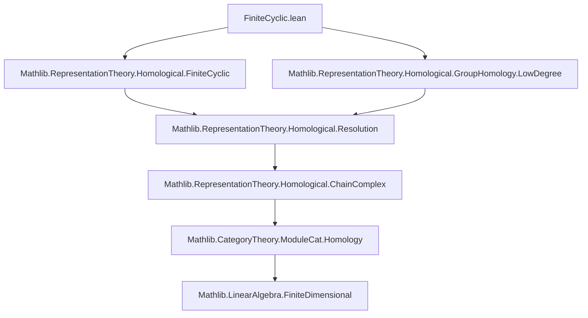

### Technical Brief: `FiniteCyclic.lean`

---

#### **1. Key Definitions & Theorems**

| Name | Type / Signature | Purpose |
|------|------------------|---------|
| `coinvariantsTensorResolutionIso` | `(hg : ∀ x, x ∈ Subgroup.zpowers g) → (resolution k g⁻¹ ...).complex.coinvariantsTensorObj A ≅ moduleCatChainComplex A g` | Constructs an isomorphism of chain complexes between the coinvariants of the tensor product of $A$ with the standard projective resolution of $k$, and a periodic chain complex built from $A$ and group actions. |
| `groupHomologyIso₀` | `(hg : ∀ x, x ∈ Subgroup.zpowers g) → H₀(G, A) ≅ A / im(ρ(g) - id)` | Computes $H_0(G, A)$ as the cokernel of $ρ(g) - \mathrm{id}_A$. |
| `groupHomologyIsoEven` | `(hg, i, [NeZero i], hi : Even i) → H_i(G, A) ≅ homology of A --N--> A --(ρ(g)-id)--> A` | Identifies even-degree group homology (for $i > 0$) with homology of the complex $A \xrightarrow{N} A \xrightarrow{ρ(g)-\mathrm{id}} A$. |
| `groupHomologyπEven` | `(hg, i, [NeZero i], hi : Even i) → ker(N) → H_i(G, A)` | The canonical quotient map from $N$-invariants to $H_i(G, A)$ for even $i > 0$. |
| `groupHomologyπEven_eq_zero_iff` | Lemma describing when $\pi_{\text{even}}(x) = 0$ | Characterizes kernel of $\pi_{\text{even}}$ as $\mathrm{im}(ρ(g) - \mathrm{id})$. |
| `groupHomologyπEven_eq_iff` | Lemma describing equality in $H_i(G, A)$ | Two elements map to same class iff their difference lies in $\mathrm{im}(ρ(g) - \mathrm{id})$. |
| `groupHomologyIsoOdd` | `(hg, i, hi : Odd i) → H_i(G, A) ≅ homology of A --(ρ(g)-id)--> A --N--> A` | Identifies odd-degree group homology with homology of $A \xrightarrow{ρ(g)-\mathrm{id}} A \xrightarrow{N} A$. |
| `groupHomologyπOdd` | `(hg, i, hi : Odd i) → ker(ρ(g)-id) → H_i(G, A)` | Canonical quotient map from $ρ(g)$-fixed points to $H_i(G, A)$ for odd $i$. |
| `groupHomologyπOdd_eq_zero_iff` | Lemma for odd $i$: $\pi_{\text{odd}}(x) = 0 \iff x \in \mathrm{im}(N)$ | Describes kernel of $\pi_{\text{odd}}$. |
| `groupHomologyπOdd_eq_iff` | Lemma for odd $i$: equality criterion | Two elements map to same class iff their difference lies in $\mathrm{im}(N)$. |

---

#### **2. Naming Conventions**

- **Prefixes:**
  - `groupHomologyIso*`: Isomorphisms computing group homology.
  - `groupHomologyπ*`: Canonical projection maps from cycles to homology.
  - `coinvariantsTensor*`: Related to coinvariants of tensoring with group algebra resolution.
  - `normHomCompSub`, `subCompNormHom`: Short complexes involving norm map $N = \sum_{h \in G} h$ and $ρ(g) - \mathrm{id}$.

- **Suffixes:**
  - `₀`: Degree 0 case.
  - `Even`, `Odd`: Parity of homological degree.
  - `π`: Projection map (quotient by image).
  - `iso`: Isomorphism (often involving homology or chain complexes).

- **Variables:**
  - `A`: Representation.
  - `g`: Generator of cyclic group.
  - `hg`: Proof that $G = \langle g \rangle$.
  - `i`: Homological degree.

---

#### **3. Tactic Stack**

Frequently used tactics in proofs:
- `aesop`: For automated reasoning about equalities and membership.
- `simp`: Simplification using definitional equalities and lemmas.
- `rw`: Rewriting using previously proven equivalences.
- `induction`: Structural induction on natural numbers (especially for parity).
- `ext`: Extensionality for functions/morphisms.
- `subst`: Substituting equalities.
- `by_cases`: Case analysis on boolean conditions (e.g., `Even`/`Odd`).
- `exact`, `assumption`, `refine`: For direct proof construction.
- `ModuleCat.mono_iff_injective`, `HomologicalComplex.*`: Specialized homological algebra simplifications.

---

#### **4. Proof Logic**

The logical flow follows a standard pattern for computing group homology via resolutions:

1. **Resolution Setup**: Use the standard periodic projective resolution of $k$ over $k[G]$, where $G$ is finite cyclic generated by $g$.
2. **Coinvariants Tensor Isomorphism**: Show that tensoring this resolution with $A$ and taking coinvariants yields a complex isomorphic to a simpler alternating complex involving:
   - $ρ(g) - \mathrm{id}_A$
   - Norm map $N = \sum_{h \in G} ρ(h)$

3. **Homology Identification**:
   - For $i = 0$: Directly compute $H_0$ as coinvariants modulo $ρ(g) - \mathrm{id}$.
   - For $i > 0$:
     - Use the isomorphism of chain complexes to transfer homology.
     - Apply known homology isomorphisms for alternating constant complexes (`alternatingConstHomologyIsoEven`, `alternatingConstHomologyIsoOdd`).
     - Use parity induction or case analysis on $i$.

4. **Projection Maps & Characterizations**:
   - Define canonical projections from cycles to homology.
   - Prove kernel/image characterizations using module-theoretic properties (e.g., `mem_range`, `codRestrict`).

---

#### **5. Imports**

Primary dependencies defining scope:

```lean
import Mathlib.RepresentationTheory.Homological.FiniteCyclic
import Mathlib.RepresentationTheory.Homological.GroupHomology.LowDegree
```

These indicate the file builds upon:
- General theory of group homology (via projective resolutions, coinvariants).
- Homological algebra in module categories.
- Specific low-degree computations (e.g., $H_0$, $H_1$).
- Representation theory over commutative rings.

---

#### **8. Mermaid Diagrams**

##### **Dependency Graph (Module-Level)**



##### **Overview of File Structure**

```mermaid
flowchart LR
  A[Finite Cyclic Group G] --> B[Projective Resolution P• of k]
  B --> C[Coinvariants Tensor A ⊗_{k[G]} P•]
  C --> D[Isomorphic Complex: A --N--> A --ρ(g)-id--> A]
  D --> E[Homology Computation]
  E --> F[H₀ ≅ coker(ρ(g)-id)]
  E --> G[Hᵢ (even >0) ≅ homology of A --N--> A --ρ(g)-id--> A]
  E --> H[Hᵢ (odd) ≅ homology of A --ρ(g)-id--> A --N--> A]
  F --> I[Projection π₀]
  G --> J[Projection πᵢ^even]
  H --> K[Projection πᵢ^odd]
  J --> L[Kernel = im(ρ(g)-id)]
  K --> M[Kernel = im(N)]
```

---

This file formalizes a classical result in group homology: for finite cyclic groups, homology can be computed via a 2-periodic complex built from the norm map and the deviation of the generator action from identity. The Lean formalization emphasizes explicit isomorphisms and concrete descriptions of cycles, boundaries, and projections — crucial for downstream applications like cohomology ring structures or Tate cohomology.
