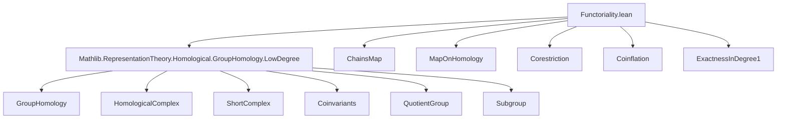
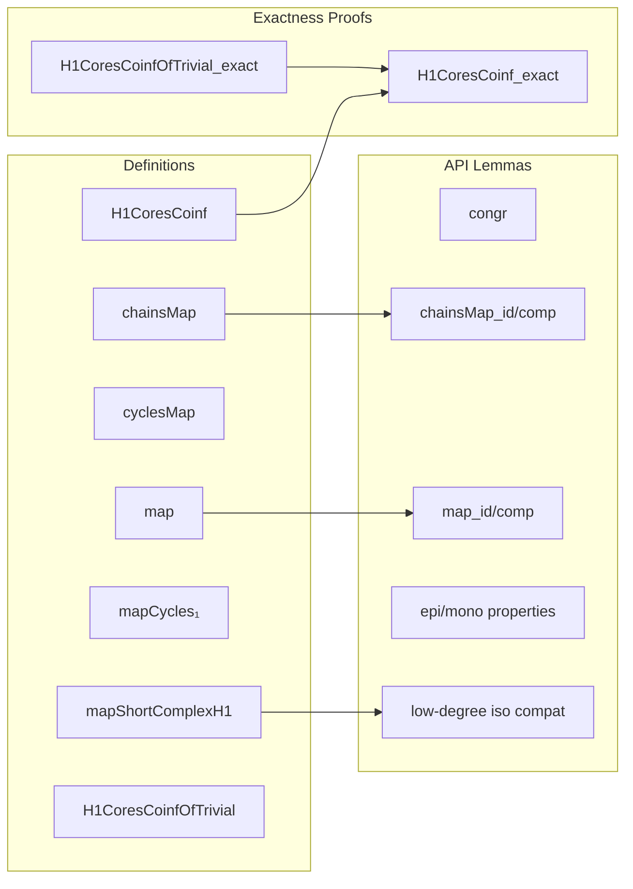

Here is the **technical metadata** extracted from `Functoriality.lean`, structured as requested:

---

### 1. KEY DEFINITIONS & THEOREMS

| Name | Type / Purpose |
|------|----------------|
| `chainsMap f φ` | `inhomogeneousChains A ⟶ inhomogeneousChains B` — chain map induced by group homomorphism `f : G →* H` and rep morphism `φ : A → Res(f)(B)` |
| `map f φ n` | `Hₙ(G, A) ⟶ Hₙ(H, B)` — induced map on *n*th group homology |
| `cyclesMap f φ n` | `Zₙ(G, A) ⟶ Zₙ(H, B)` — induced map on *n*-cycles |
| `chainsMap₁`, `chainsMap₂`, `chainsMap₃` | Explicit chain maps in low degrees (1, 2, 3) |
| `mapShortComplexH1 f φ` | `shortComplexH1 A ⟶ shortComplexH1 B` — map of short complexes for degree 1 |
| `mapCycles₁ f φ` | `Z₁(G, A) ⟶ Z₁(H, B)` — induced map on 1-cycles |
| `H1CoresCoinf A S` | Short complex `H₁(S, A) → H₁(G, A) → H₁(G/S, A_S)` — corestriction-coinflation sequence in degree 1 |
| `H1CoresCoinfOfTrivial A S` | Same as above, but for *S*-trivial representations (simpler case) |
| `coresNatTrans f n` | Natural transformation `Hₙ(Res(f)(–)) ⇒ Hₙ(–)` (corestriction) |
| `coinfNatTrans S n` | Natural transformation `Hₙ(–) ⇒ Hₙ(–_S)` (coinflation) |
| `congr` | Lemma: if `f₁ = f₂`, then `F f₁ φ = F f₂ (h ▸ φ)` |
| `chainsMap_id`, `chainsMap_comp` | Identity and composition laws for `chainsMap` |
| `map_id`, `map_comp` | Identity and composition laws for `map` |
| `cyclesMap_id`, `cyclesMap_comp` | Identity and composition laws for `cyclesMap` |
| `H1CoresCoinf_exact` | Exactness of the corestriction-coinflation sequence in degree 1 |
| `H1CoresCoinfOfTrivial_exact` | Exactness in the *S*-trivial case (used as intermediate step) |
| `epi_map_0_of_epi`, `epi_map₁_quotientGroupMk'_epi`, etc. | Epimorphism properties of induced maps in degrees 0 and 1 |

---

### 2. NAMING CONVENTIONS

- **Prefixes**:
  - `chainsMap_`: chain-level maps (before homology)
  - `map_`: homology-level maps
  - `cyclesMap_`: cycle-level maps
  - `mapShortComplex_`: maps of short complexes (used for low-degree constructions)
  - `H*_π`: projection from cycles to homology (`H0π`, `H1π`)
  - `isoCycles_`, `cyclesIso_`: isomorphisms identifying cycles with standard modules
  - `coinf_`, `cores_`: coinflation / corestriction maps
- **Suffixes**:
  - `_f`: hom component of a module morphism
  - `_hom`: underlying linear map
  - `_comp`: composition lemmas
  - `_id`: identity lemmas
  - `_epi`, `_mono`: properties of induced maps
  - `_exact`: exactness results
- **Special**:
  - `lsingle`, `single`: standard generators of inhomogeneous chains
  - `lmapDomain`, `mapRange`: domain/codomain change for finsupp-based chains
  - `resOfQuotientIso`, `toCoinvariantsMkQ`: structure isomorphisms for coinvariants / quotients

---

### 3. TACTIC STACK

- **Core tactics**:
  - `ext`: extensionality for functions, finsupp, modules
  - `simp` / `simp only` / `simp_rw`: heavy use of `simp` with custom lemmas (`reassoc`, `elementwise`, `simps!`)
  - `rw`: rewriting using lemmas like `map_comp`, `H1π_comp_map`, etc.
  - `subst`: for equality substitution
  - `induction ... using ..._induction_on`: structural induction on homology classes (e.g., `H1_induction_on`)
  - `rcases`: destruct existential quantifiers (e.g., `⟨y, hy⟩`)
  - `choose!`: dependent choice for sections / lifts
  - `apply`, `exact`, `refine`: proof construction
  - `have`, `set`: local definitions for intermediate constructions (e.g., `z`, `ve`, `β`)
  - `convert`: for equational reasoning modulo definitional equality
  - `apply_fun`, `congr`: congruence reasoning (especially for `congr` lemma)
  - `apply_fun`, `apply_congr`: functional extensionality and congruence

- **Category-theoretic automation**:
  - `HomologicalComplex.*_map`, `ShortComplex.*_map`
  - `ModuleCat.*_ext`, `ModuleCat.mono_iff_injective`, `ModuleCat.epi_iff_surjective`
  - `cancel_mono`, `cancel_epi`: for epimorphism/monomorphism cancellation

---

### 4. PROOF LOGIC

- **General pattern**:
  1. **Define** chain-level maps (`chainsMap`, `mapShortComplexH1`, etc.) using `ModuleCat.ofHom`.
  2. **Verify** chain map property (`comm'`) via `ext` + `simp` + `hom_comm_apply`.
  3. **Lift** to cycles/homology via `HomologicalComplex.cyclesMap`, `homologyMap`.
  4. **Prove** naturality/identity/composition via `ext`, `simp`, and previously proven lemmas.
  5. **Use** low-degree isomorphisms (`chainsIso₀`, `chainsIso₁`, `isoCycles₁`) to simplify computations.
  6. **For exactness** (e.g., `H1CoresCoinf_exact`):
     - Reduce to cycle representatives (`induction x using H1_induction_on`).
     - Use surjectivity of relevant maps (`mapCycles₁_quotientGroupMk'_epi`, `Coinvariants.mk_surjective`).
     - Construct preimages (`choose!`, `rcases`).
     - Define correction terms (`z`, `ve`, `β`) to land in the right submodule (e.g., `S`-support).
     - Show equality up to boundaries via explicit boundary computations (`d₂₁`, `d₁₀`).
     - Use `H1π_eq_iff`, `H1π_eq_zero_iff` to conclude homology equality.

- **Inductive structure**:
  - Prove exactness first for *S*-trivial reps (`H1CoresCoinfOfTrivial_exact`).
  - Then extend to general reps using coinvariants and surjectivity of `Coinvariants.mk`.

---

### 5. IMPORTS

- `Mathlib.RepresentationTheory.Homological.GroupHomology.LowDegree`  
  → Provides foundational definitions: `inhomogeneousChains`, `groupHomology`, `cycles`, `boundaries`, `H0π`, `H1π`, `shortComplexH1`, `coinvariants`, `quotienttoCoinvariants`, etc.

- Implicit imports (via `open`):
  - `CategoryTheory`: homological algebra, natural transformations, short complexes
  - `Rep`: representation category
  - `Finsupp`: finite support functions (used for inhomogeneous chains)
  - `Representation`: module actions, restriction of scalars (`Action.res`)

---

### 6. MERMAID DIAGRAMS

#### Dependency Graph (Top-Level)

#### Overview of File Structure

---

Let me know if you'd like a **dependency graph of lemmas**, or a **proof dependency DAG** for `H1CoresCoinf_exact`.
