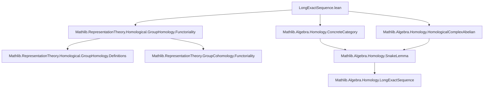
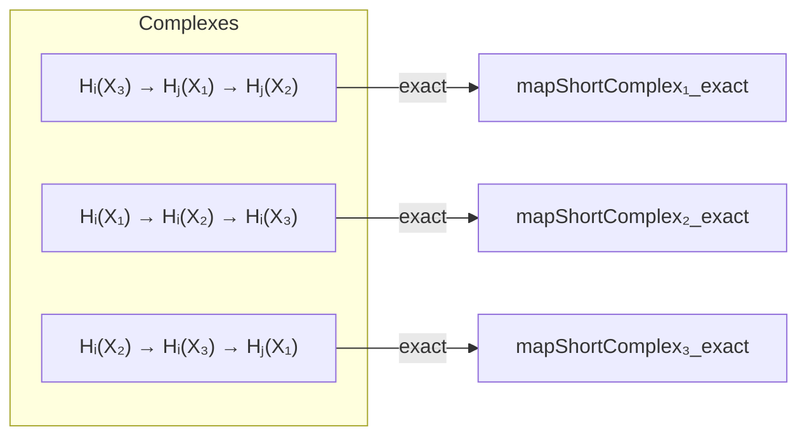

### Technical Brief: `LongExactSequence.lean`

---

#### **1. Key Definitions & Theorems**

| Name | Type / Signature | Purpose |
|------|------------------|---------|
| `groupHomology.δ` | `δ (i j : ℕ) (hij : j + 1 = i) : groupHomology X.X₃ i ⟶ groupHomology X.X₁ j` | Connecting homomorphism in long exact sequence of group homology induced by a short exact sequence of $G$-representations. |
| `map_chainsFunctor_shortExact` | `ShortExact (X.map (chainsFunctor k G))` | Shows that applying the inhomogeneous chain complex functor to a short exact sequence of $G$-representations yields a short exact sequence of complexes. |
| `mapShortComplex₁`, `mapShortComplex₂`, `mapShortComplex₃` | `abbrev` short complexes of homology groups | Construct the three short complexes appearing in the long exact sequence: $H_i(X₃) \to H_j(X₁) \to H_j(X₂)$, $H_i(X₁) \to H_i(X₂) \to H_i(X₃)$, and $H_i(X₂) \to H_i(X₃) \to H_j(X₁)$. |
| `mapShortComplex₁_exact`, `mapShortComplex₂_exact`, `mapShortComplex₃_exact` | `lemma` asserting exactness | Prove exactness of the above three short complexes using homology exactness lemmas from `SnakeInput`. |
| `δ_apply`, `δ₀_apply`, `δ₁_apply` | `theorem` describing action of $\delta$ on cycles | Explicitly describe how $\delta$ acts on representatives: lifting a cycle in $X₃$, mapping to $X₂$, differentiating, and projecting back to $X₁$. |
| `cyclesMkOfCompEqD` | `abbrev` constructing a cycle in $X₁$ | Given $f(x) = d(y)$, constructs a cycle representative for the image of $\delta$. |
| `mem_cycles₁_of_comp_eq_d₂₁` | `theorem` verifying 1-cycles | Ensures that if $f(x) = d_2(y)$, then $x$ is a 1-cycle in $X₁$. |
| `epi_δ_of_isZero`, `mono_δ_of_isZero`, `isIso_δ_of_isZero` | `theorem`s about $\delta$ when intermediate homology vanishes | Consequences of the snake lemma: $\delta$ is epi/mono/isomorphism when adjacent homology groups vanish. |

---

#### **2. Naming Conventions**

- **Prefixes**:
  - `map_`: indicates application of a functor (e.g., `map_chainsFunctor_shortExact`, `mapShortComplex₂`).
  - `δ`: used for the connecting homomorphism (`δ_apply`, `δ₀_apply`, `δ₁_apply`).
  - `cyclesMk`, `mem_cycles`: cycle construction and membership lemmas.
  - `Hnπ`: projection from cycles to homology classes (e.g., `H0π`, `H1π`, `H2π`).
  - `inhomogeneousChains`: chain complex of inhomogeneous cochains (note: despite name, it's *chains*, not cochains).
  - `snakeInput`: refers to the input data for the snake lemma construction.

- **Suffixes**:
  - `_exact`: asserts exactness of a constructed short complex.
  - `_apply`: theorems describing the action of a morphism on elements/cycles.
  - `_of_`: e.g., `mem_cycles₁_of_comp_eq_d₂₁`, `cyclesMkOfCompEqD`: condition-based naming.

---

#### **3. Tactic Stack**

- **Core tactics**:
  - `simp`, `simp only`, `simp_rw`: heavily used for rewriting definitions (especially of chains, differentials, projections).
  - `exact`: for direct proof steps, especially in `letI` contexts.
  - `have`, `suffices`: intermediate lemma introduction.
  - `congr`: for extensionality arguments on functions (e.g., `congr($(...))`).
  - `Finsupp.ext`: to prove equality of finitely supported functions.
  - `ModuleCat.mono_iff_injective`, `Rep.mono_iff_injective`: for reducing monomorphisms in representation categories to injectivity.
  - `ring`/`abel` not present — algebra is handled via `LinearMap`/`ModuleCat` API.

- **Category-theoretic automation**:
  - `HomologicalComplex.shortExact_of_degreewise_shortExact`: lifts degreewise exactness to short exactness of complexes.
  - `moduleCat_exact_iff_range_eq_ker`: bridges module-theoretic and categorical exactness.

---

#### **4. Proof Logic**

- **High-level strategy**:
  1. **Lift short exactness** of representations to short exactness of chain complexes via `map_chainsFunctor_shortExact`.
  2. **Apply general homological algebra** (snake lemma) to obtain long exact sequence in homology.
  3. **Specialize** to group homology by identifying homology of `inhomogeneousChains X` with $H_*(G, X)$.
  4. **Describe connecting map explicitly** using representatives (chains/cycles), verifying well-definedness and cycle conditions.

- **Typical proof pattern**:
  - Use `snakeInput` to construct the long exact sequence data.
  - Prove exactness via `homology_exact₁/₂/₃`.
  - For element-wise descriptions (`δ_apply`), lift elements through surjections (`g`), differentiate, and descend via injections (`f`), using exactness to ensure cycles.

- **Induction not used** — all arguments are categorical or element-wise with finite support.

---

#### **5. Imports & Dependencies**

| Import | Role |
|--------|------|
| `Mathlib.Algebra.Homology.ConcreteCategory` | Provides `HomologicalComplex`, `ShortComplex`, and categorical homology tools. |
| `Mathlib.Algebra.Homology.HomologicalComplexAbelian` | Ensures homology categories are abelian (needed for snake lemma). |
| `Mathlib.RepresentationTheory.Homological.GroupHomology.Functoriality` | Defines `chainsFunctor`, `inhomogeneousChains`, and functoriality of group homology. |

> **Note**: This file builds on prior work in `GroupHomology.Functoriality`, especially the definition of the chain complex functor and its behavior under morphisms.

---

#### **6. Mermaid Diagrams**

##### **Dependency Graph (Module-Level)**



##### **Overview of Theoretical Flow**

```mermaid
flowchart LR
  subgraph Input
    I1[Short exact sequence of G-reps: 0 → X₁ → X₂ → X₃ → 0]
  end

  subgraph Construction
    I1 -->|map chainsFunctor| C1[Short exact complex: 0 → C*(X₁) → C*(X₂) → C*(X₃) → 0]
    C1 -->|Snake Lemma| L1[Long exact sequence in homology]
  end

  subgraph Output
    L1 --> O1[Connecting map δ: Hᵢ(G, X₃) → Hⱼ(G, X₁)]
    L1 --> O2[Exact triangles: Hᵢ(X₃) → Hⱼ(X₁) → Hⱼ(X₂), etc.]
  end

  O1 -->|Explicit description| δ_apply[δ on cycles]
  δ_apply -->|Special cases| δ₀_apply[δ on H₁]
  δ_apply -->|Special cases| δ₁_apply[δ on H₂]
```

##### **Diagram of Main Short Complexes**



---

#### **7. Summary**

This file formalizes the **long exact sequence in group homology** induced by a short exact sequence of $G$-representations over a commutative ring $k$. It leverages the **snake lemma** in the abelian category of chain complexes, after verifying that the inhomogeneous chain complex functor preserves short exactness. The key contribution is an **explicit description of the connecting homomorphism** $\delta$, with concrete formulas for low degrees ($\delta_0$, $\delta_1$), essential for computational applications and further development (e.g., inflation-restriction, corestriction, etc.). The structure follows standard homological algebra conventions, with heavy reliance on `HomologicalComplex` and `SnakeLemma` infrastructure.
