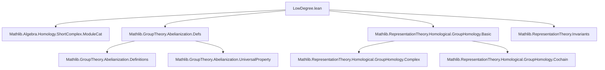
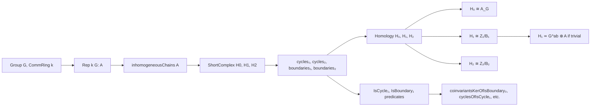

**Technical Brief: `LowDegree.lean` — Low-Degree Group Homology for $k$-Linear $G$-Representations**

---

### **1. Key Definitions & Theorems**

| Name | Type / Purpose |
|------|----------------|
| `chainsIso₀`, `chainsIso₁`, `chainsIso₂`, `chainsIso₃` | Isomorphisms between chain objects in the inhomogeneous chain complex and standard `Finsupp`-based modules: e.g., $(\text{inhomogeneousChains } A).X\ n \cong (G^n \to_0 A)$ for $n = 0,1,2,3$. |
| `d₁₀`, `d₂₁`, `d₃₂` | Explicit $k$-linear differentials:  • $d_{10} : (G \to_0 A) \to A$, $d_{10}(\text{single } g\ a) = \rho(g^{-1})a - a$  • $d_{21} : (G^2 \to_0 A) \to (G \to_0 A)$, $d_{21}(\text{single } (g_1,g_2)\ a) = \text{single } g_2(\rho(g_1^{-1})a) - \text{single } (g_1g_2)a + \text{single } g_1 a$  • $d_{32} : (G^3 \to_0 A) \to (G^2 \to_0 A)$, standard bar-like differential. |
| `cycles₁`, `cycles₂` | Submodules of 1- and 2-cycles: $\ker(d_{10})$, $\ker(d_{21})$. |
| `boundaries₁`, `boundaries₂` | Submodules of 1- and 2-boundaries: $\operatorname{im}(d_{21})$, $\operatorname{im}(d_{32})$. |
| `shortComplexH0`, `shortComplexH1`, `shortComplexH2` | Exact short complexes encoding $C_1 \xrightarrow{d_{10}} C_0 \to A_G$, $C_2 \xrightarrow{d_{21}} C_1 \xrightarrow{d_{10}} C_0$, $C_3 \xrightarrow{d_{32}} C_2 \xrightarrow{d_{21}} C_1$. |
| `groupHomology.H0Iso A` | Isomorphism $H_0(G,A) \cong A_G$ (coinvariants). |
| `groupHomology.H1π A`, `groupHomology.H2π A` | Canonical epimorphisms $Z_1(G,A) \twoheadrightarrow H_1(G,A)$, $Z_2(G,A) \twoheadrightarrow H_2(G,A)$. |
| `groupHomology.H1AddEquivOfIsTrivial` | Additive equivalence $H_1(G,A) \simeq G^{\text{ab}} \otimes_\mathbb{Z} A$ when $A$ is trivial. |
| `cyclesIso₀`, `isoCycles₁`, `isoCycles₂` | Isomorphisms identifying abstract homology cycles $Z_n(G,A) = \ker(d_{n,n-1})$ with concrete `Finsupp`-based definitions (`cycles₁`, `cycles₂`). |
| `coinvariantsKerOfIsBoundary₀`, `cyclesOfIsCycle₁`, `boundariesOfIsBoundary₁`, etc. | Bridge between abstract representation-theoretic cycles/boundaries and elementary `IsCycle₁`, `IsBoundary₁`, etc., defined via group actions. |

---

### **2. Naming Conventions**

- **Prefixes**:
  - `chainsIso_`: chain complex object isomorphisms.
  - `d_`: differentials (e.g., `d₁₀`, `d₂₁`, `d₃₂`).
  - `cycles_`, `boundaries_`: submodules of cycles and boundaries.
  - `isCycle_`, `isBoundary_`: predicate versions of cycle/boundary conditions on `Finsupp`.
  - `coinvariantsKerOf_`, `cyclesOf_`, `boundariesOf_`: conversion lemmas between abstract and concrete structures.
- **Suffixes**:
  - `_iff`, `_of`, `_eq`, `_comp`, `_inv`: logical equivalences, implications, equalities, composition/inverse lemmas.
  - `_hom`, `_inv`: component maps of isomorphisms.
  - `_apply`: evaluation lemmas (e.g., `d₁₀_single_apply`).
- **Quantifier prefixes**:
  - `single_`, `mem_`, `le_`, `eq_`, `comp_`, `inv_`, `hom_`, `vert_`, `horiz_`, `exact_`, `surjective_`, `isTrivial_`.

---

### **3. Tactic Stack**

- **Core tactics**:
  - `simp`, `simp only`, `simp_rw`, `aesop`, `abel`, `ring`, `linarith`
- **Homological algebra**:
  - `ModuleCat.hom_ext`, `lhom_ext`, `Finsupp.ext`, `Submodule.ext`, `Submodule.span_eq_of_le`
  - `CokernelCofork.π_mapOfIsColimit`, `CokernelCofork.mapIsoOfIsColimit`
  - `ShortComplex.moduleCat_exact_iff`, `HomologicalComplex.iCycles`, `iCycles_mk`
- **Category-theoretic**:
  - `isoMk`, `isoMk_of_inv`, `≫`, `≫ₘ`, `≫ₘ_assoc`, `≫ₘ_left_id`, `≫ₘ_right_id`
  - `Iso.inv`, `Iso.hom`, `Iso.symm`, `Iso.trans`
- **Finsupp-specific**:
  - `Finsupp.induction`, `Finsupp.sum_add_index`, `Finsupp.sum_sub_index`, `Finsupp.single_eq_single`, `Finsupp.domLCongr_apply`, `domLCongr_single`

---

### **4. Proof Logic**

- **Inductive structure**:
  - Proofs of differential identities (e.g., $d_{21} \circ d_{10} = 0$) use `simp` + `abel` on `single` generators, leveraging `Finsupp` induction.
- **Submodule equalities**:
  - Use `Submodule.span_eq_of_le` for coinvariants kernel, or `Submodule.ext` + `Finsupp.induction`.
- **Isomorphism constructions**:
  - Built via `isoMk` or `≈≫` (composition of isomorphisms), often using `inhomogeneousChains.isoSc'` to relate abstract chain complexes to concrete short complexes.
- **Equivalence of definitions**:
  - `cyclesIso₀`, `isoCycles₁`, `isoCycles₂` use `cyclesMapIso'` and `isoSc'` to transfer cycle objects.
- **Trivial representation simplifications**:
  - When `[A.IsTrivial]`, many differentials vanish (`d₁₀_eq_zero_of_isTrivial`), leading to simplifications like `cycles₁_eq_top_of_isTrivial`.
- **Group-theoretic manipulations**:
  - Heavy use of group identities (`inv_mul_cancel`, `mul_inv_cancel`, `inv_inv`, `inv_mul_eq_mul_inv`, etc.) in `simp`-based proofs.

---

### **5. Imports & Dependencies**

- `Mathlib.Algebra.Homology.ShortComplex.ModuleCat`
- `Mathlib.GroupTheory.Abelianization.Defs`
- `Mathlib.RepresentationTheory.Homological.GroupHomology.Basic`
- `Mathlib.RepresentationTheory.Invariants`

**Scope**: This file specializes the general group homology machinery (from `GroupHomology.Basic`) to low degrees (0–2), providing concrete computational models using `Finsupp` and explicit differentials, and connects them to group-theoretic constructions (coinvariants, abelianization, tensor product).

---

### **6. Mermaid Diagrams**

#### **Dependency Graph (Module-Level)**

#### **Overview Diagram (Conceptual Flow)**

---

### **7. Summary**

This file provides a *computational bridge* between the abstract homological definition of group homology and concrete group-theoretic objects. It introduces:
- Explicit models for $C_n$, $Z_n$, $B_n$, $H_n$ for $n = 0,1,2$,
- Natural isomorphisms between abstract and concrete definitions,
- A full API for manipulating cycles and boundaries via `Finsupp`,
- A key classification $H_1(G,A) \cong G^{\text{ab}} \otimes A$ in the trivial case.

It serves as a foundation for low-degree group cohomology calculations and is essential for applications in group extensions, Schur multipliers, and representation theory.
