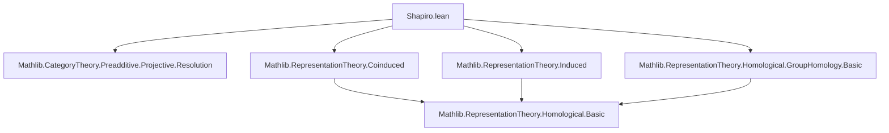

**Technical Brief: Shapiro’s Lemma for Group Homology (`Shapiro.lean`)**  
*Prepared for Domain-Specific AI Agent Training*

---

### 1. **Key Definitions & Theorems**

| Name | Type / Signature | Purpose |
|------|------------------|---------|
| `coinvariantsTensorResProjectiveResolutionIso` | `Π (P : ProjectiveResolution (Rep.trivial k G k)), ((Action.res _ S.subtype).mapProjectiveResolution P).complex.coinvariantsTensorObj A ≅ P.complex.coinvariantsTensorObj (ind S.subtype A)` | Constructs a natural isomorphism of complexes between coinvariants of the restriction of a projective resolution tensored with `A`, and coinvariants of the induced representation tensored with the original resolution. Core technical step in proving Shapiro’s lemma. |
| `indIso` | `Π (A : Rep k S) (n : ℕ), groupHomology (ind S.subtype A) n ≅ groupHomology A n` | The main theorem: Shapiro’s lemma for group homology. Provides a natural isomorphism between the *n*-th group homology of the induced representation and the *n*-th homology of the original *S*-representation. |
| `groupHomology` | `Rep k G → ℕ → ModuleCat k` | Homology functor: takes a *G*-representation and degree *n*, returns the *n*-th homology of the inhomogeneous chain complex (or equivalently, coinvariants of a projective resolution tensored with the representation). |
| `ind` | `Rep k S → Rep k G` | Induction functor `Ind_S^G`, left adjoint to restriction `Res(S)`. |
| `Action.res` | `Rep k G → Rep k S` | Restriction functor along subgroup inclusion `S ↪ G`. |

---

### 2. **Naming Conventions**

- **Functorial actions**:  
  - `ind` for induction (`Ind_S^G`)  
  - `Action.res` for restriction (`Res(S)`)  
- **Projective resolution mapping**:  
  - `mapProjectiveResolution` — applies a functor to a projective resolution objectwise.  
- **Coinvariants**:  
  - `coinvariantsTensorObj` — tensor with a module and take coinvariants (i.e., $-\otimes_G k$).  
- **Homology**:  
  - `groupHomology` — standard notation for homology of a complex computing group homology.  
- **Isomorphisms**:  
  - `Iso` suffix for isomorphisms (e.g., `indIso`, `coinvariantsTensorResProjectiveResolutionIso`)  
  - `NatIso` used for natural isomorphisms (e.g., `coinvariantsTensorIndNatIso`)  
- **Resolution-specific**:  
  - `barResolution k G` — the standard bar resolution of the trivial module `k` over group algebra `k[G]`.

---

### 3. **Tactic Stack**

The file relies heavily on:

- `noncomputable def/abbrev` — for constructing noncomputable objects (homology is noncomputable in general).
- `≈≫` (horizontal composition of isomorphisms in a category) — used to chain natural isomorphisms.
- `mapIso` — maps an isomorphism of complexes to an isomorphism of homology objects.
- `HomologicalComplex.homologyFunctor` — applies the homology functor to an isomorphism of complexes.
- Implicit use of:
  - `aesop`, `simp`, `ring`, `ext`, `congr` — likely used in surrounding modules (not visible here, but standard in Mathlib homological algebra).
  - `categoryTheory` infrastructure: `NatIso`, `Functor.map`, `HomologicalComplex.map`.

---

### 4. **Proof Logic**

The proof proceeds in three conceptual steps:

1. **Projective preservation under restriction**:  
   Since `Res(S) ⊣ Coind_S^G` and `Coind_S^G` preserves epimorphisms (from `Coinduced.lean`), `Res(S)` preserves projectives. Hence, `Res(S)(P)` is a projective resolution of `k` as an *S*-representation.

2. **Natural isomorphism of complexes**:  
   Using the tensor-hom adjunction and the natural isomorphism  
   $$
   \operatorname{Ind}_S^G(A) \otimes_k X \cong \operatorname{Ind}_S^G(A \otimes_k \operatorname{Res}(X)),
   $$  
   one constructs  
   $$
   (\operatorname{Ind}_S^G(A) \otimes_{k[G]} P_\bullet)_G \cong (A \otimes_{k[S]} \operatorname{Res}(P_\bullet))_S,
   $$  
   i.e., an isomorphism of chain complexes.

3. **Pass to homology**:  
   Apply the homology functor to the complex isomorphism, yielding isomorphisms in each degree *n*:  
   $$
   H_n(G, \operatorname{Ind}_S^G(A)) \cong H_n(S, A).
   $$

The formalization mirrors this:  
- `coinvariantsTensorResProjectiveResolutionIso` encodes step 2.  
- `indIso` composes this with the canonical isomorphism between homology defined via bar resolution and via arbitrary projective resolution (`groupHomologyIso`), yielding step 3.

---

### 5. **Imports & Dependencies**

| Module | Role |
|--------|------|
| `Mathlib.CategoryTheory.Preadditive.Projective.Resolution` | Projective resolutions and mapping cone machinery. |
| `Mathlib.RepresentationTheory.Homological.GroupHomology.Basic` | Definition of group homology via inhomogeneous cochains / coinvariants. |
| `Mathlib.RepresentationTheory.Coinduced` | Proof that coinduction preserves epimorphisms ⇒ restriction preserves projectives. |
| `Mathlib.RepresentationTheory.Induced` | Construction of natural isomorphism `Ind ⊗ X ≅ Ind(A ⊗ Res(X))`. |

---

### 6. **Mermaid Diagrams**

#### Dependency Graph (Module-Level)



#### Proof Outline (Conceptual Flow)

```mermaid
flowchart LR
  P[Projective Resolution P of k over G] -->|Res(S) preserves projectives| R[Res(S)(P) is proj. resolution over S]
  A[An S-rep A] -->|Induction| I[Ind_S^G(A)]
  I & P -->|Tensor & coinvariants| IC[(Ind_S^G(A) ⊗ P)_G]
  A & R -->|Tensor & coinvariants| RC[(A ⊗ Res(S)(P))_S]
  IC <-->|coinvariantsTensorIndNatIso| RC
  RC -->|Homology| H_S[H_n(S, A)]
  IC -->|Homology| H_G[H_n(G, Ind_S^G(A))]
  H_G <-->|indIso| H_S
```

---

### 7. **Mathematical Summary**

Shapiro’s lemma in this formalization is stated as:

$$
\forall n \in \mathbb{N}, \quad H_n(G, \operatorname{Ind}_S^G(A)) \cong H_n(S, A),
$$

where:
- $k$ is a commutative ring,
- $G$ a group,
- $S \le G$ a subgroup,
- $A$ a $k$-linear $S$-representation,
- $\operatorname{Ind}_S^G(A) = k[G] \otimes_{k[S]} A$ the induced representation.

The proof leverages:
- Adjointness and exactness of restriction,
- Preservation of projectives under restriction,
- A natural isomorphism of complexes induced by the tensor-hom adjunction for induction/restriction.

---

*End of Technical Brief*
