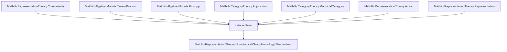

### Technical Brief: `Induced.lean`

---

#### **1. Key Definitions & Theorems**

| Name | Type / Signature | Purpose |
|------|------------------|---------|
| `IndV φ ρ` | `Type u` (abbrev) | Underlying $k$-module of the induced representation: $(k[H] \otimes_k A)_G$, where $k[H] = (H \to_0 k)$ (finitely supported functions), and $G$ acts via $\varphi : G \to^* H$ on $k[H]$ and via $\rho$ on $A$. |
| `IndV.mk h` | `A →ₗ[k] IndV φ ρ` | Linear map sending $a \mapsto \llbracket h \otimes a \rrbracket$, used for universal property and extension. |
| `ind φ ρ` | `Representation k H (IndV φ ρ)` | Induced $H$-representation: $h \cdot \llbracket h_1 \otimes a \rrbracket = \llbracket h_1 h^{-1} \otimes a \rrbracket$. |
| `ind φ A` | `Rep k H` | Induced object in $\mathsf{Rep}(k, H)$, defined as `Rep.of (A.ρ.ind φ)`. |
| `indMap f` | `ind φ A ⟶ ind φ B` | Induced morphism on coinvariants: $(\mathrm{id} \otimes f)$ descends to coinvariants. |
| `indFunctor k φ` | `Rep k G ⥤ Rep k H` | Induction functor: $A \mapsto \mathrm{Ind}_G^H(A)$, $f \mapsto \mathrm{indMap}\, f$. |
| `indResHomEquiv φ A B` | `(ind φ A ⟶ B) ≃ₗ[k] (A ⟶ Res_φ B)` | Linear equivalence underlying adjunction: $H$-equivariant maps $\mathrm{Ind}_G^H A \to B$ correspond to $G$-equivariant maps $A \to \mathrm{Res}_\varphi B$. |
| `indResAdjunction k φ` | `indFunctor k φ ⊣ Action.res _ φ` | Adjointness: induction is left adjoint to restriction. |
| `coinvariantsTensorIndHom φ A B` | `((Ind A) ⊗ B)_H → (A ⊗ Res B)_G` | Map induced by $h \otimes a \otimes b \mapsto a \otimes h \cdot b$. |
| `coinvariantsTensorIndInv φ A B` | `(A ⊗ Res B)_G → ((Ind A) ⊗ B)_H` | Inverse map: $a \otimes b \mapsto 1 \otimes a \otimes b$. |
| `coinvariantsTensorIndIso φ A B` | `((Ind A) ⊗ B)_H ≅ (A ⊗ Res B)_G` | Natural isomorphism of $k$-modules. |
| `coinvariantsTensorIndNatIso φ A` | `(Ind A ⊗ -)_H ≅ (A ⊗ Res(-))_G` | Natural isomorphism of functors $\mathsf{Rep}(k, H) \to \mathsf{Mod}_k$. |

---

#### **2. Naming Conventions**

- **Prefixes**:
  - `IndV.`: underlying module-level constructions (before quotienting to coinvariants).
  - `ind.`: representation-level constructions (after quotienting).
  - `indMap.`: morphism-level induction.
  - `indFunctor.`: categorical induction functor.
  - `coinvariantsTensorInd.`: constructions involving coinvariants of tensor products with induced reps.

- **Suffixes**:
  - `.mk`: canonical generators / maps into coinvariants.
  - `.hom_ext`, `.ext`: extensionality lemmas for maps out of coinvariants/tensor products.
  - `.iso`, `.natIso`: isomorphisms / natural isomorphisms.
  - `.hom`, `.inv`: components of isomorphisms.

- **Other patterns**:
  - `φ` used universally for group homomorphism $G \to^* H$.
  - `A`, `B` for representations; `ρ`, `τ` for their structure maps.
  - `h`, `g`, `s` for group elements; `x`, `y`, `a`, `b` for module elements.

---

#### **3. Tactic Stack**

| Tactic | Frequency | Role |
|--------|-----------|------|
| `simp` | Very high | Simplification of group actions, tensor products, coinvariants, and `mk` maps. |
| `ext` | High | Extensionality proofs: for linear maps, module homs, coinvariants, tensor products. |
| `rfl` | Medium | Reflexivity in equality proofs (e.g., identity/composition preservation). |
| `simp_all` | Medium | Simplify with all hypotheses; used in `hom_comm_apply` reasoning. |
| `have := ...; simp_all` | Medium | Extracting and using equivariance conditions. |
| `simpa using ...` | Medium | Simplify goal using a given proof. |
| `ring` | Low | Implicitly used in `mul_assoc`, `mul_inv`, etc., but not explicit. |
| `aesop` | Not present | No automated reasoning beyond `simp`/`ext`. |
| `cases` | Low | Rarely needed due to `ext`-style reasoning. |

---

#### **4. Proof Logic**

- **Structure**:
  - **Step 1**: Define underlying module `IndV` as coinvariants of a tensor product.
  - **Step 2**: Define $H$-action on `IndV` via `Coinvariants.map` of left multiplication on $k[H]$.
  - **Step 3**: Prove `ind` satisfies representation axioms (`map_one'`, `map_mul'`) using `ext` + `simp`.
  - **Step 4**: Define `indMap` and `indFunctor`, verifying functoriality via `ext` + `rfl`.
  - **Step 5**: Construct `indResHomEquiv`:
    - `toFun`: send $f$ to $x \mapsto f(1 \otimes x)$.
    - `invFun`: lift $f : A \to B$ to $k[H] \otimes A \to B$, then descend to coinvariants.
    - Verify inverses using equivariance (`hom_comm_apply`) and `Coinvariants.mk_eq_iff`.
  - **Step 6**: Promote `indResHomEquiv` to adjunction via `Adjunction.mkOfHomEquiv`, checking naturality.
  - **Step 7**: For Shapiro’s lemma setup:
    - Define `coinvariantsTensorIndHom` and `coinvariantsTensorIndInv` using universal properties of coinvariants/tensor.
    - Prove they are inverses using `Coinvariants.mem_ker_of_eq` and `Coinvariants.mk_eq_iff`.
    - Show naturality in $B$ to get `coinvariantsTensorIndNatIso`.

- **Key Proof Techniques**:
  - **Universal properties**: coinvariants (`Coinvariants.lift`, `Coinvariants.map`), tensor product (`TensorProduct.lift`, `TensorProduct.mk`).
  - **Equivariance checks**: reduce to generators via `IndV.hom_ext`, `TensorProduct.ext`, `Finsupp.lhom_ext'`.
  - **Coinvariant descent**: verify invariance under $G$-action using `Coinvariants.mem_ker_of_eq`.

---

#### **5. Imports & Dependencies**

| Import | Purpose |
|--------|---------|
| `Mathlib.RepresentationTheory.Coinvariants` | Core definitions: `Coinvariants`, `Coinvariants.mk`, `Coinvariants.lift`, `Coinvariants.map`. |
| `Mathlib.Algebra.Module.TensorProduct` | Tensor product of modules, linearity, universal property. |
| `Mathlib.Algebra.Module.Finsupp` | $k[H] = H \to_0 k$, used for group algebra structure. |
| `Mathlib.CategoryTheory.Adjunction` | Adjoint functors, `Adjunction.mkOfHomEquiv`. |
| `Mathlib.CategoryTheory.MonoidalCategory` | Tensor structure on module categories, `tensorObj`, `curriedTensor_obj_obj`. |
| `Mathlib.RepresentationTheory.Action` | Restriction of scalars along group homomorphism (`Action.res`). |
| `Mathlib.RepresentationTheory.Representation` | Base definitions: `Representation`, `Rep`, `Rep.of`, `Rep.ρ`. |

---

#### **6. Mermaid Diagrams**

##### **Dependency Graph (Module-Level)**



##### **Overview of File Structure**

```mermaid
graph LR
  A[Induced.lean] --> B[IndV: underlying k-module]
  A --> C[ind: H-action on IndV]
  A --> D[indMap: morphism lift]
  A --> E[indFunctor: Rep k G → Rep k H]
  A --> F[adjunction: ind ⊣ res]
  A --> G[coinvariantsTensorIndIso: (Ind A ⊗ B)_H ≅ (A ⊗ Res B)_G]
  A --> H[natural iso: (Ind A ⊗ -)_H ≅ (A ⊗ Res(-))_G]

  G --> I[Shapiro’s Lemma]
```

##### **Functor Diagram (Adjunction)**

```mermaid
graph LR
  Rep k G -- indFunctor k φ --> Rep k H
  Rep k H -- Action.res _ φ --> Rep k G

  Rep k G <. indResAdjunction .> Rep k H
```

##### **Natural Isomorphism Diagram**

```mermaid
graph LR
  Rep k H -- (Ind A ⊗ -)_H --> Mod k
  Rep k H -- (A ⊗ Res(-))_G --> Mod k

  (Ind A ⊗ -)_H <. coinvariantsTensorIndNatIso .> (A ⊗ Res(-))_G
```

---

This file formalizes foundational properties of induction in representation theory over a commutative ring, with emphasis on categorical structure (adjunctions, naturality) and explicit constructions for applications like Shapiro’s lemma.
