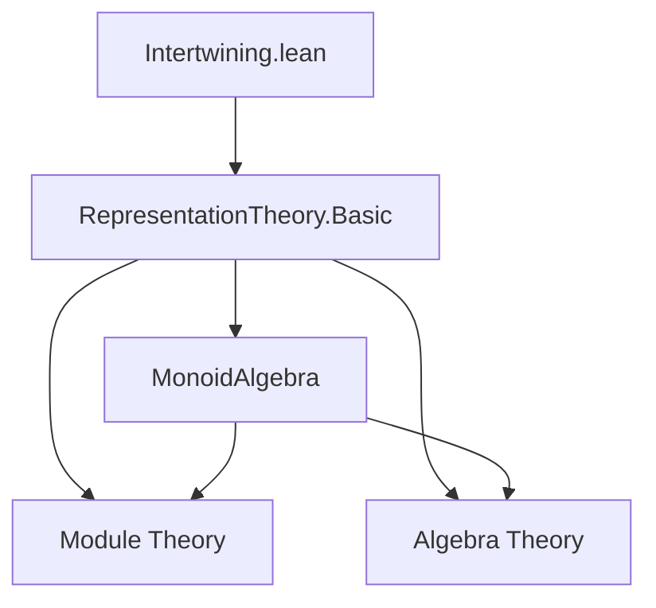

### Technical Brief: `Intertwining.lean`

---

#### **1. Key Definitions & Theorems**

| Name | Type / Structure | Purpose |
|------|------------------|---------|
| `IsIntertwiningMap` | `Prop` | Unbundled predicate: a linear map `f : V →ₗ[A] W` intertwines `ρ` and `σ` iff `∀ g v, f(ρ g v) = σ g (f v)`. |
| `IntertwiningMap` | `Structure` | Bundled version: an `A`-linear map `V →ₗ[A] W` satisfying the intertwining condition. |
| `coeFnAddMonoidHom` | `IntertwiningMap ρ σ →+ V → W` | Coercion to additive monoid homomorphism. |
| `equivLinearMapAsModule` | `IntertwiningMap ρ σ ≃ₗ[A] ρ.asModule →ₗ[A[G]] σ.asModule` | Equivalence between intertwining maps and $A[G]$-linear maps between associated modules. |
| `id` | `IntertwiningMap ρ ρ` | Identity intertwining map. |
| `llcomp` | `IntertwiningMap σ τ →ₗ[A] IntertwiningMap ρ σ →ₗ[A] IntertwiningMap ρ τ` | Linear composition of intertwining maps. |
| `comp` | `IntertwiningMap σ τ → IntertwiningMap ρ σ → IntertwiningMap ρ τ` | Dot-notation-friendly composition. |
| `centralMul` | `g ∈ Z(G) ⇒ IntertwiningMap ρ ρ` | Action of a central element as an intertwining map. |
| `equivAlgEnd` | `IntertwiningMap ρ ρ ≃ₐ[A] Module.End A[G] ρ.asModule` | Isomorphism of algebras between endomorphism ring of `ρ` and $A[G]$-linear endomorphisms. |
| `isIntertwiningMap_of_mem_center` | `g ∈ Z(G) ⇒ IsIntertwiningMap ρ ρ (ρ g)` | Central elements act by intertwining maps. |

---

#### **2. Naming Conventions**

- **Prefixes**:
  - `isIntertwining` / `isIntertwining'`: predicate vs bundled version.
  - `coe_`: coercion lemmas (e.g., `coe_zero`, `coe_add`, `coe_mul`).
  - `llcomp`: “left-linear composition” — linear in both arguments.
  - `centralMul`: central element multiplication.

- **Suffixes**:
  - `'` (prime): often denotes bundled version of a predicate (e.g., `isIntertwining` vs `isIntertwining'`).
  - `Hom`: for morphism-like objects (e.g., `coeFnAddMonoidHom`).
  - `Equiv`: for equivalences (e.g., `equivLinearMapAsModule`, `equivAlgEnd`).

---

#### **3. Tactic Stack**

Frequently used tactics in proofs:

| Tactic | Usage |
|--------|-------|
| `simp` | Simplifying definitions, especially `isIntertwining'`, `coe_*`, `map_*`. |
| `ext` | Extensionality for functions, linear maps, and structures. |
| `induction ... using MonoidAlgebra.induction_linear` | Structural induction on monoid algebra elements. |
| `rw [isIntertwiningMap_iff]` | Rewriting using iff-lemma for `IsIntertwiningMap`. |
| `fast_instance%` | Instantiating typeclass instances via injective coercion. |
| `rfl` | Reflexivity for definitional equalities (e.g., `coe_mk`, `coe_one`). |
| `congrFun`, `congrArg` | For proving function equality via pointwise equality. |

---

#### **4. Proof Logic**

- **Structure of proofs**:
  - Most proofs follow a **definitional unfolding + simplification + extensionality** pattern.
  - For algebraic structures (e.g., `Monoid`, `Semiring`, `Algebra`), proofs use `Function.Injective.*` lemmas to lift structure via `toLinearMap`.
  - Induction on `MonoidAlgebra` elements is used to verify $A[G]$-linearity in `equivLinearMapAsModule`.
  - Central element arguments use `Submonoid.mem_center_iff` to commute actions.

- **Typical flow**:
  1. Unfold definitions (`isIntertwining'`, `coe_*`, etc.).
  2. Apply `simp` with relevant lemmas.
  3. Use `ext` to reduce to pointwise equality.
  4. For module/algebra structures: lift via injective coercion (`toLinearMap_injective`, etc.).

---

#### **5. Imports & Dependencies**

- **Core import**:
  ```lean
  import Mathlib.RepresentationTheory.Basic
  ```
- **Scoped notation**:
  ```lean
  open scoped MonoidAlgebra
  ```
- **Key dependencies**:
  - `Mathlib.RepresentationTheory.Basic`: defines `Representation`, `asModule`, `MonoidAlgebra`.
  - `Mathlib.Algebra.Module.Basic`: modules, linear maps, endomorphisms.
  - `Mathlib.Algebra.MonoidAlgebra.Basic`: monoid algebra structure.
  - `Mathlib.Algebra.Algebra.Basic`: algebras, center, central elements.
  - `Mathlib.Data.Nat.Basic`: `nsmul`, `pow`, `natCast`.

---

#### **6. Mermaid Diagrams**

##### **Dependency Graph (Module-Level)**



##### **Overview of File Structure**

```mermaid
flowchart LR
  A[Representation Theory] --> B[Intertwining Maps]
  B --> C[Unbundled: IsIntertwiningMap]
  B --> D[Bundled: IntertwiningMap]
  D --> E[Linear Structure: +, •, 0]
  D --> F[Composition & Monoid Structure]
  D --> G[Algebra Structure on End]
  D --> H[Central Elements]
  E --> I[Module over A]
  F --> J[Semiring / Monoid on End]
  G --> K[Equiv to A[G]-linear maps]
  H --> L[Action of Z(G)]
```

##### **Algebraic Equivalence Chain**

```mermaid
flowchart LR
  IntertwiningMap[IntertwiningMap ρ ρ]
  equivAlgEnd[≃ₐ[A] Module.End A[G] ρ.asModule]
  equivLinearMapAsModule[≃ₗ[A] ρ.asModule →ₗ[A[G]] σ.asModule]

  IntertwiningMap -- equivAlgEnd --> Module.End
  IntertwiningMap -- equivLinearMapAsModule --> Hom_{A[G]}
```

---

#### **7. Summary**

This file formalizes the theory of **intertwining maps** (equivariant linear maps) between representations of a monoid $G$ over a commutative ring $A$. It establishes:

- A **bundled** and **unbundled** notion of intertwining.
- A **module structure** over $A$ on `IntertwiningMap ρ σ`.
- A **composition** operation, making `IntertwiningMap ρ ρ` into a **semiring** and **$A$-algebra**.
- An **algebra isomorphism** between `IntertwiningMap ρ ρ` and $A[G]$-linear endomorphisms of the associated module.
- A construction of intertwining maps from **central elements** of $G$.

The formalization leverages Lean’s typeclass inference and injective coercion techniques to lift algebraic structures along `toLinearMap`.
