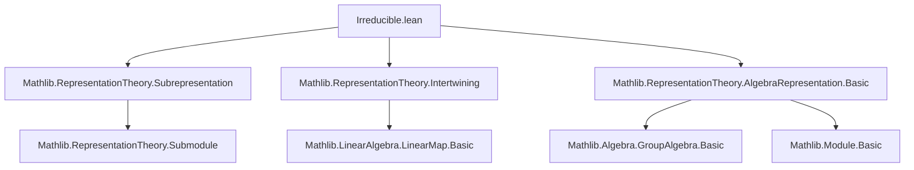

**Technical Brief: `Irreducible.lean`**

---

### 1. **Key Definitions & Theorems**

| Name | Type / Signature | Purpose |
|------|------------------|---------|
| `IsIrreducible` | `class IsIrreducible extends IsSimpleOrder (Subrepresentation ρ)` | Defines irreducibility of a representation `ρ` as having no nontrivial proper subrepresentations (i.e., its subrepresentation lattice is simple). |
| `irreducible_iff_isSimpleModule_asModule` | `IsIrreducible ρ ↔ IsSimpleModule k[G] ρ.asModule` | Equates representation-theoretic irreducibility with simplicity of the associated `k[G]`-module. |
| `is_simple_module_iff_irreducible_ofModule` | `IsSimpleModule k[G] M ↔ IsIrreducible (ofModule M)` | Shows the converse: simplicity of a `k[G]`-module implies irreducibility of the induced representation. |
| `injective_or_eq_zero` | `f : IntertwiningMap ρ σ → Injective f ∨ f = 0` | Schur’s Lemma (weak form): nonzero intertwiners from an irreducible representation are injective. |
| `bijective_or_eq_zero` | `[IsIrreducible σ] → f : IntertwiningMap ρ σ → Bijective f ∨ f = 0` | Schur’s Lemma (stronger form): nonzero intertwiners between irreducibles are bijective. |
| `algebraMap_intertwiningMap_bijective_of_isAlgClosed` | `[IsAlgClosed k] → Bijective (algebraMap k (IntertwiningMap ρ ρ))` | Over an algebraically closed field, scalars act as bijective intertwiners — key step toward Schur’s Lemma conclusion that `End(ρ) ≅ k`. |
| `finrank_eq_one_of_isMulCommutative` | `[IsMulCommutative G] → Module.finrank k V = 1` | If `G` is abelian, any irreducible representation over an algebraically closed field has dimension 1. |

---

### 2. **Naming Conventions**

- **Prefixes**:
  - `is_`: for properties (`isIrreducible`, `isSimpleModule`)
  - `algebraMap_`: for maps induced by the algebra structure (`algebraMap_intertwiningMap_...`)
  - `finrank_`: for finite-dimensional rank statements
- **Suffixes**:
  - `_of_isAlgClosed`: conditions assuming algebraic closedness
  - `_of_isMulCommutative`: conditions assuming commutativity of `G`
  - `_iff_`: bi-implications (↔)
- **Module/Representation duality**:
  - `asModule`: conversion from `Representation` to `Module k[G]`
  - `ofModule`: reverse direction

---

### 3. **Tactic Stack**

Frequently used tactics in proofs:
- `rw` — rewriting using equivalences and definitions
- `exact` — closing goals with a given term
- `have _ : ... := ...` — intermediate lemma introduction
- `exact OrderIso.isSimpleOrder_iff ...` — leveraging order isomorphisms
- `rw [← LinearEquiv.map_eq_zero_iff ...]` — translating via linear equivalence
- `exact LinearMap.injective_or_eq_zero ...` — applying known lemmas about linear maps
- `exact (Bijective.of_comp_iff' ...).1 this` — functional composition reasoning

No heavy automation (`aesop`, `ring`, `simp`) appears — proofs are mostly *structured manual* reasoning using algebraic equivalences.

---

### 4. **Proof Logic**

- **Core strategy**: Translate between representation-theoretic and module-theoretic notions via `Subrepresentation` ↔ `Submodule k[G]` order isomorphisms.
- **Schur’s Lemma proofs**:
  - Use `equivLinearMapAsModule` to lift intertwiners to `k[G]`-linear maps.
  - Apply standard linear algebra facts (`injective_or_eq_zero`, `bijective_or_eq_zero`) on the module side.
- **Dimension 1 result**:
  - Lift commutativity of `G` to `k[G]`.
  - Apply `IsSimpleModule.finrank_eq_one_of_isMulCommutative`.
- **Algebraically closed case**:
  - Use `IsSimpleModule.algebraMap_end_bijective_of_isAlgClosed` on `ρ.asModule`.
  - Transport bijectivity back via `IntertwiningMap.equivAlgEnd`.

---

### 5. **Imports & Dependencies**

| Import | Role |
|--------|------|
| `Mathlib.RepresentationTheory.Subrepresentation` | Defines subrepresentations and their lattice structure |
| `Mathlib.RepresentationTheory.Intertwining` | Intertwining maps, `IntertwiningMap`, and basic properties |
| `Mathlib.RepresentationTheory.AlgebraRepresentation.Basic` | `Representation`, `ofModule`, `asModule`, and basic algebraic constructions |

**Core underlying theories**:
- Module theory over group algebras `k[G]`
- Order theory (`IsSimpleOrder`)
- Linear algebra over fields (especially algebraically closed ones)

---

### 6. **Mermaid Diagrams**

#### **Dependency Graph (Module-Level)**



#### **Conceptual Overview (Theory Flow)**

```mermaid
flowchart LR
  Rep[Representation ρ] --> Subrep[Subrepresentation lattice]
  Subrep -->|order iso| Submod[Submodule lattice of ρ.asModule]
  Submod -->|simplicity| SimpleMod[IsSimpleModule k[G] ρ.asModule]
  SimpleMod -->|def| Irred[IsIrreducible ρ]
  Intertwiner[IntertwiningMap f] -->|equivLinearMapAsModule| LinearMap[k[G]-linear map]
  LinearMap -->|Schur| InjectiveOrZero[Injective f ∨ f = 0]
  InjectiveOrZero -->|bijective case| BijectiveOrZero[Bijective f ∨ f = 0]
  BijectiveOrZero -->|alg closed| AlgebraMapBijective[algebraMap k → End(f) bijective]
```

---

### 7. **Summary**

This file formalizes the foundational theory of **irreducible representations** in Lean 4, establishing equivalence between:
- Representation-theoretic irreducibility (`IsIrreducible`)
- Module-theoretic simplicity (`IsSimpleModule k[G]`)

It proves **Schur’s Lemma** in full generality (injectivity/bijectivity of intertwiners), and derives the classical corollary that irreducible representations of **abelian groups** over algebraically closed fields are **1-dimensional**.

The proofs rely heavily on the **order isomorphism** between subrepresentations and submodules, and on transporting linear-algebraic facts across the `k[G]`-module equivalence.
