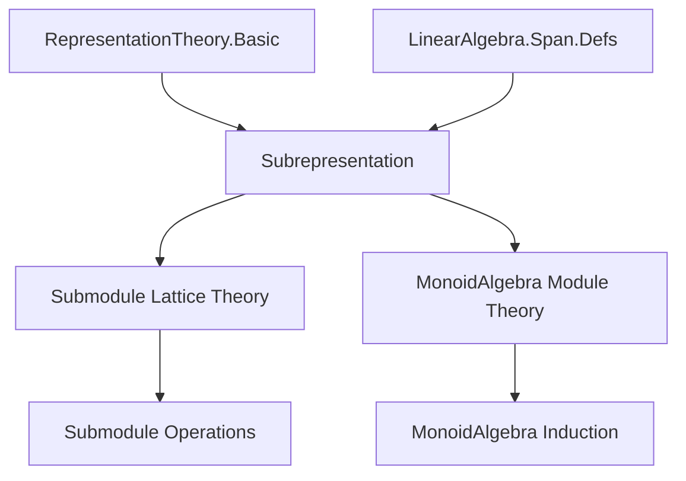

### Technical Brief: Subrepresentation.lean

---

#### **1. Key Definitions & Theorems**

| Name | Type / Signature | Purpose |
|------|------------------|---------|
| `Subrepresentation ρ` | `Type _` (structure) | A submodule of `W` stable under the `G`-action of representation `ρ`. |
| `toSubmodule_injective` | `Function.Injective toSubmodule` | Ensures distinct subrepresentations have distinct underlying submodules. |
| `toRepresentation` | `Subrepresentation ρ → Representation A G _` | Restricts `ρ` to a subrepresentation, yielding a representation on the submodule. |
| `asSubmodule σ` | `Submodule A[G] ρ.asModule` | Embeds a subrepresentation `σ` of `ρ` as an `A[G]`-submodule of the associated module. |
| `asSubmodule' σ` | `Submodule A[G] M` | Same as `asSubmodule`, but for `ρ = Representation.ofModule`. |
| `ofSubmodule N` | `Subrepresentation (Representation.ofModule M)` | Converts an `A[G]`-submodule `N ≤ M` into a subrepresentation of the induced representation. |
| `ofSubmodule' N` | `Subrepresentation ρ` | Converts an `A[G]`-submodule of `ρ.asModule` into a subrepresentation of `ρ`. |
| `subrepresentationSubmoduleOrderIso` | `Subrepresentation ρ ≃o Submodule A[G] ρ.asModule` | Order-isomorphism between subrepresentations of `ρ` and `A[G]`-submodules of `ρ.asModule`. |
| `submoduleSubrepresentationOrderIso` | `Submodule A[G] M ≃o Subrepresentation (ofModule M)` | Order-isomorphism between `A[G]`-submodules of `M` and subrepresentations of `ofModule M`. |
| `instance Lattice`, `BoundedOrder` | `Lattice (Subrepresentation ρ)`, `BoundedOrder (Subrepresentation ρ)` | Provides lattice and bounded order structure via `toSubmodule`-induced operations. |

---

#### **2. Naming Conventions**

- **Prefixes**:
  - `asSubmodule[_]`: conversion *from* subrepresentation *to* `A[G]`-submodule.
  - `ofSubmodule[_]`: conversion *from* `A[G]`-submodule *to* subrepresentation.
- **Suffixes**:
  - `'` (prime): variants for `ofModule`-induced representations (e.g., `asSubmodule'`, `ofSubmodule'`).
- **Structure fields**:
  - `toSubmodule`, `apply_mem_toSubmodule`: standard for subobjects with stability condition.
- **Lemmas**:
  - `coe_*`, `toSubmodule_*`: relate operations on `Subrepresentation` to those on `Submodule`.
  - `mem_*_iff`: characterize membership in constructed submodules/subrepresentations.

---

#### **3. Tactic Stack**

Frequently used tactics in proofs:

| Tactic | Usage |
|--------|-------|
| `simp` / `simp only [...]` | Simplify goals using definitional equalities and lemmas like `coe_sup`, `mem_asSubmodule_iff`. |
| `ext` | Prove equality of functions or submodules by extensionality. |
| `rw [...]` | Rewrite using lemmas (e.g., `Representation.single_smul`, `mul_smul`). |
| `induction ... using MonoidAlgebra.induction_linear` | Structural induction on elements of the monoid algebra. |
| `exact`, `rfl`, `congr!` | Immediate proofs or congruence closure. |
| `intro`, `intro h`, `rintro ...` | Introduce hypotheses for implications or conjunctions. |
| `have h : ...; exact h` | Intermediate lemma introduction. |
| `simpa [...] using ...` | Simplify using a hypothesis or lemma. |

---

#### **4. Proof Logic**

- **Structure**: Most proofs follow a *definitional → structural → stability* pattern:
  1. Define the object (e.g., `asSubmodule σ`) by lifting the underlying submodule.
  2. Prove stability under `A[G]`-action via induction on `MonoidAlgebra` elements.
  3. Verify correctness of conversions (`left_inv`, `right_inv`) using definitional equality (`rfl`).
  4. For order-isomorphisms, show monotonicity via `by rfl` (since `≤` is defined via `⊆` on underlying sets).
- **Induction**: `MonoidAlgebra.induction_linear` is used to reduce `A[G]`-linearity checks to:
  - `zero`
  - `add`
  - `single g a` (basis elements).
- **Stability checks**: Always reduce to `σ.apply_mem_toSubmodule g h`, using module axioms and algebra maps.

---

#### **5. Imports & Dependencies**

| Import | Purpose |
|--------|---------|
| `Mathlib.RepresentationTheory.Basic` | Core representation theory: `Representation`, `asModule`, `ofModule`, `RestrictScalars`. |
| `Mathlib.LinearAlgebra.Span.Defs` | Provides `Submodule`, `sup`, `inf`, `coe`, `SetLike`, and related infrastructure. |
| `Pointwise` | For `+`, `∩`, `⊔`, `⊓` notation on sets/submodules. |
| `MonoidAlgebra` scope | For `MonoidAlgebra`, `single`, `smul`, `induction_linear`. |

---

#### **6. Mermaid Diagrams**

##### **Dependency Graph (Theory Module)**



##### **Overview of Subrepresentation Theory Flow**

```mermaid
graph LR
  A[Representation ρ : G → End A W] --> B[Subrepresentation ρ]
  B --> C[Submodule A W (underlying)]
  B --> D[Stability: g·v ∈ σ]
  C --> E[Submodule Lattice]
  D --> F[Induced A[G]-module structure]
  F --> G[ρ.asModule]
  G --> H[Submodule A[G] ρ.asModule]
  H <-->|orderIso| B
  I[Module M over A[G]] --> J[ofModule M]
  J --> B'
  H' <-->|orderIso| B'
```

##### **Conversion Equivalences**

```mermaid
graph LR
  Subrep[Subrepresentation ρ] -- asSubmodule --> SubmodA[G][Submodule A[G] ρ.asModule]
  SubmodA[G] -- ofSubmodule' --> Subrep
  Subrep <-->|subrepresentationSubmoduleOrderIso| SubmodA[G]

  SubmodA[G]M[Submodule A[G] M] -- ofSubmodule --> SubrepOfMod[Subrepresentation (ofModule M)]
  SubrepOfMod -- asSubmodule' --> SubmodA[G]M
  SubmodA[G]M <-->|submoduleSubrepresentationOrderIso| SubrepOfMod
```

---

#### **7. Summary**

This module formalizes the equivalence between subrepresentations of a representation `ρ` and `A[G]`-submodules of its associated module `ρ.asModule`. It constructs explicit conversions (`asSubmodule`, `ofSubmodule'`, etc.), proves they are order-isomorphisms, and equips `Subrepresentation ρ` with a bounded lattice structure inherited from `Submodule A W`. The proofs rely heavily on induction over the monoid algebra and stability under the group action. The design reflects standard categorical and module-theoretic practice, with Lean-specific idioms like `SetLike`, `PartialOrder.ofSetLike`, and `simps` for clean projections.
