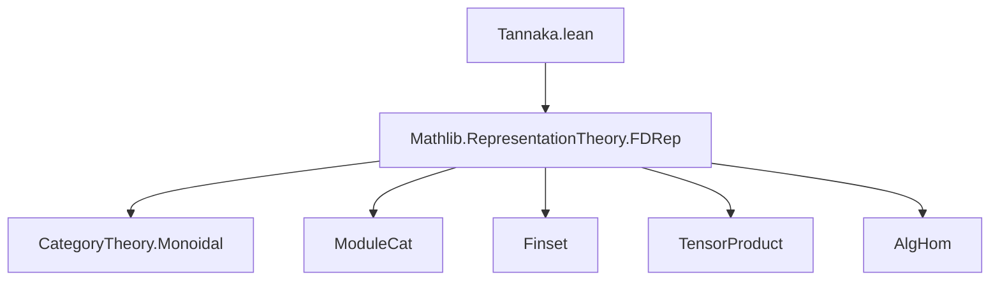
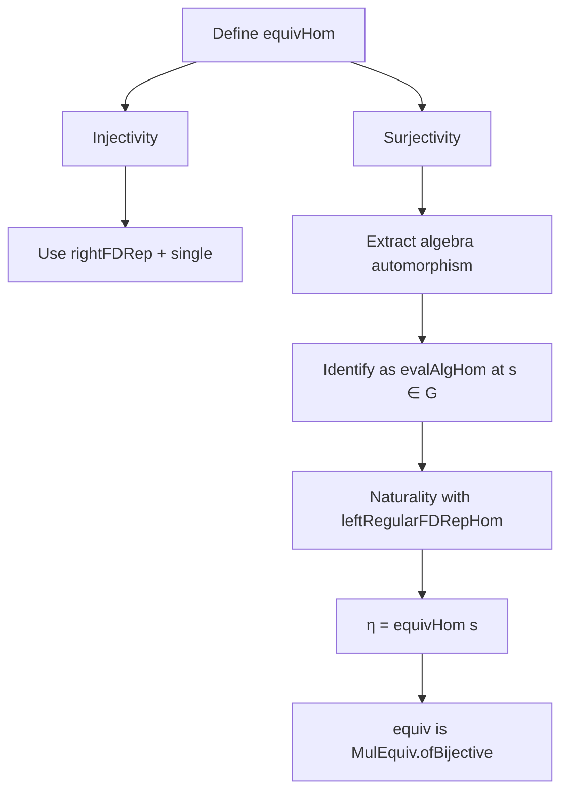

### Technical Brief: `Tannaka.lean`

---

#### **1. Key Definitions & Theorems**

| Name | Type / Signature | Purpose |
|------|------------------|---------|
| `forget` | `LaxMonoidalFunctor (FDRep k G) (FGModuleCat k)` | Monoidal forgetful functor from finite-dimensional $k$-representations of $G$ to $k$-modules. |
| `equivApp g X` | `X.V ≅ X.V` | Natural isomorphism component of the automorphism of the forgetful functor induced by group element $g$. |
| `equivHom` | `G →* Aut (forget k G)` | Group homomorphism from $G$ to monoidal natural automorphisms of `forget`. |
| `rightRegular` | `Representation k G (G → k)` | Right regular representation: $(s \cdot f)(t) = f(t \cdot s)$. |
| `leftRegular` | `Representation k G (G → k)` | Left regular representation: $(s \cdot f)(t) = f(s^{-1} \cdot t)$. |
| `rightFDRep` | `FDRep k G` | Right regular representation as a finite-dimensional representation. |
| `mulRepHom` | `rightFDRep ⊗ rightFDRep ⟶ rightFDRep` | Multiplication map in the regular representation, a morphism in `FDRep`. |
| `algHomOfRightFDRepComp η` | `(G → k) →ₐ[k] (G → k)` | Algebra morphism induced by the component of $\eta \in \mathrm{Aut}(\mathrm{forget})$ on `rightFDRep`. |
| `sumSMulInv v` | `(G → k) →ₗ[k] X` | $G$-equivariant linear map sending delta function at identity to $v \in X$. |
| `ofRightFDRep X v` | `rightFDRep ⟶ X` | Representation morphism induced by $v \in X$, universal property of regular rep. |
| `leftRegularFDRepHom s` | `End(rightFDRep)` | Endomorphism of right regular rep induced by left multiplication by $s$. |
| `equiv` | `G ≃* Aut (forget k G)` | **Main theorem**: Tannaka duality for finite groups — $G$ is canonically isomorphic to the monoidal automorphism group of the forgetful functor. |

---

#### **2. Naming Conventions**

- **Prefixes**:
  - `equivApp`, `equivHom`: components of the equivalence.
  - `rightRegular`, `leftRegular`: regular representations.
  - `algHomOfRightFDRepComp`: constructs algebra morphism from component on `rightFDRep`.
  - `sumSMulInv`, `ofRightFDRep`: constructions from universal property of regular rep.
  - `leftRegularFDRepHom`: homs induced by group elements.

- **Suffixes**:
  - `Hom`: morphism in representation category.
  - `Comp`: component of a natural transformation at a specific object.
  - `FDRep`: when lifted to `FDRep k G`.

- **Pattern**:
  - `X.ρ g`: action of $g \in G$ on object $X$.
  - `single t c`: delta function at $t$ with value $c$.

---

#### **3. Tactic Stack**

| Tactic | Usage |
|--------|-------|
| `ext` | Proving extensionality of functions, linear maps, representations. |
| `simp` / `simp_all` | Simplifying using `@[simp]` lemmas (e.g., `rightRegular_apply`, `leftRegular_apply`). |
| `congrArg`, `congrFun`, `congr` | Equality reasoning for function/application. |
| `rw` | Rewriting using naturality, monoidality, or definition lemmas. |
| `intro`, `exact`, `refine` | Standard proof construction. |
| `have`, `suffices` | Intermediate lemma introduction. |
| `apply_fun` | Applying a function to both sides of an equality. |
| `by_cases` | Case analysis on decidable equalities (e.g., `u = t * s`). |
| `induction_on`, `TensorProduct.induction_on` | Structural induction on tensor products. |
| `funext` | Extensionality for functions. |
| `rwa`, `convert` | Rewriting with application of new hypotheses. |

---

#### **4. Proof Logic**

The proof follows a standard Tannaka reconstruction strategy:

1. **Define the candidate isomorphism** `equivHom : G →* Aut(forget)` via its components `equivApp`.
2. **Show injectivity** using evaluation on `rightFDRep` and delta functions (`single`).
3. **Show surjectivity**:
   - For any $\eta \in \mathrm{Aut}(\mathrm{forget})$, extract an algebra automorphism of $(G \to k)$ via `algHomOfRightFDRepComp`.
   - Use that algebra automorphisms of $(G \to k)$ are induced by permutation of points (via `evalAlgHom`).
   - Show that the induced element $s \in G$ satisfies $\eta = \mathrm{equivHom}(s)$, using naturality with `leftRegularFDRepHom`.
4. **Conclude bijectivity** and hence isomorphism `G ≃* Aut(forget)`.

Key structural lemmas:
- `map_mul_toRightFDRepComp`: naturality with `mulRepHom` ensures $\eta$ preserves multiplication.
- `toRightFDRepComp_injective`: equality of automorphisms is detected on `rightFDRep`.
- `toRightFDRepComp_in_rightRegular`: $\eta$'s component on `rightFDRep` is itself a right-regular action.

---

#### **5. Imports & Dependencies**

- **Core imports**:
  ```lean
  Mathlib.RepresentationTheory.FDRep
  ```
- **Implicit dependencies**:
  - `CategoryTheory.Monoidal`
  - `ModuleCat`
  - `Finset`, `Pi`, `TensorProduct`
  - `AlgHom`, `EvalAlgHom`
  - `InducedCategory`, `LaxMonoidalFunctor`

---

#### **6. Mermaid Diagrams**

##### **Dependency Graph (Module-Level)**



##### **Overview of Theoretical Flow**

```mermaid
graph LR
  A[FDRep k G] -->|forget| B[FGModuleCat k]
  C[G] -->|equivHom| D[Aut(forget)]
  D -->|component at rightFDRep| E[(G → k) →ₗ[k] (G → k)]
  E -->|preserve mul| F[(G → k) →ₐ[k] (G → k)]
  F -->|evalAlgHom| G[G]
  G -->|equivHom| D
  style D fill:#f9f,stroke:#333
  style G fill:#bbf,stroke:#333
```

##### **Proof Structure (High-Level)**



---

#### **7. Summary**

This file formalizes **Tannaka duality for finite groups** in Lean 4: a finite group $G$ is recovered as the group of monoidal natural automorphisms of the forgetful functor from finite-dimensional $k$-representations of $G$ to $k$-modules, where $k$ is an integral domain. The proof leverages the universal property of the regular representation and properties of algebra automorphisms of $(G \to k)$. The formalization is clean, modular, and uses standard representation-theoretic constructions (`rightRegular`, `leftRegular`, `sumSMulInv`, etc.) and categorical tools (`LaxMonoidalFunctor`, `Aut`, `MonoidalCategory`).
