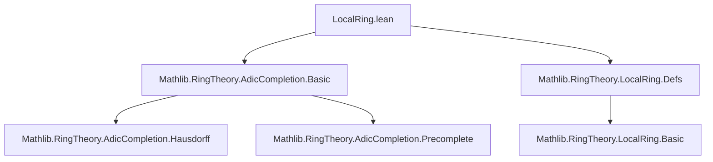
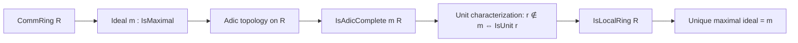
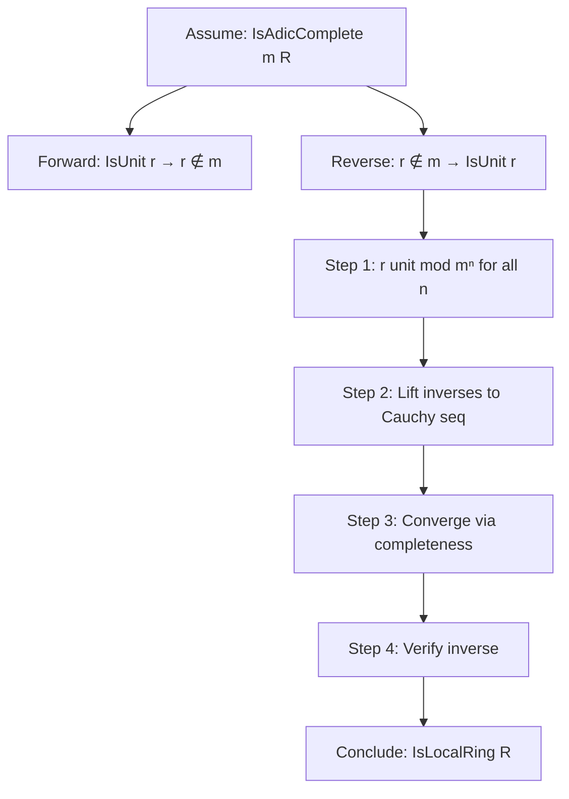

**Technical Brief: `LocalRing.lean` — Complete Local Rings via Adic Completion**

---

### **1. Key Definitions & Theorems**

| Name | Type / Signature | Purpose |
|------|------------------|---------|
| `isUnit_iff_notMem_of_isAdicComplete_maximal` | `(r : R) → IsUnit r ↔ r ∉ m` | Characterizes units in an adically complete ring w.r.t. a maximal ideal: an element is a unit iff it is *not* in the maximal ideal. |
| `isLocalRing_of_isAdicComplete_maximal` | `[IsAdicComplete m R] → IsLocalRing R` | Proves that if $ R $ is adically complete with respect to a maximal ideal $ \mathfrak{m} $, then $ R $ is a *local ring* (i.e., has a unique maximal ideal). |

**Auxiliary constructions used in proof:**
- `mapu`: Shows that the image of $ r $ in each finite quotient $ R / \mathfrak{m}^n $ is a unit (for $ n > 0 $).
- `invSeries`: Constructs a Cauchy sequence of approximations to the inverse of $ r $ modulo $ \mathfrak{m}^n $.
- `mod`: Establishes compatibility of the approximations across quotients (i.e., consistency of the inverse series).
- `eq`: Verifies that the limit $ \mathrm{inv} $ satisfies $ \mathrm{inv} \cdot r = 1 $.

---

### **2. Naming Conventions**

- **Predicate prefixes**: `isUnit_`, `isLocalRing_`, `isAdicComplete`, `IsMaximal`, `IsHausdorff`, `IsPrecomplete`.
- **Suffixes**:
  - `_iff_`: Biconditional characterizations (`isUnit_iff_notMem_...`)
  - `_of_`: Implication from a property to a structure (`isLocalRing_of_...`)
- **Variable naming**:
  - `r`, `s`: Ring elements.
  - `m`: Ideal (maximal).
  - `inv`, `invSeries`: Constructed inverse elements.
  - `n`, `a`, `b`: Natural numbers indexing powers of $ \mathfrak{m} $.

---

### **3. Tactic Stack**

Frequently used tactics in this file:

| Tactic | Role |
|--------|------|
| `rcases` / `cases` | Decompose existential or conjunction hypotheses. |
| `by_contra` / `contradiction` | Proof by contradiction (e.g., assuming $ r \in \mathfrak{m} $). |
| `simp` / `simp only` | Simplify using definitional equalities and lemmas (e.g., `Ideal.mul_mem_left`, `Ideal.Quotient.eq_zero_iff_mem`). |
| `rw` / `nth_rw` | Rewrite using equalities (especially ring identities and quotient maps). |
| `induction` | Structural induction on $ n \in \mathbb{N} $. |
| `choose` / `Classical.choose_spec` | Construct choice functions (e.g., inverses in quotients). |
| `apply` / `exact` | Apply lemmas or hypotheses directly. |
| `aesop` / `ring` | *Not used* — this file avoids automation in favor of explicit constructive reasoning. |
| `simp_rw` | *Not used* — manual rewriting preferred. |

---

### **4. Proof Logic**

The proof follows a **constructive Cauchy-limit strategy**, leveraging adic completeness:

1. **Forward direction** (`IsUnit r → r ∉ m`):
   - Assume $ r \in \mathfrak{m} $ and $ r $ invertible.
   - Derive contradiction: $ 1 = r s \in \mathfrak{m} $, violating maximality ($ \mathfrak{m} \neq R $).

2. **Reverse direction** (`r ∉ m → IsUnit r`):
   - Show $ r $ maps to a unit in each $ R / \mathfrak{m}^n $ (via induction on $ n $, using field structure when $ n=1 $, and lifting via `factorPowSucc.isUnit_of_isUnit_image`).
   - Choose inverses $ s_n \in R / \mathfrak{m}^n $ and lift them to a sequence $ \mathrm{invSeries}(n) \in R $.
   - Prove compatibility: $ \mathrm{invSeries}(a) \equiv \mathrm{invSeries}(b) \mod \mathfrak{m}^a $ for $ a \le b $.
   - Use `IsAdicComplete.toIsPrecomplete.prec` to get a limit $ \mathrm{inv} \in R $.
   - Verify $ \mathrm{inv} \cdot r = 1 $ using Hausdorffness (`IsHausdorff.haus`) of the adic topology.

3. **Local ring conclusion**:
   - Use `isUnit_iff_notMem_of_isAdicComplete_maximal` to show:
     - $ 0 \ne 1 $ (since $ \mathfrak{m} \ne R $).
     - For any $ a + b = 1 $, at least one of $ a, b $ is not in $ \mathfrak{m} $, hence a unit.

---

### **5. Imports & Dependencies**

| Module | Role |
|--------|------|
| `Mathlib.RingTheory.AdicCompletion.Basic` | Provides `IsAdicComplete`, `IsHausdorff`, `toIsPrecomplete`, etc. |
| `Mathlib.RingTheory.LocalRing.Defs` | Defines `IsLocalRing`, `isUnit_or_isUnit_of_add_one`, etc. |

**Key underlying structures:**
- `CommRing R`: Commutative ring structure.
- `Ideal.IsMaximal m`: $ \mathfrak{m} $ is maximal.
- `IsAdicComplete m R`: $ R $ is complete in the $ \mathfrak{m} $-adic topology.

---

### **6. Mermaid Diagrams**

#### **Dependency Graph (File-Level)**

#### **Theoretical Overview (Conceptual Flow)**

#### **Proof Structure (High-Level)**

---

### **7. Summary**

This file establishes a foundational result in commutative algebra:  
> **A ring complete with respect to a maximal ideal is local**, with the maximal ideal being the set of non-units.

The proof is constructive and explicit, relying on the interplay between adic topology, quotient fields, and Cauchy completion. It avoids non-constructive principles (e.g., Zorn’s Lemma) and uses only the given completeness assumption.

This result is critical for algebraic geometry and number theory, where complete local rings (e.g., $ p $-adic integers $ \mathbb{Z}_p $) serve as local models.
