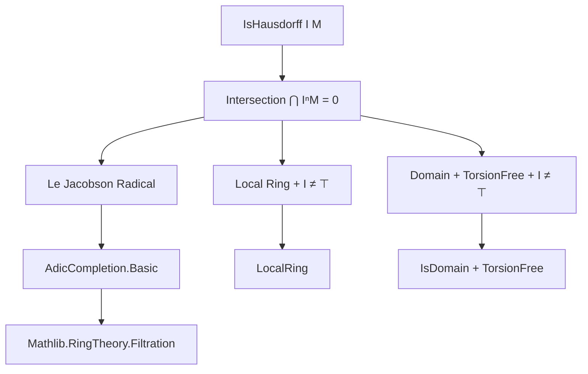

**Technical Brief: `Noetherian.lean` Module**

---

### 1. **Key Definitions & Theorems**

| Name | Type / Signature | Purpose |
|------|------------------|---------|
| `IsHausdorff.of_le_jacobson` | `I ≤ Jacobson ⊥ → IsHausdorff I M` | Proves Hausdorffness of the $I$-adic topology on $M$ when $I$ lies in the Jacobson radical. |
| `IsHausdorff.of_isLocalRing` | `[IsLocalRing R] → I ≠ ⊤ → IsHausdorff I M` | Special case for local rings: any proper ideal $I$ yields a Hausdorff topology on $M$. |
| `IsHausdorff.of_isTorsionFree` | `[IsDomain R] → [IsTorsionFree R M] → I ≠ ⊤ → IsHausdorff I M` | Uses torsion-freeness (over domains) to ensure intersection of powers of $I$ acting on $M$ is zero. |
| `IsHausdorff.of_isDomain` | `[IsDomain R] → I ≠ ⊤ → IsHausdorff I R` | Special case for $M = R$, using torsion-freeness of $R$ over itself. |
| `IsHausdorff (maximalIdeal R) M` | Instance | Immediate corollary: in a local ring, the maximal ideal defines a Hausdorff topology on any finite module. |

All lemmas rely on foundational results:
- `Ideal.iInf_pow_smul_eq_bot_of_le_jacobson`: Intersection of $I^n \cdot M = \{0\}$ if $I \subseteq \operatorname{Jac}(R)$.
- `Ideal.iInf_pow_smul_eq_bot_of_isTorsionFree`: Same conclusion under torsion-freeness and $I \neq R$.

---

### 2. **Naming Conventions**

- **Prefix `of_`**: Indicates a *sufficient condition* for `IsHausdorff`, e.g., `of_le_jacobson`, `of_isTorsionFree`.
- **`IsHausdorff`**: Main predicate; used as a typeclass-like structure (though defined as a proposition with evidence).
- **`maximalIdeal R`**: Standard notation for the unique maximal ideal in a local ring.
- **`Ideal.jacobson ⊥`**: Jacobson radical of the zero ideal (i.e., intersection of all maximal ideals).

---

### 3. **Tactic Stack**

Frequent tactics used in proofs:
- `aesop`: For automated reasoning about ideals, modules, and inclusions.
- `simpa [SModEq.zero] using hx`: Simplifies using the definition of the quotient topology (here, $x \equiv 0 \mod I^n M$ for all $n$).
- `trans`: Chaining inequalities/containments (e.g., $I \subseteq \mathfrak{m} \subseteq \operatorname{Jac}(R)$).
- `le_maximalIdeal`, `maximalIdeal_le_jacobson`: Lemmas from `Mathlib.RingTheory.LocalRing` used to relate ideals in local rings.

---

### 4. **Proof Logic**

The logical flow across lemmas follows a common pattern:

1. **Goal**: Show $\bigcap_{n} I^n \cdot M = \{0\}$ (equivalent to `IsHausdorff I M`).
2. **Strategy**:
   - Use a known lemma (`iInf_pow_smul_eq_bot_*`) to establish the intersection is zero.
   - Apply `le` to conclude inclusion in the zero submodule.
   - Use `simpa` to translate the module-theoretic condition into the `SModEq`-based definition of Hausdorffness.

In local ring cases:
- $I \neq R$ implies $I \subseteq \mathfrak{m}$ (the unique maximal ideal).
- $\mathfrak{m} \subseteq \operatorname{Jac}(R)$ always holds.
- Thus $I \subseteq \operatorname{Jac}(R)$, enabling `of_le_jacobson`.

In torsion-free domain cases:
- Use algebraic properties of domains and torsion-free modules to apply `iInf_pow_smul_eq_bot_of_isTorsionFree`.

---

### 5. **Imports**

| Import | Role |
|--------|------|
| `Mathlib.RingTheory.AdicCompletion.Basic` | Provides definitions of adic topology, Hausdorffness, and key lemmas like `iInf_pow_smul_eq_bot_*`. |
| `Mathlib.RingTheory.Filtration` | Supplies background on filtrations and their compatibility with module structures. |
| `Mathlib.RingTheory.LocalRing` (via `IsLocalRing`) | Used for properties of maximal ideal and Jacobson radical in local rings. |
| `Mathlib.RingTheory.IsDomain`, `Mathlib.RingTheory.TorsionFree` | For torsion-freeness and domain assumptions. |

---

### 6. **Mermaid Diagrams**

#### **Dependency Graph (Theoretical)**


#### **File Overview**
```mermaid
flowchart LR
  subgraph "Noetherian.lean"
    A[IsHausdorff.of_le_jacobson] --> B[IsHausdorff.of_isLocalRing]
    B --> C[Instance: IsHausdorff (maximalIdeal R) M]
    A --> D[IsHausdorff.of_isTorsionFree]
    D --> E[IsHausdorff.of_isDomain]
  end

  subgraph "Dependencies"
    F[Mathlib.RingTheory.AdicCompletion.Basic] --> A
    G[Mathlib.RingTheory.LocalRing] --> B
    H[Mathlib.RingTheory.IsDomain] --> D
  end
```

---

### 7. **Domain-Specific AI Agent Implications**

- **Focus Areas**: Adic topology, local rings, Noetherian conditions, torsion-free modules.
- **Key Proof Patterns**: Reduction to intersection-of-powers = 0 via structural lemmas.
- **Suggested AI Capabilities**:
  - Recognize when to apply `of_le_jacobson` vs `of_isTorsionFree`.
  - Automatically discharge $I \neq R$ or $I \subseteq \operatorname{Jac}(R)$ goals using `le_maximalIdeal`/`maximalIdeal_le_jacobson`.
  - Suggest torsion-freeness assumptions when working over domains.

--- 

Let me know if you'd like this exported as a JSON metadata schema or integrated into a larger theory map.
