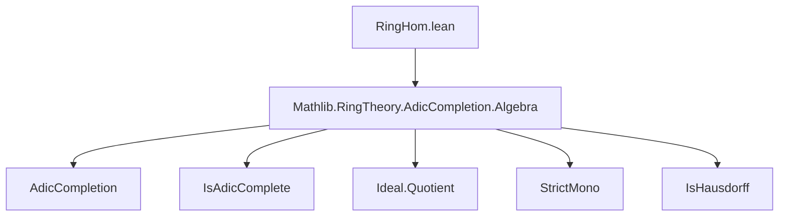
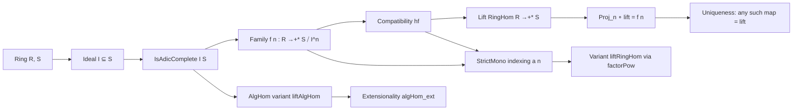

### Technical Brief: `RingHom.lean` — Lift of Ring Homomorphisms to Adic Completions

---

#### **1. Key Definitions & Theorems**

| Name | Type / Signature | Purpose |
|------|------------------|---------|
| `liftRingHom` | `R →+* S` | Lifts a compatible family of ring maps `f n : R →+* S ⧸ I^n` to a ring map `R →+* S`, assuming `S` is `I`-adically complete. |
| `of_liftRingHom` | `of I S (liftRingHom I f hf x) = AdicCompletion.liftRingHom I f hf x` | Relates the lift in `S` to its image under the canonical embedding `of I S : S →+* AdicCompletion I S`. |
| `ofAlgEquiv_comp_liftRingHom` | `(ofAlgEquiv I).comp (liftRingHom I f hf) = AdicCompletion.liftRingHom I f hf` | Shows compatibility of the lift with the algebra equivalence `S ≃ₐ[S] AdicCompletion I S`. |
| `mk_liftRingHom` | `Ideal.Quotient.mk (I ^ n) (liftRingHom I f hf x) = f n x` | Ensures the lift commutes with the projection to each quotient `S ⧸ I^n`. |
| `mk_comp_liftRingHom` | `(Ideal.Quotient.mk (I ^ n)).comp (liftRingHom I f hf) = f n` | Functional form of the above: the lift projects to `f n`. |
| `eq_liftRingHom` | `(∀ n, proj_n ∘ F = f n) ⇒ F = liftRingHom I f hf` | Uniqueness: any ring map factoring through all `S ⧸ I^n` as `f n` must be the lift. |
| `liftAlgHom` | `A →ₐ[R] S` | `AlgHom`-variant of `liftRingHom`, for algebras over a base ring `R`. |
| `mk_liftAlgHom` | `liftAlgHom I f hf x = f n x` | Projection property for `liftAlgHom`. |
| `mkₐ_comp_liftAlgHom` | `(mkₐ R (I ^ n)).comp (liftAlgHom I f hf) = f n` | Functional projection property. |
| `algHom_ext` | `(∀ n, projₐ_n ∘ f = projₐ_n ∘ g) ⇒ f = g` | Extensionality for `AlgHom`s into an `I`-adically complete module. |
| `liftRingHom` (StrictMono variant) | `R →+* S` | Variant of `liftRingHom` where the family `f n` is indexed over a strictly increasing sequence `a n` instead of all `n`. |
| `factorPow_comp_eq_of_factorPow_comp_succ_eq'` | `(factorPow I (ha.monotone hle)).comp (f n) = f m` | Extends compatibility from successive indices to arbitrary `m ≤ n`, for sequences indexed by `a n`. |

---

#### **2. Naming Conventions**

- **Prefixes**:
  - `lift_`: indicates construction of a lift (e.g., `liftRingHom`, `liftAlgHom`).
  - `mk_`: indicates projection to a quotient (e.g., `mk_liftRingHom`, `mk_liftAlgHom`).
  - `of_`: refers to canonical maps into completions (e.g., `ofAlgEquiv`, `of_liftRingHom`).
  - `eq_`: uniqueness statements (e.g., `eq_liftRingHom`).
- **Suffixes**:
  - `_comp_`: composition with canonical maps (e.g., `mk_comp_liftRingHom`, `mkₐ_comp_liftAlgHom`).
  - `_alg`: for algebra-homomorphism variants (e.g., `liftAlgHom`, `mkₐ_comp_liftAlgHom`).
  - `'`: prime variants (e.g., `factorPow_comp_eq_of_factorPow_comp_succ_eq'`), often generalizations or variants of a base lemma.

---

#### **3. Tactic Stack**

- **Core tactics**: `simp`, `ext`, `rw`, `apply`, `refine`, `symm`, `congr`
- **Domain-specific**:
  - `AdicCompletion.ext_evalₐ`: extensionality in adic completion via evaluation at all `n`.
  - `IsHausdorff.funext'`, `IsHausdorff.StrictMono.funext'`: uniqueness via Hausdorffness of adic topology.
  - `Submodule.eq_factor_of_eq_factor_succ`: used to lift compatibility from successive quotients to arbitrary ones.
  - `AlgHom.cancel_left`, `AlgHom.ext`: algebra homomorphism extensionality and cancellation.

---

#### **4. Proof Logic**

- **Structure**:
  1. **Construction**: Define `liftRingHom` as composition of `AdicCompletion.liftRingHom` with the inverse of the algebra equivalence `S ≃ₐ[S] AdicCompletion I S`.
  2. **Projection properties**: Prove `mk_liftRingHom` and `mk_comp_liftRingHom` using `ofAlgEquiv` and `evalₐ` definitions.
  3. **Uniqueness**: Use `IsHausdorff.funext'` (or its `StrictMono` variant) to show two maps agreeing on all projections are equal.
  4. **StrictMono variant**:
     - Extend compatibility from `f(n+1) → f(n)` to all `m ≤ n` via `factorPow_comp_eq_of_factorPow_comp_succ_eq'`.
     - Reduce to standard `liftRingHom` by precomposing with `factorPow I (ha.id_le n)`.

- **Inductive/Recursive flavor**: Not strictly inductive, but relies on *coinductive* reasoning (compatibility over all `n`, Hausdorffness ⇒ equality).

---

#### **5. Imports & Dependencies**

- **Primary import**:
  ```lean
  import Mathlib.RingTheory.AdicCompletion.Algebra
  ```
- **Key underlying theories**:
  - `AdicCompletion`: construction and universal property of adic completion.
  - `IsAdicComplete`: predicate for `I`-adic completeness.
  - `Ideal.Quotient`, `Ideal.pow`, `factorPow`: quotient and power structure.
  - `StrictMono`, `Monotone`: order-theoretic lemmas for indexing sequences.
  - `IsHausdorff`: Hausdorffness of adic topology ⇒ extensionality.

---

#### **6. Mermaid Diagrams**

##### **Dependency Graph (Module Level)**



##### **Overview of Theory Flow**



---

#### **7. Summary**

This module formalizes the **universal property of `I`-adic completeness** for rings and algebras: a compatible system of maps into the quotients `S ⧸ I^n` lifts uniquely to a map into `S`. It leverages the adic completion `AdicCompletion I S` as an intermediate object, using the equivalence `S ≃ AdicCompletion I S` when `S` is complete. The `StrictMono` variant allows indexing over sparse sequences (e.g., `2^n`), useful in practice for efficiency or convergence arguments.

The formalization is clean and modular, with a consistent naming scheme and heavy use of `simp`-friendly lemmas (`mk_*`, `comp_*`) to support automation.
