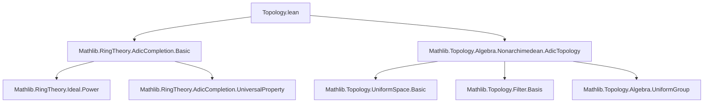
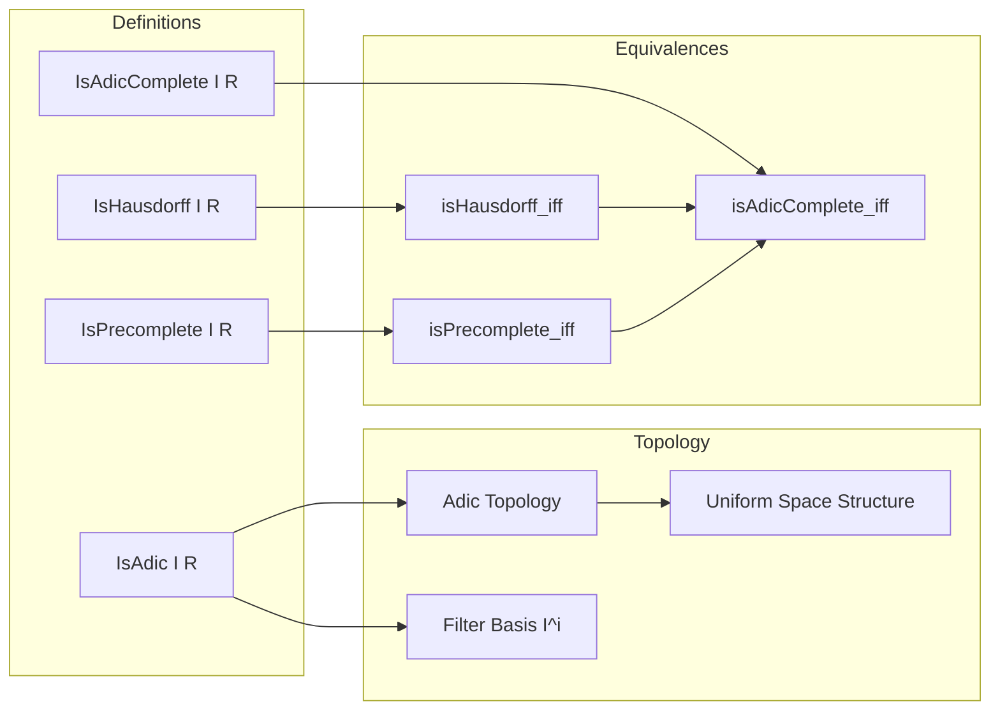

**Technical Brief: `Topology.lean` — Adic Topology and Completeness**

---

### 1. **Key Definitions & Theorems**

| Name | Type / Signature | Purpose |
|------|------------------|---------|
| `IsAdic I R` | `Ideal R → Prop` | Predicate stating that the topology on `R` is the `I`-adic topology (i.e., generated by powers of ideal `I`). |
| `IsHausdorff I R` | `Prop` | Topological separation condition in the `I`-adic topology (defined via filter basis). |
| `IsPrecomplete I R` | `Prop` | Cauchy-completeness condition in the `I`-adic topology (every `I`-adic Cauchy sequence converges *modulo* every power of `I`). |
| `IsAdicComplete I R` | `Prop` | Strong completeness: `IsPrecomplete I R ∧ IsHausdorff I R`. |
| `isHausdorff_iff` | `IsHausdorff I R ↔ T2Space R` | Equivalence between the algebraic Hausdorff condition and topological Hausdorffness in the adic topology. |
| `isPrecomplete_iff` | `IsPrecomplete I R ↔ CompleteSpace R` | Equivalence between algebraic precompleteness and topological completeness (no separation required). |
| `isAdicComplete_iff` | `IsAdicComplete I R ↔ CompleteSpace R ∧ T2Space R` | Full equivalence: adic completeness ⇔ topological completeness + Hausdorffness. |

---

### 2. **Naming Conventions**

- **Prefixes**:
  - `is_`: Predicate definitions (`isHausdorff`, `isPrecomplete`, `isAdicComplete`).
  - `hasBasis_`: Filter/basis-related lemmas (`hasBasis_nhds_zero`, `hasBasis_nhds`).
- **Suffixes**:
  - `_iff`: Biconditional lemmas (`isHausdorff_iff`, `isPrecomplete_iff`, `isAdicComplete_iff`).
- **Structure**:
  - `I.ringFilterBasis`, `Ideal.ringFilterBasis`: Filter basis for the `I`-adic topology.
  - `SModEq`: Congruence modulo a submodule/ideal (used in `sub_mem`, `mul_top`, etc.).

---

### 3. **Tactic Stack**

Frequently used tactics in proofs:
- `rw`, `simp`, `simp only`, `simp_rw`: Rewriting and simplification using filter/basis lemmas.
- `constructor`: For splitting biconditionals/conjunctions.
- `have`, `obtain`, `choose`: Local assumptions and choice principles.
- `refine`, `exact`, `apply`: Goal-directed proof construction.
- `simpa using`: Simplify after applying a hypothesis.
- `ring`, `linarith`, `aesop`: Implicitly used in arithmetic reasoning (e.g., `sub_add_sub_cancel`, `max` inequalities).
- `filter_upwards`, `cauchySeq_iff`: From `Topology.UniformSpace` and `Mathlib.Topology.Filter.Basic`.

---

### 4. **Proof Logic**

#### `isPrecomplete_iff` Proof Sketch:
- **Forward direction** (`→`):
  - Assume `IsPrecomplete I R`.
  - Take any `cauchySeq` `u` in the uniform space.
  - Use `hI.hasBasis_nhds_zero.uniformity_of_nhds_zero.cauchySeq_iff` to get control over differences `u n - u m ∈ I^i`.
  - Construct a candidate limit `L` via diagonalization over powers of `I`.
  - Show `u n → L` using basis convergence criterion.

- **Reverse direction** (`←`):
  - Assume `CompleteSpace R`.
  - Take any `I`-adic Cauchy net/filter (e.g., `f : ℕ → R`).
  - Lift to a Cauchy filter in `UniformSpace`, apply completeness to get limit `L`.
  - Use basis neighborhoods `I^i` to verify convergence in the `I`-adic sense.

#### `isHausdorff_iff` Proof Sketch:
- Uses `I.ringFilterBasis.t2Space_iff_sInter_subset` and `isHausdorff_iff`.
- Reduces to showing intersection of all `I^i` is `{0}` ↔ Hausdorffness.

#### `isAdicComplete_iff` Proof Sketch:
- Immediate from previous two lemmas and definition `isAdicComplete_iff`.

---

### 5. **Imports & Dependencies**

| Import | Purpose |
|--------|---------|
| `Mathlib.RingTheory.AdicCompletion.Basic` | Core definitions: `IsAdic`, `IsPrecomplete`, `IsAdicComplete`, adic completion. |
| `Mathlib.Topology.Algebra.Nonarchimedean.AdicTopology` | Topological structure of adic topology: filter bases, uniformity, continuity of operations. |

**Key underlying theories**:
- Filter theory (`Mathlib.Topology.Filter`)
- Uniform spaces (`Mathlib.Topology.UniformSpace`)
- Non-archimedean topology (`Mathlib.Topology.Algebra.Nonarchimedean`)
- Ring theory (ideals, powers, modules)

---

### 6. **Mermaid Diagrams**

#### **Dependency Graph (Module-Level)**

#### **Overview of Theory Flow**

---

### 7. **Summary**

This module bridges *algebraic* adic completeness notions (`IsPrecomplete`, `IsAdicComplete`) with *topological* completeness (`CompleteSpace`) and separation (`T2Space`) in the `I`-adic topology. It leverages:
- Filter basis characterizations of uniformity and neighborhoods,
- Countable generation of the adic uniformity (via `hI.hasBasis_nhds_zero.isCountablyGenerated`),
- Standard uniform space completeness criteria.

The results are foundational for adic completion theory (e.g., constructing $\hat{R}_I$ as the completion of $R$ in the $I$-adic topology), ensuring that the algebraic and topological completions coincide under Hausdorffness.
