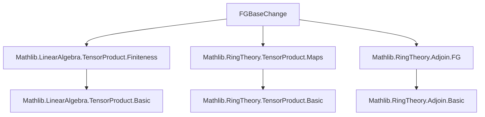

**Technical Brief: `FGBaseChange.lean`**

---

### 1. **Key Definitions & Theorems**

| Name | Type / Signature | Purpose |
|------|------------------|---------|
| `exists_fg_and_mem_baseChange` | `{R A B : Type*} [CommSemiring R] [CommSemiring A] [Semiring B] [Algebra R A] [Algebra R B] (x : A ⊗[R] B) → ∃ C : Subalgebra R B, C.FG ∧ x ∈ C.baseChange A` | Main theorem: For any tensor element $x \in A \otimes_R B$, there exists a *finitely generated* $R$-subalgebra $C \subseteq B$ such that $x$ lies in the image of $C \otimes_R A \to A \otimes_R B$ (i.e., $x \in C.\text{baseChange}\ A$). |
| `TensorProduct.exists_finset` | `(x : A ⊗[R] B) → ∃ S : Finset (A × B), x ∈ span R (S.image (· ** ·))` | Intermediate lemma used in proof: expresses any tensor as a finite $R$-linear combination of simple tensors $a \otimes b$. |
| `Algebra.adjoin R (S.image fun j ↦ j.2)` | `Subalgebra R B` | Constructs the $R$-subalgebra of $B$ generated by the second components of a finite set $S \subseteq A \times B$. |
| `Subalgebra.fg_adjoin_finset` | `Subalgebra.FG (adjoin R (S.image f))` if $S$ is finite | Shows that adjoin of a finite set yields a finitely generated subalgebra. |
| `Subalgebra.tmul_mem_baseChange` | `(a : A) → (b : B) → a ∈ C → b ∈ C → a • b ∈ C.baseChange A` (simplified) | Ensures that simple tensors built from elements of a subalgebra $C$ lie in its base change. |
| `Algebra.subset_adjoin` | `s ∈ S → s.2 ∈ adjoin R (S.image fun j ↦ j.2)` | Membership: elements of $S$'s image lie in the adjoined subalgebra. |

---

### 2. **Naming Conventions**

- **Prefixes**:
  - `fg_`: indicates finitely generated (e.g., `fg_adjoin_finset`).
  - `baseChange`: refers to extension of scalars along a subalgebra inclusion.
  - `adjoin`: for constructing subalgebras generated by a set.
- **Suffixes**:
  - `_mem_`: indicates membership in a constructed object (e.g., `tmul_mem_baseChange`).
  - `_image`: for images under maps (e.g., `S.image fun j ↦ j.2`).
- **Structure**:
  - `exists_...`: existential lemmas (e.g., `exists_fg_and_mem_baseChange`).
  - `..._finset`: when finiteness is via a `Finset`.

---

### 3. **Tactic Stack**

- `obtain ⟨S, hS⟩ := TensorProduct.exists_finset x`: destructures existence of finite generating set.
- `classical`: enables classical choice (for constructing witnesses).
- `refine ⟨..., ?_, ?_⟩`: constructs pair with two goals.
- `exact ...`: closes goals using lemmas.
- `hS ▸ ...`: rewrite using equality `hS` (i.e., $x = \sum s.1 \otimes s.2$).
- `Finset.mem_image_of_mem _ hs`: used implicitly in `subset_adjoin` reasoning.

No heavy automation (`aesop`, `ring`, `simp_rw`) appears — proof is mostly *constructive* and *algebraic*.

---

### 4. **Proof Logic**

1. **Decompose** $x$ as a finite sum of simple tensors using `TensorProduct.exists_finset`.
2. Let $S \subseteq A \times B$ be the finite set of pairs $(a, b)$ appearing.
3. Define $C := R[\{b \mid (a, b) \in S\}] \subseteq B$, i.e., the $R$-subalgebra generated by the $b$-components.
4. Show:
   - $C$ is finitely generated: via `fg_adjoin_finset`.
   - $x \in C.\text{baseChange}\ A$: each simple tensor $a \otimes b$ lies in $C.\text{baseChange}\ A$ because $b \in C$, and finite sums preserve membership.

The proof is *explicit* and *constructive*: the subalgebra $C$ is given concretely as `Algebra.adjoin R (S.image fun j ↦ j.2)`.

---

### 5. **Imports**

| Module | Role |
|--------|------|
| `Mathlib.LinearAlgebra.TensorProduct.Finiteness` | Provides `TensorProduct.exists_finset`, finiteness lemmas for tensors. |
| `Mathlib.RingTheory.TensorProduct.Maps` | Contains `baseChange`, maps from $C \otimes_R A \to A \otimes_R B$, and basic properties. |
| `Mathlib.RingTheory.Adjoin.FG` | Gives `fg_adjoin_finset`, finitely generatedness of adjoined subalgebras. |

These imports define the *algebraic context*: tensor products over commutative semirings, subalgebras, and finite generation.

---

### 6. **Mermaid Diagrams**

#### Dependency Graph (Module-Level)



#### Theoretical Overview (Proof Sketch)

```mermaid
flowchart LR
  x[A ⊗[R] B element] -->|TensorProduct.exists_finset| S[Finite S ⊆ A × B]
  S -->|image₂| B_elements[Finite subset of B]
  B_elements -->|adjoin R| C[Subalgebra C ≤ B]
  C -->|fg_adjoin_finset| C_fg[C is FG]
  S -->|tmul_mem_baseChange + sum_mem| x_in_Cbase[x ∈ C.baseChange A]
  C_fg & x_in_Cbase -->|refine| ∃C, C.FG ∧ x ∈ C.baseChange A
```

---

### 7. **Mathematical Context**

This result is foundational for *localization* and *descent* arguments in algebraic geometry and commutative algebra: it shows that any tensor element lives already in a “finitely generated” sub-base-change, enabling reduction to Noetherian or finite-type scenarios.

The theorem is a variant of the well-known fact that in a tensor product $A \otimes_R B$, every element involves only finitely many $B$-coefficients — here made precise in terms of *subalgebras* rather than just submodules.

--- 

Let me know if you'd like the corresponding `lean`-style dependency graph or formalization of related corollaries (e.g., for finite presentation).
