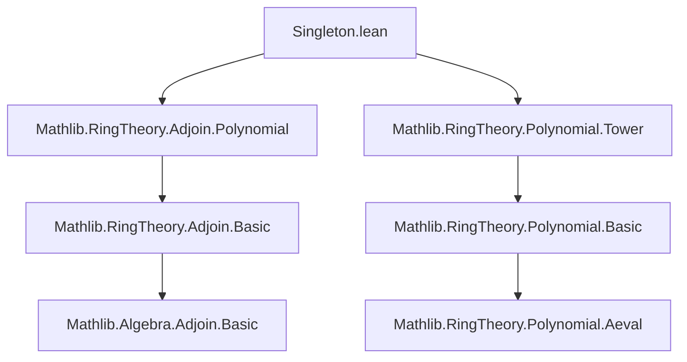

Here's a structured technical brief based on the provided `Singleton.lean` file:

---

### **1. Key Definitions & Theorems**

| Name | Type | Purpose |
|------|------|---------|
| `RingHom.adjoinAlgebraMap` | `Algebra.adjoin A {b} →+* Algebra.adjoin A {(algebraMap B C) b}` | Constructs a ring homomorphism from the subalgebra generated by `b` to that generated by its image under `algebraMap B C`. |
| `RingHom.adjoin_algebraMap_apply` | `∀ x, RingHom.adjoinAlgebraMap b x = algebraMap B C x` | Shows the underlying function of `adjoinAlgebraMap` acts as the ambient algebra map. |
| `RingHom.adjoin_algebraMap_surjective` | `Function.Surjective (adjoinAlgebraMap b)` | Proves surjectivity of the map, enabling construction of an algebra structure. |
| `RingHom.toAlgebra` | Instance | Induces an algebra structure over the domain of a ring homomorphism. |
| `IsScalarTower.of_algebraMap_eq'` | Instance | Verifies scalar tower property for the induced algebra structure. |
| `RingHom.adjoinAlgebraMapEquiv` | `Algebra.adjoin A {b} ≃+* Algebra.adjoin A {(algebraMap B C) b}` | Provides a ring isomorphism when `algebraMap B C` is injective (via `FaithfulSMul`). |

---

### **2. Naming Conventions**

- **Prefixes**:
  - `adjoinAlgebraMap`: Indicates construction related to adjoined subalgebras and algebra maps.
  - `adjoin_algebraMap_apply`: Applies the map to an element.
- **Suffixes**:
  - `_surjective`, `_equiv`: Denote properties or derived structures (surjectivity, equivalence).
- **Case style**: `camelCase` for definitions (`adjoinAlgebraMap`), `snake_case` for lemmas (`adjoin_algebraMap_apply`).

---

### **3. Tactic Stack**

Frequent tactics used in proofs:
- `induction ... using ..._induction`: Structural induction on `adjoin_singleton` elements.
- `aesop`: Automated reasoning with normalization and simplification hints.
- `simp_rw`, `simp`: For rewriting using definitional equalities and lemmas like `aeval_algebraMap_apply`.
- `ring`: Implicitly used via `aesop`'s norm/arith support.
- `apply RingEquiv.ofBijective ...`: To construct ring isomorphisms from bijective homomorphisms.

---

### **4. Proof Logic**

- **Inductive structure**: Proofs rely on `adjoin_singleton_induction`, which mirrors the construction of elements in `adjoin A {b}` as `aeval p b` for polynomials `p`.
- **Surjectivity proof**:
  - Uses `adjoin_eq_exists_aeval` to express any element in the target as `aeval p (algebraMap b)`.
  - Lifts this to a preimage via `aeval p b`.
- **Isomorphism construction**:
  - Assumes `FaithfulSMul B C` (equivalent to injectivity of `algebraMap B C` in this context).
  - Shows bijectivity of `adjoinAlgebraMap`, then applies `RingEquiv.ofBijective`.

---

### **5. Imports**

- `Mathlib.RingTheory.Adjoin.Polynomial`: Provides foundational results on `adjoin` and its relation to polynomial evaluation.
- `Mathlib.RingTheory.Polynomial.Tower`: Supports reasoning about scalar towers and compatibility of algebra maps.

---

### **8. Mermaid Diagrams**

#### **Dependency Graph (Module-Level)**



#### **Overview of Theoretical Flow**

```mermaid
flowchart LR
  A[Algebra A B] --> B[Adjoin {b} ⊆ B]
  A --> C[Algebra A C]
  B --> D[Adjoin {(algebraMap b)} ⊆ C]
  D --> E[IsScalarTower A B C]
  B -->|RingHom.adjoinAlgebraMap| D
  D -->|Algebra structure| E
  B <-->|Equiv if FaithfulSMul| D
```

#### **Element-Level Construction**

```mermaid
flowchart LR
  p[Polynomial A] -->|aeval b| x[Algebra.adjoin A {b}]
  p -->|aeval (algebraMap b)| y[Algebra.adjoin A {(algebraMap b)}]
  x -->|RingHom.adjoinAlgebraMap| y
  y -->|surjectivity| z[All elements in target]
```

---

Let me know if you'd like a formalized dependency graph for `Mathlib` or a proof sketch in natural language.
