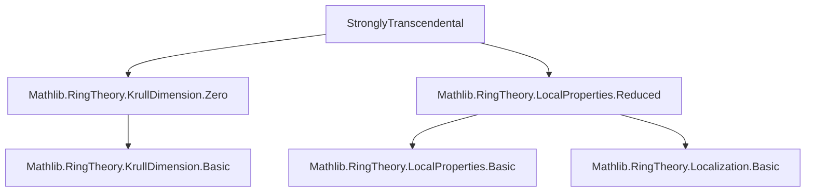
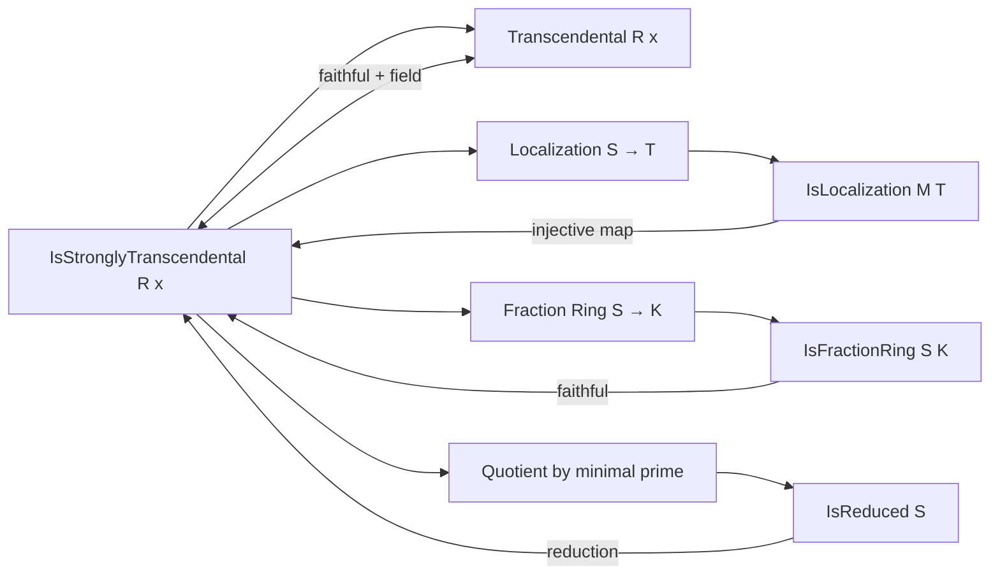
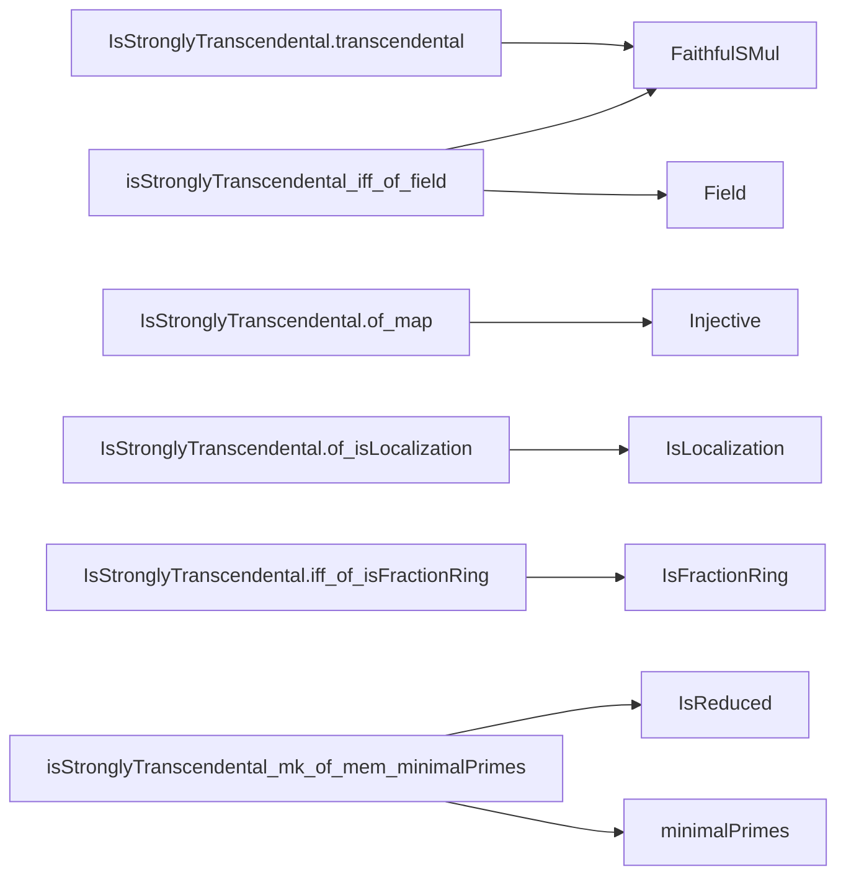

**Technical Brief: `StronglyTranscendental.lean`**

---

### 1. **Key Definitions & Theorems**

| Name | Type / Signature | Purpose |
|------|------------------|---------|
| `IsStronglyTranscendental R x` | `x : S → Prop` | Defines *strong transcendence*: for all `u : S`, `p : R[X]`, if `p(x) * u = 0`, then `p.map (algebraMap R S) * C u = 0`. Generalizes transcendence to non-domains. |
| `IsStronglyTranscendental.transcendental` | `IsStronglyTranscendental R x → FaithfulSMul R S → Transcendental R x` | Shows strong transcendence implies transcendence under faithfulness. |
| `isStronglyTranscendental_iff_of_field` | `IsStronglyTranscendental R x ↔ Transcendental R x` | Equivalence in the case where the codomain is a field and the action is faithful. |
| `IsStronglyTranscendental.of_map` | `Injective f → IsStronglyTranscendental R (f x) → IsStronglyTranscendental R x` | Strong transcendence descends along injective algebra maps. |
| `IsStronglyTranscendental.of_isLocalization` | `IsLocalization M T → IsStronglyTranscendental R x → IsStronglyTranscendental R (algebraMap S T x)` | Strong transcendence descends to localizations. |
| `IsStronglyTranscendental.of_isLocalization_left` | `IsLocalization M S → IsStronglyTranscendental R x → IsStronglyTranscendental S x` | Strong transcendence descends when base changes along localization. |
| `IsStronglyTranscendental.restrictScalars` | `IsStronglyTranscendental S x → IsStronglyTranscendental R x` | Strong transcendence is preserved under restriction of scalars (tower). |
| `IsStronglyTranscendental.of_surjective_left` | `Surjective (algebraMap R S) → IsStronglyTranscendental R x → IsStronglyTranscendental S x` | Strong transcendence descends along surjective algebra maps. |
| `IsStronglyTranscendental.iff_of_isLocalization` | `M ≤ S⁰ → IsLocalization M T → IsStronglyTranscendental R (algebraMap S T x) ↔ IsStronglyTranscendental R x` | Equivalence under localization at a multiplicative set disjoint from zero. |
| `IsStronglyTranscendental.iff_of_isFractionRing` | `IsFractionRing S K → IsStronglyTranscendental R x ↔ Transcendental R (algebraMap S K x)` | Connects strong transcendence over `R` to transcendence in the fraction field. |
| `IsStronglyTranscendental.of_transcendental` | `Transcendental R (algebraMap S K x) → IsStronglyTranscendental R x` | Transcendence in a faithful extension implies strong transcendence. |
| `isStronglyTranscendental_mk_of_mem_minimalPrimes` | `[IsReduced S] → IsStronglyTranscendental R x → q ∈ minimalPrimes S → IsStronglyTranscendental R (Ideal.Quotient.mk q x)` | Strong transcendence descends to reductions modulo minimal primes. |

---

### 2. **Naming Conventions**

- **Prefixes**:
  - `IsStronglyTranscendental.` — predicate definitions and basic lemmas.
  - `isStronglyTranscendental_` — lowercase variant used for lemmas (e.g., `isStronglyTranscendental_iff_of_field`).
- **Suffixes**:
  - `_iff_of_…` — characterizes equivalence under a structural condition (e.g., localization, fraction ring).
  - `_of_…` — descent properties (e.g., `of_map`, `of_isLocalization`, `of_surjective_left`).
  - `_left` / `_right` — indicates direction of descent in towers (e.g., `of_isLocalization_left` vs `of_isLocalization`).
- **`algebraMap` / `aeval` / `map` / `C`** — standard polynomial evaluation and map notation.

---

### 3. **Tactic Stack**

- **Core tactics**:
  - `simp`, `rw`, `refine`, `exact`, `intro`, `cases`, `obtain`, `ext`
- **Algebraic simplification**:
  - `linear_combination` — for constructing equations from hypotheses.
  - `map_injective`, `map_surjective`, `mul_right_cancel`, `mul_right_inj` — for cancellation in domains/localizations.
  - `congr` — to lift equalities through functors (e.g., `map`, `C`, `aeval`).
- **Localization-specific**:
  - `IsLocalization.exists_mk'_eq`, `IsLocalization.mk'_eq_zero_iff`, `IsLocalization.integerNormalization_map_to_map`
  - `IsLocalization.map_units`, `IsLocalization.injective`
- **Ring-theoretic**:
  - `Ideal.Quotient.mk_surjective`, `Ideal.Quotient.eq_zero_iff_mem`, `Ideal.IsPrime.mem_or_mem_of_mul_eq_zero`
  - `Ring.KrullDimLE.isField_of_isReduced.toField`

---

### 4. **Proof Logic**

- **General pattern**:
  1. **Unfold definition**: Introduce `u`, `p`, assume `p.aeval x * u = 0`.
  2. **Lift or descend** via structural properties (injectivity, surjectivity, localization, fraction ring).
  3. **Apply induction hypothesis or known lemma** (e.g., `h`, `hM`, `hK`).
  4. **Rewrite using algebraic identities** (e.g., `map_mul`, `aeval_algHom_apply`, `map_map`).
  5. **Cancel or lift** using injectivity/surjectivity or localization properties.
  6. **Conclude** by `simpa` or `exact`.

- **Common subproofs**:
  - **Localization descent**: Use `IsLocalization.exists_mk'_eq` to reduce to numerator-denominator form, then clear denominators.
  - **Fraction field equivalence**: Reduce to field case via `isStronglyTranscendental_iff_of_field`.
  - **Minimal prime descent**: Use reducedness + localization at prime to reduce to field case, then lift coefficient-wise.

---

### 5. **Imports & Dependencies**

| Module | Role |
|--------|------|
| `Mathlib.RingTheory.KrullDimension.Zero` | Provides `KrullDimLE 0` and consequences (e.g., reduced + dim 0 ⇒ field). |
| `Mathlib.RingTheory.LocalProperties.Reduced` | Provides `IsReduced` and related lemmas (e.g., `isField_of_isReduced`). |
| `Polynomial` | For `aeval`, `map`, `C`, `coeff`, etc. |
| `TensorProduct` (scoped) | Not directly used in this file, but imported for generality. |
| `nonZeroDivisors` (scoped) | Likely used implicitly via `S⁰` (the set of non-zero divisors). |

---

### 6. **Mermaid Diagrams**

#### **Dependency Graph (Module Level)**

#### **Conceptual Overview (Theory Flow)**

#### **Proof Strategy Dependency (for key lemmas)**

---

### 7. **Summary**

This module formalizes *strong transcendence*, a subtle strengthening of transcendence that works in arbitrary algebras (not necessarily domains). It is designed to support the proof of **Zariski’s Main Theorem** (via the Stacks Project tag `00PZ`). The theory is tightly integrated with localization, fraction rings, Krull dimension, and reducedness, and leverages Lean’s powerful algebraic library (especially `Mathlib.RingTheory`). The proofs follow a uniform descent pattern, often reducing to the field case via localization or quotienting.
