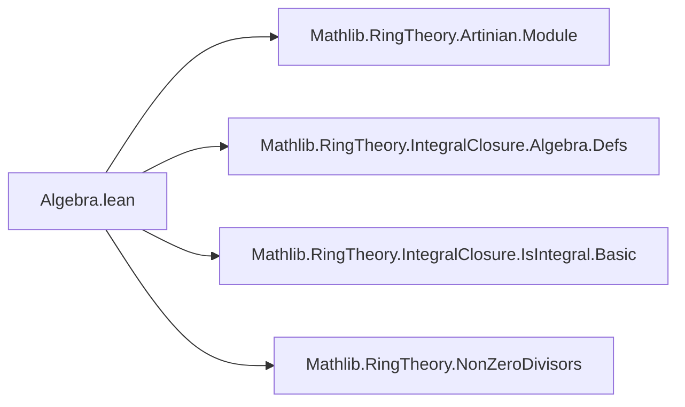

### Technical Brief: `Algebra.lean` — Algebras over Artinian Rings

---

#### **1. Key Definitions & Theorems**

| Name | Type / Signature | Purpose |
|------|------------------|---------|
| `isUnit_of_isIntegral_of_nonZeroDivisor` | `{a : A} → IsIntegral R a → a ∈ A⁰ → IsUnit a` | Shows that in an algebra over an Artinian ring, an integral non-zero-divisor is a unit. |
| `isUnit_iff_nonZeroDivisor_of_isIntegral` | `{a : A} → IsIntegral R a → (IsUnit a ↔ a ∈ A⁰)` | Equivalence: integral element is a unit iff it's a non-zero divisor. |
| `isUnit_of_nonZeroDivisor_of_isIntegral'` | `[Algebra.IsIntegral R A] → {a : A} → a ∈ A⁰ → IsUnit a` | Specialization of the above when *all* elements are integral (i.e., `A` is integral over `R`). |
| `isUnit_iff_nonZeroDivisor_of_isIntegral'` | `[Algebra.IsIntegral R A] → {a : A} → (IsUnit a ↔ a ∈ A⁰)` | Full equivalence under global integrality assumption. |
| `isUnit_submonoid_eq_of_isIntegral` | `[Algebra.IsIntegral R A] → IsUnit.submonoid A = A⁰` | Identifies the submonoid of units with the submonoid of non-zero divisors under integrality. |

**Notation & auxiliary definitions used:**
- `A⁰`: `nonZeroDivisors A`, the submonoid of non-zero divisors in `A`.
- `Algebra.adjoin R {a}`: the subalgebra of `A` generated by `a` over `R`.
- `B.subtype`: inclusion map `B → A`.
- `Module.Finite R B`: finite generation of `B` as an `R`-module.
- `isArtinian_of_tower`: if $ R \to B \to A $ is a tower and $ R $ is Artinian, then $ B $ is Artinian.

---

#### **2. Naming Conventions**

- **Prefixes:**
  - `isUnit_...`: indicates a theorem about unit-ness.
  - `isIntegral_...`: references integrality over `R`.
  - `nonZeroDivisor` / `mem_nonZeroDivisors`: references membership in `A⁰`.
- **Suffixes:**
  - `'` (prime): variant of a previous theorem, often under stronger assumptions (e.g., `isUnit_of_nonZeroDivisor_of_isIntegral'`).
  - `of_...`: specifies the hypothesis structure (e.g., `of_isIntegral_of_nonZeroDivisor`).
- **Equivalence theorems** use `isUnit_iff_nonZeroDivisor_of_isIntegral`.

---

#### **3. Tactic Stack**

The proofs rely heavily on:
- `let` + `have` for local definitions and intermediate facts.
- `simp` / `simpa` for simplification and rewriting using lemmas like `isUnit_iff_nonZeroDivisor_of_isIntegral'`.
- `ext` (extensionality) for proving equality of submonoids.
- `map` (of `IsUnit.map`) to transport unit-ness along ring homomorphisms (here, `B.subtype`).
- `inferInstance` to infer class instances (e.g., `Module.Finite`, `IsArtinianRing`).
- `comap_nonZeroDivisors_le_of_injective`: used to relate non-zero-divisors in subalgebra and ambient algebra.

No heavy automation (e.g., `aesop`, `ring`, `linarith`) is used — the proofs are mostly structural and rely on algebraic lemmas from Mathlib.

---

#### **4. Proof Logic**

- **Core idea**: Reduce to the case of a *simple* algebra $ B = R[a] $, which is finite over $ R $ because $ a $ is integral. Since $ R $ is Artinian, so is $ B $. In an Artinian domain, every non-zero-divisor is a unit — but here $ B $ may not be a domain, yet the non-zero-divisor condition still forces unit-ness via module-theoretic arguments.
- **Structure of main proof (`isUnit_of_isIntegral_of_nonZeroDivisor`)**:
  1. Construct $ B = R[a] $, the subalgebra generated by $ a $.
  2. Show $ B $ is finite over $ R $, hence Artinian.
  3. Use injectivity of the inclusion $ B \hookrightarrow A $ to pull back the non-zero-divisor property: $ a \in A⁰ \Rightarrow b \in B⁰ $.
  4. Apply `isUnit_of_mem_nonZeroDivisors` (a standard result for Artinian rings) in $ B $, then map back to $ A $.

- **Equivalence proofs** are immediate from the forward/backward directions of the main theorem.

- **Submonoid equality** uses extensionality and `isUnit.mem_submonoid_iff`, reducing to the equivalence already proven.

---

#### **5. Imports & Dependencies**

| Import | Purpose |
|--------|---------|
| `Mathlib.RingTheory.Artinian.Module` | Provides `isArtinian_of_tower`, `Module.Finite` consequences, and Artinian module theory. |
| `Mathlib.RingTheory.IntegralClosure.Algebra.Defs` | Defines `Algebra.IsIntegral`, `adjoin`, and related algebraic constructions. |
| `Mathlib.RingTheory.IntegralClosure.IsIntegral.Basic` | Basic facts about integral elements: closure under ring ops, `isIntegral_adjoin_simple`, etc. |

Also uses:
- `nonZeroDivisors` module (from `RingTheory.NonZeroDivisors`).
- Standard ring/algebra infrastructure: `Algebra`, `IsUnit`, `Subtype.val_injective`, etc.

---

#### **6. Mermaid Diagrams**

##### **Dependency Graph (Theorems & Lemmas)**

```mermaid
graph TD
  A[isUnit_of_isIntegral_of_nonZeroDivisor] --> B[isUnit_iff_nonZeroDivisor_of_isIntegral]
  A --> C[isUnit_of_nonZeroDivisor_of_isIntegral']
  C --> D[isUnit_iff_nonZeroDivisor_of_isIntegral']
  D --> E[isUnit_submonoid_eq_of_isIntegral]
  A --> F[Module.Finite R (adjoin R {a})]
  A --> G[isArtinian_of_tower]
  A --> H[comap_nonZeroDivisors_le_of_injective]
  A --> I[isUnit_of_mem_nonZeroDivisors]
```

##### **Overview of File Theory Context**

```mermaid
graph LR
  subgraph "Core Theory"
    R[Artinian Ring R]
    A[Algebra A over R]
    I[Integral Elements]
    Z[Non-zero Divisors A⁰]
    U[Units IsUnit A]
  end

  R -->|finite modules| I
  I -->|main thm| Z ↔ U
  Z -->|submonoid| U
  U -->|submonoid eq| Z
```

##### **Module Scope**



---

#### **7. Summary**

This file establishes a clean dichotomy for integral elements in algebras over Artinian rings: they are either units or zero divisors. The key insight is that integrality + Artinian base forces finite module structure, enabling reduction to the Artinian ring case where non-zero-divisors are units. The results are foundational for further structure theory (e.g., decomposition of Artinian algebras, primary decomposition, or behavior of spectra).
