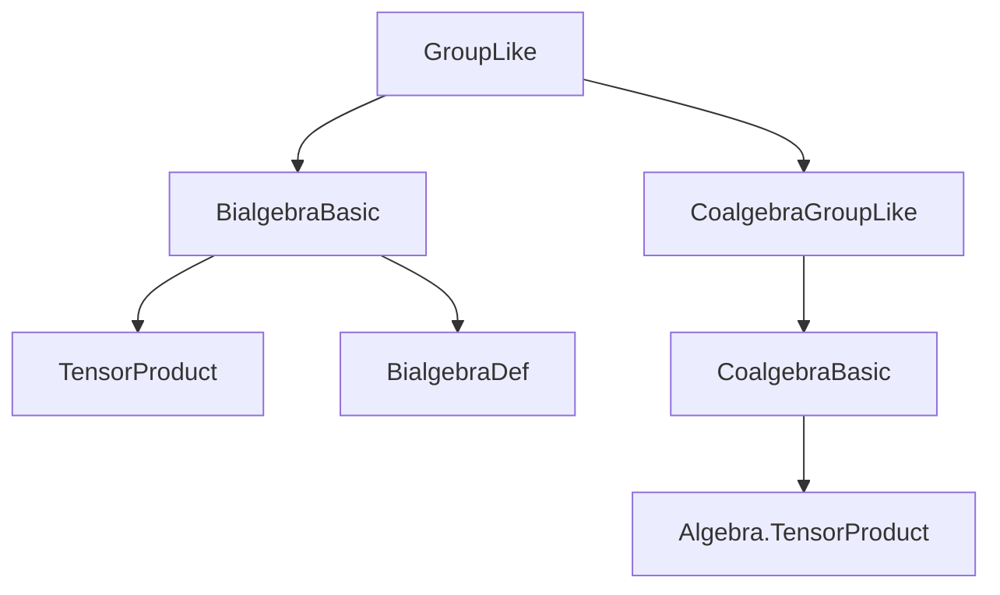
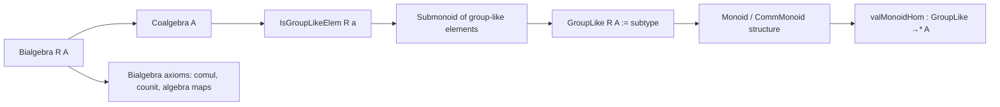
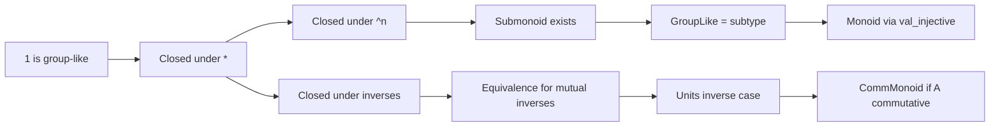

**Technical Brief: `GroupLike.lean`**

---

### 1. **Key Definitions & Theorems**

| Name | Type / Signature | Purpose |
|------|------------------|---------|
| `IsGroupLikeElem R a` | `Prop` | Predicate stating that `a : A` is *group-like*: `counit a = 1` and `comul a = a ⊗ a` (in the tensor product over `R`). |
| `IsGroupLikeElem.one` | `IsGroupLikeElem R (1 : A)` | Proves the unit `1` is group-like. |
| `IsGroupLikeElem.mul` | `IsGroupLikeElem R a → IsGroupLikeElem R b → IsGroupLikeElem R (a * b)` | Closure under multiplication. |
| `groupLikeSubmonoid R A` | `Submonoid A` | Submonoid of group-like elements. |
| `IsGroupLikeElem.pow` | `IsGroupLikeElem R a → IsGroupLikeElem R (a ^ n)` | Closure under natural powers. |
| `IsGroupLikeElem.of_mul_eq_one` | `a * b = 1 → b * a = 1 → IsGroupLikeElem R a → IsGroupLikeElem R b` | Closure under inverses (when inverse exists). |
| `isGroupLikeElem_iff_of_mul_eq_one` | `a * b = 1 ∧ b * a = 1 ⇒ IsGroupLikeElem R a ↔ IsGroupLikeElem R b` | Equivalence of group-likeness for mutual inverses. |
| `isGroupLikeElem_unitsInv` | `IsGroupLikeElem R u⁻¹ ↔ IsGroupLikeElem R u` | Special case for units: inverses in `Aˣ` preserve group-likeness. |
| `GroupLike R A` | `Type*` | Type of group-like elements, defined as `{a // IsGroupLikeElem R a}` (subtype). |
| `GroupLike.valMonoidHom` | `GroupLike R A →* A` | Canonical monoid homomorphism embedding group-like elements into `A`. |
| `GroupLike.instMonoid` / `GroupLike.instCommMonoid` | `Monoid (GroupLike R A)` / `CommMonoid (GroupLike R A)` | Induced monoid / commutative monoid structure via injective `val`. |

---

### 2. **Naming Conventions**

- **Predicates**: `IsGroupLikeElem` — standard `is_` prefix for properties.
- **Submonoid**: `groupLikeSubmonoid` — `groupLike` + `Submonoid`.
- **Lemmas**:
  - `one`, `mul`, `pow`, `of_mul_eq_one`, `unitsInv` — action-based naming.
  - `val_one`, `val_mul`, `val_pow` — `val_` prefix for projections from subtype.
- **Instances**: `instMonoid`, `instCommMonoid` — standard Lean naming.
- **Homomorphisms**: `valMonoidHom` — `val_` + `MonoidHom` suffix.

---

### 3. **Tactic Stack**

- `simp` — heavily used, especially with `ha`, `hb`, `← counit_mul`, `← comul_mul`.
- `left_inv_eq_right_inv` — key for proving equality via two-sided inverse uniqueness.
- `Algebra.TensorProduct.one_def` — used to simplify `1 ⊗ 1 = 1` in tensor product.
- `val_injective.monoid` / `val_injective.commMonoid` — typeclass inference leveraging injectivity of `val`.

No heavy automation (e.g., `aesop`, `ring`, `linarith`) is used — proofs are mostly structural and rely on algebraic simplifications.

---

### 4. **Proof Logic**

- **Structure**: The file proceeds in two stages:
  1. **Semiring case** (`[CommSemiring R] [Semiring A] [Bialgebra R A]`):
     - Show `1` and closure under `*`, `^n`, and inverses (when existent).
     - Define `groupLikeSubmonoid` as a submonoid.
     - Construct `GroupLike R A` as a subtype and lift monoid structure via `val_injective`.
  2. **Commutative case** (`[CommSemiring A]`):
     - Lift `CommMonoid` structure similarly.

- **Typical proof pattern**:
  - For `IsGroupLikeElem a * b`: simplify `counit (a * b)` and `comul (a * b)` using multiplicativity of `counit` and `comul`, then apply hypotheses.
  - For inverses: use `left_inv_eq_right_inv` on both `counit` and `comul`, leveraging that `counit` and `comul` are algebra maps (hence preserve multiplication and unit).

---

### 5. **Imports**

- `Mathlib.RingTheory.Bialgebra.Basic` — defines bialgebras, `counit`, `comul`, tensor product algebra structure.
- `Mathlib.RingTheory.Coalgebra.GroupLike` — defines `IsGroupLikeElem` in coalgebras (base for bialgebra case).

---

### 6. **Mermaid Diagrams**

#### **Dependency Graph (File-Level)**

#### **Theoretical Overview (Module Structure)**

#### **Proof Flow (Group-like elements form a monoid)**

---

### 7. **Summary**

This file establishes that in a bialgebra over a commutative semiring, the group-like elements form a (commutative) monoid. The proof leverages the coalgebra structure (counit and comultiplication) and the algebra structure (multiplicativity of `counit`, `comul`). The construction is clean and follows Lean’s standard pattern of lifting algebraic structures along injective maps (`val : GroupLike → A`). The key insight is that group-likeness is preserved under multiplication and powers, and inverses exist *within* the group-like elements precisely when they exist in the ambient algebra.
